# 🔬 Unity Equilibrium Theory (UET) v0.8.7

-brightgreen)


> **"Physics is the System Administration of the Universe — managing resources to prevent the system from crashing."**

---

## 📋 Table of Contents

1. [Overview](#-overview)
2. [The Core Equation](#-the-core-equation)
3. [Test Results](#-test-results-v087)
4. [Quick Start](#-quick-start)
5. [Topic Index](#-topic-index)
6. [Research Hub](#-research-hub)
7. [Methodology](#-methodology)

---

## 📖 Overview

**Unity Equilibrium Theory (UET)** is a framework that models the universe as an information processing system, where all physics emerges from equilibrium constraints.

| Aspect | Standard Physics | UET Approach |
|:-------|:-----------------|:-------------|
| **Mass** | Higgs mechanism | Information latency ($\tau$) |
| **Gravity** | Spacetime curvature | I-field capacity pressure |
| **Dark Matter** | Unknown particles | Information field gradients |
| **Quantum** | Wavefunction | Address search algorithm |

---

## 🎯 The Core Equation

$$\Omega = C \cdot I$$

| Symbol | Meaning | Physics |
|:-------|:--------|:--------|
| **Ω** | Equilibrium | Target state of zero rejection |
| **C** | Processing Limit | Speed of light (exchange rate) |
| **I** | Information Check | Mass (latency of existence) |

### Implementation (Field Equation)

$$\Omega[C, I] = \int \left[V(C) + \frac{\kappa}{2}|\nabla C|^2 + \beta \cdot C \cdot I + \frac{1}{2}I^2\right] dx$$

```mermaid
graph TD
    Root["UET Core: Ω = c · I"] -->|"Gradient of I"| Classical["Classical Mechanics"]
    Root -->|"Shuffling of I"| Thermo["Thermodynamics"]
    Root -->|"Capacity of I"| GR["General Relativity"]
    Root -->|"Addressing of I"| QM["Quantum Mechanics"]
    
    style Root fill:#f9f,stroke:#333,stroke-width:4px
```



---

## 📊 Test Results (v0.8.7)

### Summary

| Metric | Value |
|:-------|:------|
| **Total Tests** | 117 individual tests |
| **Pass Rate** | 98.3% (115/117) |
| **Topics** | 20 physics domains |
| **Grade** | EXCELLENT |

### Results by Domain

| Domain | Tests | Pass Rate | Key Validation |
|:-------|:-----:|:---------:|:---------------|
| **Astrophysics** (0.1-0.3) | 31 | 97% | Galaxy rotation, Black holes, Hubble |
| **Particle** (0.5-0.9) | 41 | 100% | Electroweak, Neutrino, Muon g-2 |
| **Condensed** (0.4, 0.10-0.14) | 29 | 100% | Superconductivity, Phase transitions |
| **New Topics** (0.15-0.20) | 9 | 100% | GR, Atomic physics, Heavy nuclei |

### Quick Test

```bash
python research_uet/topics/run_all_tests.py
```

---

## 🚀 Quick Start

### Installation

```bash
git clone https://github.com/unityequilibrium/Equation-UET-v0.8.7.git
cd Equation-UET-v0.8.7
pip install -r requirements.txt
```

### Run All Tests

```bash
python research_uet/topics/run_all_tests.py
```

### Expected Output

```
======================================================================
UET MASTER TEST RUNNER
======================================================================
Found 64 test files in 20 solutions

Total Individual Tests: 117
Total Passed: 115
Pass Rate: 98.3%

GRADE: EXCELLENT (100+ tests, 90%+ pass)
======================================================================
```

---

## 📁 Topic Index

### 🌌 Cosmic Scale

| # | Topic | Tests | Data Source | DOI |
|:--|:------|:-----:|:------------|:----|
| 0.1 | [Galaxy Rotation](research_uet/topics/0.1_Galaxy_Rotation_Problem/) | 4 | SPARC 175 | `10.3847/1538-3881/153/6/240` |
| 0.2 | [Black Holes](research_uet/topics/0.2_Black_Hole_Physics/) | 2 | EHT, LIGO | `10.3847/2041-8213/ab0ec7` |
| 0.3 | [Hubble Tension](research_uet/topics/0.3_Cosmology_Hubble_Tension/) | 5 | Planck 2018 | `10.1051/0004-6361/201833910` |
| 0.15 | [Cluster Dynamics](research_uet/topics/0.15_Cluster_Dynamics/) | 1 | Girardi 1998 | `10.1086/306157` |

### ⚛️ Quantum Scale

| # | Topic | Tests | Data Source | DOI |
|:--|:------|:-----:|:------------|:----|
| 0.5 | [Nuclear Binding](research_uet/topics/0.5_Nuclear_Binding_Hadrons/) | 5 | AME2020 | `10.1088/1674-1137/abddaf` |
| 0.6 | [Electroweak](research_uet/topics/0.6_Electroweak_Physics/) | 8 | PDG 2024 | `10.1093/ptep/ptac097` |
| 0.7 | [Neutrino](research_uet/topics/0.7_Neutrino_Physics/) | 5 | T2K, NOvA | `10.1007/JHEP09(2020)178` |
| 0.8 | [Muon g-2](research_uet/topics/0.8_Muon_g2_Anomaly/) | 1 | Fermilab E989 | `10.1103/PhysRevLett.126.141801` |
| 0.9 | [Quantum](research_uet/topics/0.9_Quantum_Nonlocality/) | 4 | Bell tests | — |
| 0.16 | [Heavy Nuclei](research_uet/topics/0.16_Heavy_Nuclei/) | 1 | AME2020 | `10.1088/1674-1137/abddaf` |
| 0.17 | [Mass Generation](research_uet/topics/0.17_Mass_Generation/) | 1 | PDG 2024 | `10.1093/ptep/ptac097` |
| 0.18 | [Neutrino Mixing](research_uet/topics/0.18_Neutrino_Mixing/) | 1 | NuFIT 5.2 | `10.1007/JHEP09(2020)178` |
| 0.20 | [Atomic Physics](research_uet/topics/0.20_Atomic_Physics/) | 1 | NIST ASD | `10.18434/T4W30F` |

### 🔥 Thermodynamic Scale

| # | Topic | Tests | Data Source | DOI |
|:--|:------|:-----:|:------------|:----|
| 0.4 | [Superconductivity](research_uet/topics/0.4_Superconductivity_Superfluids/) | 4 | CODATA | `10.1103/RevModPhys.93.025010` |
| 0.10 | [Fluid Dynamics](research_uet/topics/0.10_Fluid_Dynamics_Chaos/) | 7 | Reynolds | — |
| 0.11 | [Phase Transitions](research_uet/topics/0.11_Phase_Transitions/) | 2 | BEC data | — |
| 0.12 | [Vacuum Energy](research_uet/topics/0.12_Vacuum_Energy_Casimir/) | 2 | Casimir, Planck | `10.1051/0004-6361/201833910` |
| 0.13 | [Thermodynamic Bridge](research_uet/topics/0.13_Thermodynamic_Bridge/) | 3 | Bérut 2012 | `10.1038/nature10872` |
| 0.14 | [Complex Systems](research_uet/topics/0.14_Complex_Systems/) | 5 | Various | — |
| 0.19 | [Gravity/GR](research_uet/topics/0.19_Gravity_GR/) | 2 | Eöt-Wash, MICROSCOPE | `10.1103/PhysRevLett.129.121102` |

---

## 📚 Research Hub

| Document | Description |
|:---------|:------------|
| [📘 Final Paper](research_uet/topics/paper.md) | Academic submission |
| [🗺️ Data Map](research_uet/topics/COMPLETE_DATA_MAP.md) | All data sources |
| [🧪 Theory Center](research_uet/THEORY_MAP.md) | Concept definitions |
| [📊 Research README](research_uet/README.md) | Research overview |

---

## 🔍 Methodology

### Transparency

**Human + AI Collaboration:**
- **Conceptual Framework**: Human-developed
- **Mathematical Derivations**: AI-assisted
- **All results**: Reproducible via Python scripts

### Challenge

1. Download the code
2. Run `research_uet/topics/run_all_tests.py`
3. If it fails, open an issue

> **Invitation to Falsify:** We invite the physics community to test, break, and falsify this framework.

---

## 📄 Key Files

| File | Purpose |
|:-----|:--------|
| `research_uet/topics/run_all_tests.py` | Master test runner |
| `research_uet/core/uet_master_equation.py` | Core UET equation |
| `requirements.txt` | Dependencies |

---

*Version 0.8.7 | MIT License | [GitHub](https://github.com/unityequilibrium/Equation-UET-v0.8.7)*
