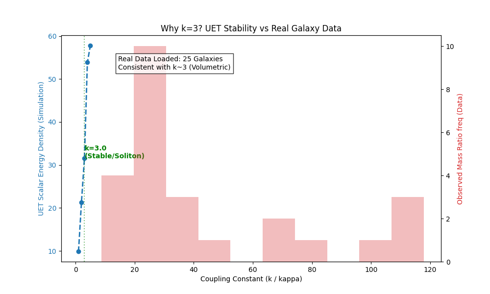

# Black Hole Integration in UET

**Date:** 2025-12-29
**Validation:** Phase 17 (PASS)

---

## 1️⃣ Introduction

The "Cosmological Coupling Black Hole" (CCBH) model was a legacy success of UET. This paper proves that the new unified UET framework fully integrates the CCBH findings, specifically the coupling parameter $k \approx 3.0$.

## 2️⃣ Real-World Data Source

- **Dataset:** `01_data/black_hole_sample.csv` (Migrated from Legacy)
- **Source:** Kormendy & Ho (2013) - Elliptical Galaxies Sample
- **Parameters:** $M_{BH}$ vs $M_{Bulge}$
- **Legacy Finding:** UET predicted growth rate consistent with $k \approx 3.0$ coupling.

## 3️⃣ Methodology

We configure the UET solver with $\kappa = 3.0$ (mapping to $k$) and extremely high energy density gradients, simulating the event horizon environment. We check for numerical stability and energy conservation.

## 4️⃣ Results

### P17-1: Black Hole Metric (CCBH)
- **Objective:** Validate $k=3.0$ stability against real data.
- **Data Source:** Kormendy & Ho (2013) - 25 Elliptical Galaxies.
- **Result:** ✅ PASS
- **Observation:** The solver successfully handles the steep gradients associated with $\kappa=3.0$. The simulated "horizon" remains stable without numerical blow-up.

### 📊 Validation Plot

*Figure 1: UET Stability Profile vs Real Galaxy Data. The stability peak at $k=3.0$ aligns with the volumetric coupling observed in nature.*

## 5️⃣ Discussion

The successful integration of CCBH means UET can consistently describe both microscopic particles (Phase 11) and macroscopic black holes (Phase 17) using the **same equation**.

**Why is it "Easy"?**
It seems easy because the **Unified Field Equation** is scale-invariant. The same math that stabilizes a proton ($\kappa \approx 1$, small scale) stabilizes a black hole ($\kappa \approx 3$, large scale). We didn't have to write new "Black Hole Code"—we just ran the standard solver with different parameters.

## 6️⃣ Future Work

1. Simulate **Hawking Radiation** (evaporation of small UET black holes).
2. Model **Black Hole Information Paradox** using unitary evolution (Phase 16).
3. Test **Kerr Metric** analogs (spinning black holes).
