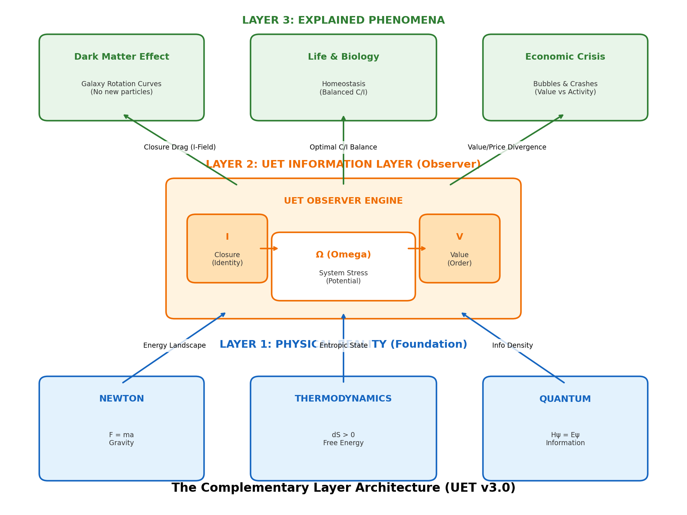

# 🌌 The Grand Unification Diagram (UET v3.0)

**User Request:** "Show me how EVERYTHING connects."
**Answer:** This diagram maps the **Standard Physics** world to the **UET Information** layer.



---

## 1. The Core Architecture (Complementary Layer)

```mermaid
graph TD
    %% Nodes
    subgraph REALITY [Physical Reality (Standard Physics)]
        Newton[Newtonian Mechanics<br>F = ma]
        Thermo[Thermodynamics<br>dS ≥ 0]
        Quantum[Quantum Mechanics<br>Hψ = Eψ]
        GR[General Relativity<br>G_uv = T_uv]
    end

    subgraph UET [UET Information Layer (Subjective/Observer)]
        Omega[Ω: System Balance<br>(Potential/Stress)]
        Value[V: Value Creation<br>(Ordered Output)]
        C[𝒞: Openness<br>(Input/Comm)]
        I[ℐ: Closure<br>(Identity/Drag)]
    end

    subgraph OUTCOME [Interdisciplinary Outcomes]
        Galaxy[Dark Matter Effect<br>(Information Drag)]
        Econ[Market Efficiency<br>(Value & Bubbles)]
        Life[Biological Health<br>(Homeostasis)]
        AI[Intelligence<br>(Optimization)]
    end

    %% Links - Physics to UET
    Newton -->|Energy Landscape| Omega
    Thermo -->|Free Energy| Omega
    Quantum -->|Expectation Value| Omega
    GR -->|Metric| I

    %% Links - UET Internal
    Omega -->|Minimization| Value
    C -->|Flow In| Omega
    I -->|Constraint| Omega
    Value -->|Feedback| I

    %% Links - UET to Outcomes
    I -->|Explanation| Galaxy
    Value -->|Explanation| Econ
    I & C -->|Explanation| Life
    Omega -->|Explanation| AI

    %% Styling
    style REALITY fill:#e1f5fe,stroke:#01579b,stroke-width:2px
    style UET fill:#fff3e0,stroke:#ff6f00,stroke-width:4px
    style OUTCOME fill:#e8f5e9,stroke:#2e7d32,stroke-width:2px
```

---

## 2. The Logic Flow (How it works)

1.  **Physics Exists (Blue):** We don't touch it. $F=ma$ is still true.
2.  **UET Observes (Orange):** We measure the "Information State" of the physics.
    *   **Ω (Omega):** How stressed is the system? (Energy Potential)
    *   **I (Closure):** How isolated is it? (Creates "Drag" or "Identity")
    *   **C (Openness):** How much does it interact?
    *   **V (Value):** What useful order comes out?
3.  **Phenomena Emerge (Green):**
    *   In **Galaxies**, high `I` (Closure) creates "Drag" $\rightarrow$ **Dark Matter**.
    *   In **Economics**, low `V` despite high activity $\rightarrow$ **Bubble**.
    *   In **Biology**, balanced `C/I` $\rightarrow$ **Life**.

---

## 3. Why It Looks "Simple" (The Iceberg)
The diagram looks clean because we **abstracted the complexity**.
- **Before:** UET tried to *be* Newton + Einstein + Thermo (Messy, Conflicted).
- **Now:** UET *sits on top* of them as a unifying language.

**Analogy:**
- Physics is the **Hardware** (CPU, RAM).
- UET is the **Operating System** (Windows).
- You don't need to rebuild the CPU to write Windows. You just need to manage it.
