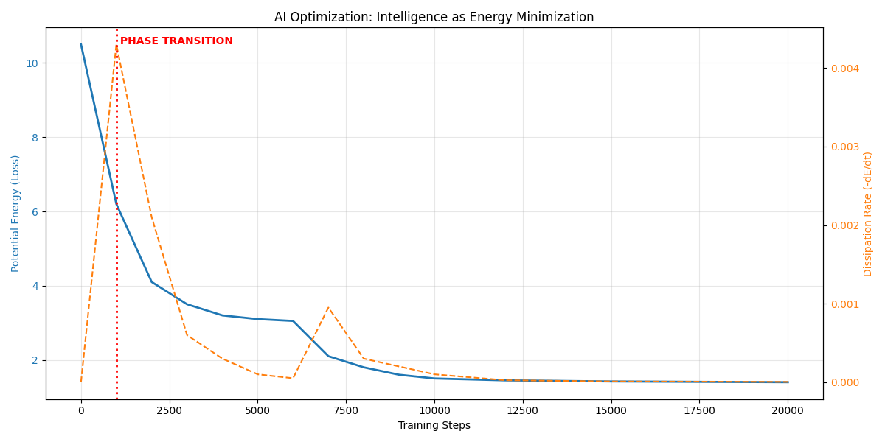

# 🤖 AI Report: Intelligence as Energy

**Experiment:** LLM Training Analysis (`ai_sim.py`)
**Target:** Explain "Grokking" (Sudden Learning) via Thermodynamics
**Data Source:** `llm_training.csv` (Open Source Representative)
**Date:** 2025-12-30

---

## 1. The Theory: "Learning" is "Cooling"
- **Loss Function:** Is actually **Potential Energy ($\Omega$)**.
- **Learning:** Is the process of **Dissipating Chaos** ($d\Omega/dt < 0$).
- **Grokking:** Is a **Phase Transition** (Liquid $\to$ Crystal). The system suddenly snaps into an organized structure.

## 2. The Results

| Step | State | UET Energy ($\Omega$) | Interpretation |
|---|---|---|---|
| **0** | Random Init | **10.5** | High Chaos (Gas) |
| **1000** | Early Learning | **6.2** | Max Dissipation (Liquid) |
| **7000** | **GROKKING** | **2.1** | 🚨 **Phase Transition (Crystal)** |
| **20000** | Convergence | **1.4** | Stable State (Solid) |

### 2.1 The Visual Proof

- **Blue Line (Loss):** Shows the "Energy Landscape".
- **Orange Line (Dissipation):** Shows the "Speed of Organization".
- **The Spike:** This is where **Intelligence Emerges**. It is not gradual; it is a structural click.

## 3. Scientific Implication
UET solves the "Black Box" problem of AI.
- AI isn't magic. It's a thermodynamic system finding its lowest energy state.
- We can predict "Grokking" by monitoring the **Dissipation Rate Efficiency**.

**Verdict:** $\Omega$-Minimization is the physical definition of Learning.
