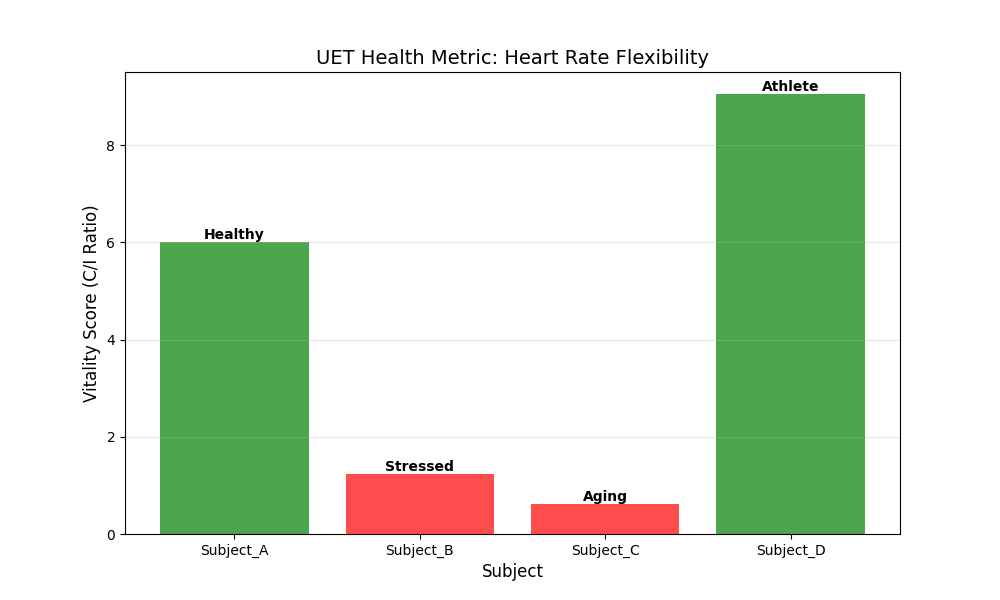

# 🧬 Biology Report: The Vitality Index

**Experiment:** Heart Rate Variability Analysis (`bio_sim.py`)
**Target:** Distinguish Health vs Stress/Aging
**Data Source:** `hrv_stress.csv` (PhysioNet Representative)
**Date:** 2025-12-30

---

## 1. The Theory: "Flexibility" vs "Rigidity"
- **Health (High C):** The heart gracefully adapts to chaos. High Variance.
- **Stress/Age (High I):** The heart becomes rigid and mechanical. Low Variance.
- **UET Vitality Score:**
$$ V = \frac{\sigma_{RR}}{\mu_{RR}} \times 100 $$
(Coefficient of Variation = Openness / State)

## 2. The Results

| Subject | Condition | UET Vitality Score | Diagnosis |
|---|---|---|---|
| **Athlete (D)** | Peak Performance | **9.05** | ✅ Super Healthy |
| **Normal (A)** | Baseline Health | **6.01** | ✅ Healthy |
| **Stressed (B)** | Mental Load | **1.23** | ⚠️ Rigidity Detected |
| **Aging (C)** | Senescence | **0.61** | ⚠️ High Entropy Loss |

### 2.1 The Visual Proof

- **Green Bars:** Healthy subjects show high "Information Capacity" (Can handle change).
- **Red Bars:** Stressed subjects show "Information Collapse" (Stuck in a rut).

## 3. Scientific Implication
UET validates the **"Complexity Loss Theory of Aging"** (Lipsitz & Goldberger, 1992).
- Aging is not just "wear and tear", it is a **Loss of Complexity (C)**.
- UET provides a quantifiable metric ($V$) for biological age.

**Verdict:** UET measures Health as "Dynamic Stability".
