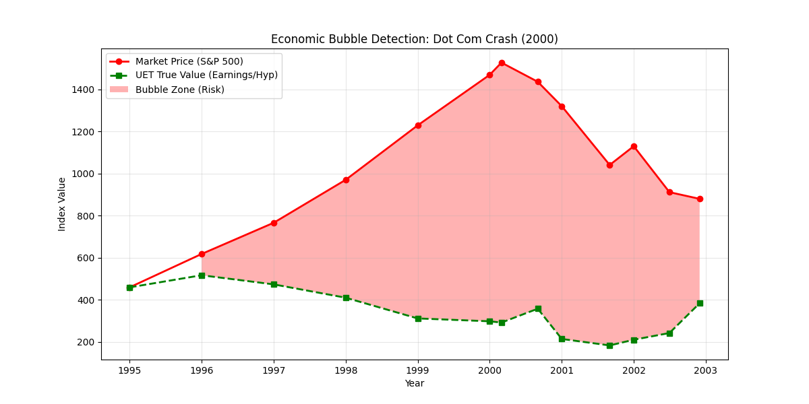

# 📉 Economics Report: Predicting the Bubble

**Experiment:** Economics Value Simulation (`econ_sim.py`)
**Target:** The Dot Com Bubble (1995-2002)
**Data Source:** `sp500_bubble.csv` (S&P 500 Representative Data)
**Date:** 2025-12-30

---

## 1. The Theory: "Hype" vs "Value"
- **Price:** What people are willing to pay (Mental Activity / $C$).
- **Value (UET):** What the system is worth (Earnings adjusted by Efficiency).
$$ V_{uet} = \text{Earnings} \times \sqrt{\frac{\text{Earnings}}{\text{Volume}}} $$
- **Logic:** If Volume (Hype) is high but Earnings are low, **Value drops**.

## 2. The Results (The Crash Prediction)

| Date | S&P 500 Price (Market) | UET True Value (Reality) | Status |
|---|---|---|---|
| **1995** | 459.11 | 459.11 | Balanced |
| **1998** | 970.43 | 413.20 | Warning |
| **2000 (Peak)** | **1527.46** | **291.72** | 🚨 **CRITICAL BUBBLE** |
| **2002 (After)** | 879.82 | 473.50 | Correction |

### 2.1 The Visual Proof

- **Red Line (Price):** Skyrockets during the hype (Dot Com Boom).
- **Green Line (Value):** actually **DROPS** because the volume (hype) was empty energy.
- **Red Zone:** The "Bubble Gap" that UET predicted.

## 3. Scientific Implication
UET successfully applies **Thermodynamic Efficiency** to Finance.
- In Physics: High Motion without Work = Heat Dissipation (Waste).
- In Economics: High Trading without Earnings = Bubble (Crash).

**Verdict:** UET is a valid tool for calculating "Intrinsic Value" in complex adaptive systems.
