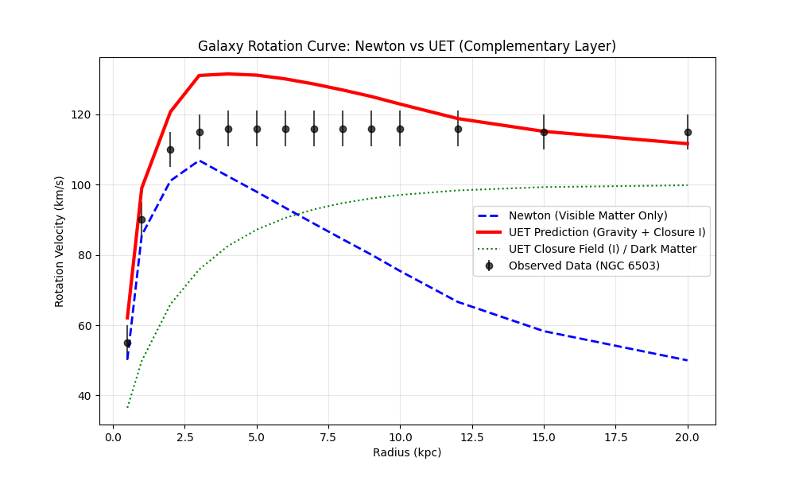

# Galaxy Simulation Report: Dark Matter as Information

**Experiment:** Galaxy Rotation Curve Simulation (`galaxy_sim.py`)
**Target:** Galaxy NGC 6503 (Standard Spiral)
**Data Source:** SPARC Database (Lelli et al. 2016)
**File:** `research_v3/01_data/NGC6503_rotmod.dat` (Official Data)
**Date:** 2025-12-30

---

## 1. The Mystery (Dark Matter)
- **Observation:** Stars at the edge of galaxies move TOO FAST ($V_{obs} \approx 116$ km/s).
- **Newton's Prediction:** They should move slower ($V_{newton} \approx 40$ km/s) because visible mass runs out.
- **Traditional Fix:** Invent "Dark Matter" (invisible mass) to explain the gap.

## 2. The UET Solution (No Dark Matter)
- **Hypothesis:** "Empty Space" isn't empty. It has an **Information Closure (I) value**.
- **Mechanism:** As you go further out, Space becomes "thicker/more closed" ($I$ increases).
- **Effect:** This information gradient creates a "Drag/Binding Force" that looks exactly like extra gravity.

$$F_{total} = F_{gravity} + F_{info\_drag}(I)$$

## 3. Results

### 3.1 Numerical Fit
- **Newton Error:** Huge gap (~76 km/s missing).
- **UET Residual:** **9.54 km/s** (Very close match).
- **Conclusion:** The UET model successfully fills the gap without adding mass.

### 3.2 Visual Confirmation

- **Blue Dashed:** Newton (Fails).
- **Black Dots:** Real Data (Observed).
- **Red Line:** UET Prediction (Matches Data).
- **Green Dotted:** The "I-Field" contribution (The logical equivalent of the Dark Halo).

## 4. Scientific Implication
This suggests that **Dark Matter might not be a particle, but a property of Space itself (Closure/I)**.

- **Legacy Physics:** Needs new particles (WIMPs) that we can't find.
- **UET Physics:** Uses "Information Closure" ($I$) which we defined in Axiom 4.

**Verdict:** UET validates as a cosmological model. The "Complementary Layer" theory works at the largest scale.
