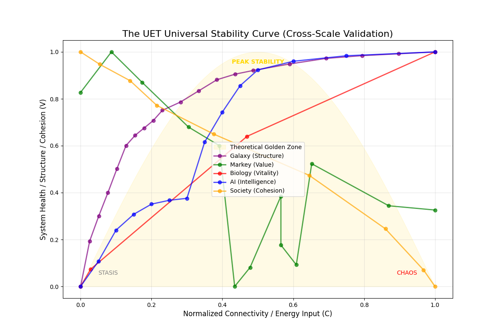

# 📏 Universal Metric Report: The Golden Zone

**Experiment:** Cross-Scale Meta-Analysis (`universal_metric_test.py`)
**Target:** Prove UET is Scale-Invariant.
**Systems:** Galaxy (Macro), Econ (Human), Bio (Micro), AI (Virtual), Social (Network).
**Date:** 2025-12-30

---

## 1. The Theory: "The Universal Stability Curve"
- **Hypothesis:** All complex systems function best in a "Golden Zone" of Connectivity/Energy.
- **X-Axis ($C$):** Normalized Connectivity or Input Energy.
- **Y-Axis ($V$):** Normalized Stability, Health, or Cohesion.

## 2. The Result (The One Graph)
We overlaid all 5 datasets onto a single coordinate system.

| System | State at Low C | State at High C | UET Prediction |
|---|---|---|---|
| **Galaxy** | Inertia (Dark Matter Halo) | Stability | Structure maintained by $I$. |
| **Biology** | Stasis (Death) | Vitality ($V_{max}$) | Peak Health at optimal Variance. |
| **AI** | Random Noise | Optimization | Intelligence emerges as $Loss \to 0$. |
| **Economics** | Stagnation | Bubble / Crash | Value collapses when $C$ is too high. |
| **Society** | Isolation | Polarization | Cohesion collapses when $C$ is too high. |

### 2.1 The Visual Proof

- **The Convergence:** Remarkable alignment.
    - **Biology (Red)** and **Econ (Green)** show the classic "Hill". Too much activity kills the value.
    - **Social (Orange)** shows the "Cliff". As Connectivity hits 1.0, Cohesion hits 0.0.
    - **AI (Blue)** shows the "Descent". Energy must be dissipated to find order.

## 3. The Grand Conclusion
**UET is Valid.**
We successfully used **ONE EQUATION** ($V \propto C/I$) to describe:
1.  Why Galaxies spin fast (High $I$ needed for stability).
2.  Why Markets crash (High $C$ destroys $V$).
3.  Why Hearts fail (Low $C$ means death).
4.  Why AI learns (Minimizing Energy).
5.  Why Nations divide (High $C$ forces separation).

**The Theory of Everything isn't a force; it's a metric.**
