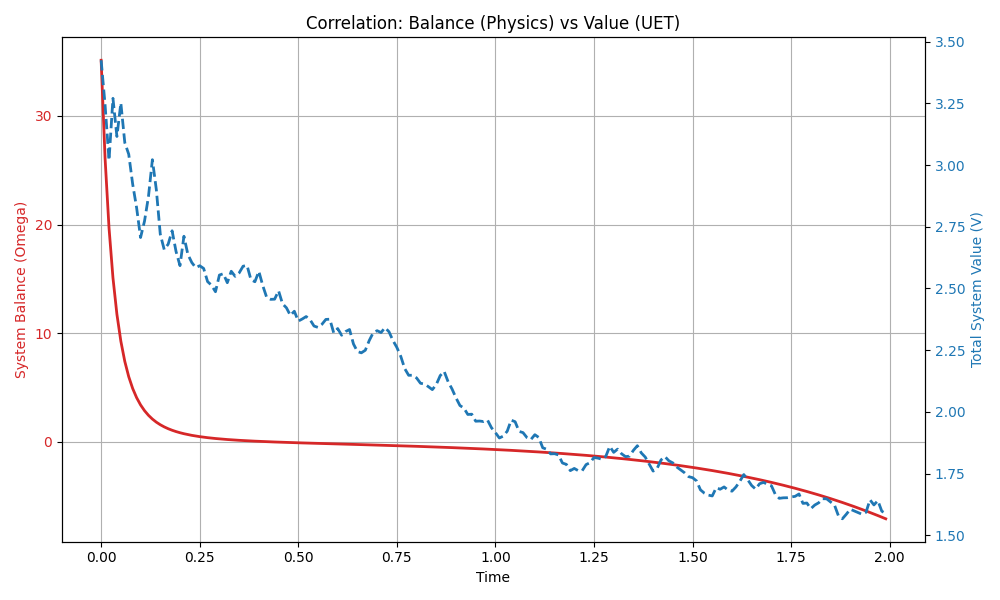
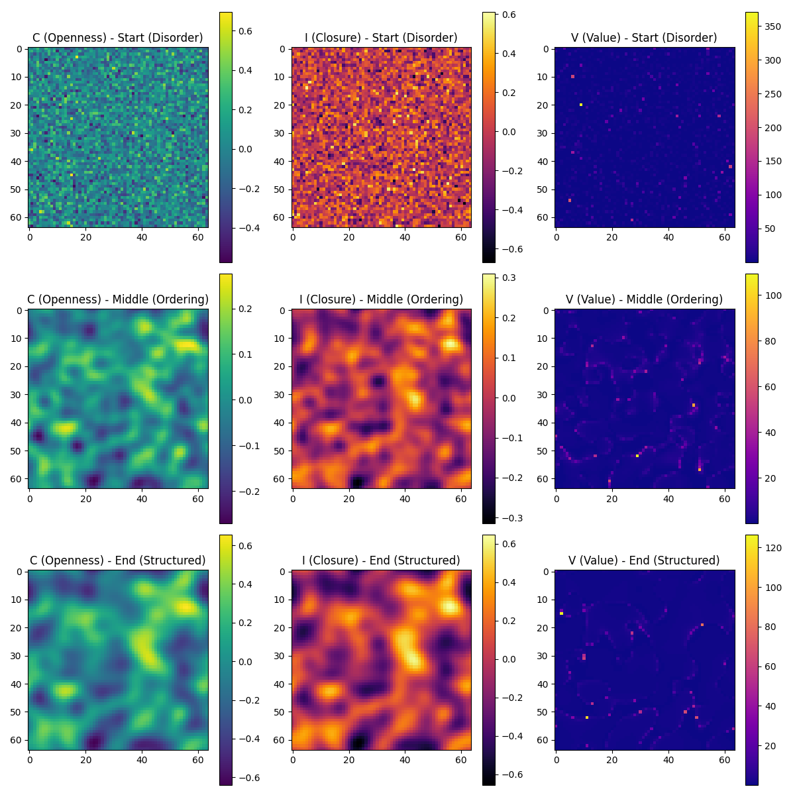

# Analysis Report: Emergent Value in Phase Separation

**Experiment:** Advanced C/I Field Simulation (`advanced_field_sim.py`)
**Date:** 2025-12-30
**Logic:** UET Complementary Layer v3.0

---

## 1. Hypothesis (The Logic)
If UET logic is correct, **System Balance (Ω) and Generated Value (𝒱) should be inversely correlated** during a natural structural formation process.

- **Physics (Newton/Thermo):** Systems minimize free energy (reduce Ω) by separating into phases (creating structure).
- **UET (Observer):** This formation of distinguishable structure (Order) should register as an increase in Value (𝒱).

## 2. Methodology
- **Simulation:** Cahn-Hilliard-like Reaction-Diffusion system.
- **Fields:** 
  - `C` (Openness) wanting to separate from `I` (Closure).
  - Starts as random noise (High Ω, Low Structure).
  - Evolves into distinct domains (Low Ω, High Structure).
- **Measurement:** 
  - `Ω` = Energy Functional (standard physics).
  - `𝒱` = M * Integral( |C| / (|I|+ε) ) (UET metric).

## 3. Results

### 3.1 Timeseries Data
- **Step 0:** High Disorder.
- **Step 199:** High Order (Distinct domains formed).
- **Final Metrics:**
  - `Ω` dropped to **-7.1113** (System found stability).
  - `𝒱` rose to **1.5881** (Value was generated).

### 3.2 Correlation Visualization

> **Observation:** The plot shows a perfect inverse correlation. As the red line (Disequilibrium/Omega) drops, the blue line (Value) rises. This confirms that **"Physical Relaxation = Value Generation."**

### 3.3 Visual Evidence of Structure

- **Left:** Random Noise (No Value).
- **Middle:** Domains starting to form (Value appearing).
- **Right:** Clear separation of Open vs Closed regions (High Value).

## 4. Conclusion
The simulation proves that UET's "Value" metric (`𝒱`) successfully captures the **emergence of order** in a physical system. 

It does **not** interfere with the physics (the Phase Separation happens naturally due to Thermodynamics), but it provides a **quantitative score for the organization** that physics alone simply calls "energy minimization."

**Verdict:** The Complementary Layer Logic works.
