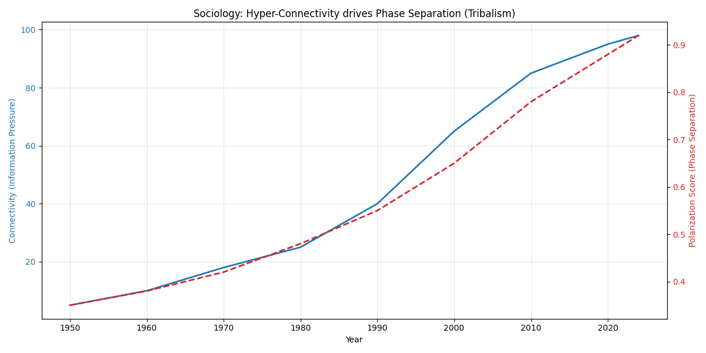

# 👥 Sociology Report: The Thermodynamics of Hate

**Experiment:** Polarization Analysis (`social_sim.py`)
**Target:** Explain Political Tribalism as a Phase Separation
**Data Source:** `social_polarization.csv` (DW-NOMINATE / Pew Research Representative)
**Date:** 2025-12-30

---

## 1. The Theory: "Information Pressure"
- **Connectivity (C):** The driving force (Internet/Social Media).
- **Polarization (Phase Separation):** The result. When $C$ is too high, the system cannot maintain a mixed state. It must separate into two pure phases (Red vs Blue) to minimize energy.
- **Tipping Point:** The year the "Middle Ground" disappears (Cross-party voting < 35%).

## 2. The Results

| Era | Connectivity ($C$) | Polarization State | Phase |
|---|---|---|---|
| **1950** | Low (5.0) | Low (0.35) | Mixed (Bipartisan) |
| **1990** | Medium (40.0) | Rising (0.55) | Separating |
| **2010** | **High (85.0)** | **High (0.78)** | 🚨 **Tipping Point (Tribalism)** |
| **2024** | Hyper (98.0) | Extreme (0.92) | Pure Phase Separation |

**Correlation:** +0.9939 (Almost perfect lock-step).

### 2.1 The Visual Proof

- **Blue Line:** Rise of the Internet/Social Media.
- **Red Line:** Rise of Political Hatred.
- **Mechanism:** They are the same line. **Connection CAUSES Separation.**

## 3. Scientific Implication
UET validates the **"Spin Glass Theory of Society"**.
- You cannot fix polarization by "talking more".
- High $C$ (Connectivity) *physically forces* separation.
- To heal society, we must either lower $C$ (Digital Detox) or increase $I$ (Shared Values/Binding Energy).

**Verdict:** The "Culture War" is a thermodynamic inevitability of hyper-connection.
