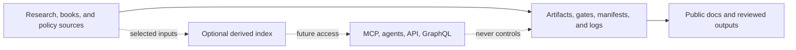

# UET Context Map

This file answers: where should a change be made, and what may depend on it?
It is a routing map, not a second project standard.

## Workspace map

| Area | Canonical workspace | Use it for | Do not use it for |
| :-- | :-- | :-- | :-- |
| `research-core` | `docs/core/`, `docs/topics/` | equations, experiments, evidence, topic status | service runtime state |
| `research-standards` | `docs/topics/For Work/`, `AGENTS.md` | shared research workflow and claim rules | topic-specific results |
| `theory-history` | `uet_history/` | historical theory notes and archive structure | current topic gate decisions |
| `book-writing` | `uet_history/3_publish/books/` | canonical book drafts, blueprints, registry | raw chat or unreviewed media |
| `thai-policy` | `thailand_proposals/` | policy and project proposals | research evidence status |
| `services-tools` | `services_and_experiments/` | optional agents, KB, API, Rust experiments | canonical claims or topic readiness |
| `repo-ops` | `.github/`, `WORK_LEDGER/`, manifests | CI, checkpoints, publishing, repository hygiene | scientific conclusions |
| `raw-private` | ignored/local-only paths | raw sources, private exports, large media | public documentation |

## Dependency direction

## Routing rules

- Change a claim, formula, source, result, or topic status in the relevant
  canonical workspace first.
- Change shared research behavior in `AGENTS.md` or `docs/topics/For Work/`.
- Change book identity or public book paths through the book registry and
  `uet_history/BOOK_WORKFLOW.md`.
- Change service behavior only inside `services_and_experiments/`, with a
  service README and boundary status kept current.
- Change retrieval/indexing code without changing canonical source files.
- Use `WORK_LEDGER/` for repo-wide history and local `UPDATE_LOG.md` files for
  topic or book wave history.

## Canonical versus derived

`docs/knowledge_base/` and any vector, SQLite, LanceDB, or PostgreSQL index are
derived retrieval layers. Search results must point back to source paths and
must not be used to promote evidence, status, or publication claims.

## Checkpoint route

Every completed work section follows:

1. classify the area
2. edit the canonical source
3. run the relevant check or review
4. update the local log when the area has one
5. add one factual `WORK_LEDGER` entry
6. inspect scope with `git status`
7. commit the coherent unit
8. push the branch or open a draft PR the same day

At ten ledger entries for unpushed work, stop expanding scope and checkpoint.

## Repository and branch routing

main is the only public canonical branch. Normal work uses one short-lived
branch per coherent unit with the area prefix codex/research/, codex/book/,
codex/history/, codex/policy/, codex/services/, or codex/repo/, then enters
main through a PR and required CI checks.

CONTRIBUTING.md is the human contribution contract, AGENTS.md is the
agent-facing operating summary, and .github/workflows/ is the executable
validation layer. Do not create a second branch policy or semantic path to
avoid an existing canonical workspace.

Before cleanup, inspect worktrees, local branches, remote heads, PRs, and
unique commits. git fetch --prune origin removes stale tracking refs, but a
branch is deletable only after its work is merged or explicitly superseded and
its unique commits are accounted for. A local branch tracking origin/main does
not become main merely because its upstream points there.

GitHub Actions may validate files and publish Pages, but it must not silently
commit or push source changes. A completed section is visible only when its
ledger entry, coherent commit, and pushed branch or PR are all present.
