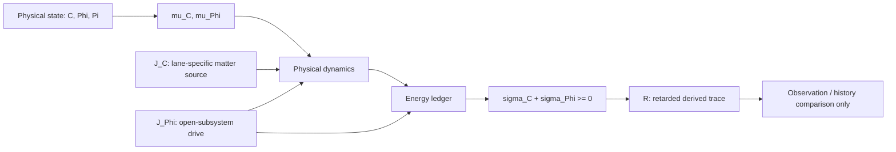

# UET Matter-Space Response and Derived Trace: Integrated Research Report

> **Evidence snapshot:** 2026-07-21
> **Program status:** `BLOCKED`
> **Claim ceiling:** `candidate normalized effective model`
> **Controlling blocker:** `core_prearrival_leakage`

## 1. Technical summary

The implemented program now expresses the intended change of viewpoint without
introducing information as a new substance.  The physical state is
`(C, Phi, Pi)`: matter or structure, effective space response, and its rate.
The trace `R` is calculated only after physical evolution from the history of
non-negative dissipation.  It can differ between histories, but it has no edge
back into the physical equations.

This distinction is the central result of the workstream:

- seeing the same `C` does **not** imply the same complete present, because
  `Phi` and `Pi` are physical state variables in this candidate model;
- seeing the same complete physical state `(C, Phi, Pi)` **does** produce the
  same future even when the stored trace history differs;
- therefore `R` is a derived record or observable of what has happened, not an
  independent information fluid, matter component, or hidden energy source.

The normalized variational and accounting structure is internally coherent in
the current one-dimensional implementation.  Sixteen of seventeen core gates
pass, including exact matter conservation at roundoff, functional-derivative
checks, dissipation sign, energy descent, open and closed ledgers, convergence,
trace invariance, and the three-scale adiabatic limit.  The one failed gate is
decisive: pre-arrival response is `1.7639381e-2` of the peak, above the declared
`1e-6` maximum.  Arrival speed itself is within `0.604%` of the declared speed,
but the compact-support requirement is not met.  Physical spacetime or causal
medium interpretation is therefore blocked for the current discretization.

Topic 0.13 is a synthetic control only.  Topic 0.11 is a passing internal
coupling diagnostic, but remains dependency-blocked and does not change the
topic's existing Draft/Tier B status or its Wave 55 structure-factor
controller.  No external, SI, galaxy, particle, antimatter, Dirac, or
dark-matter claim is supported.

The machine-readable controlling record is
[`matter_space_research_program_gate.json`](./artifacts/matter_space_research_program_gate.json).

## 2. Key findings

### 2.1 The causal order is now explicit

There is deliberately no arrow from `R` back to `C`, `Phi`, or `Pi`.  The
history buffer is a computational cache, not an additional ontology.

### 2.2 Internal closure passes; physical causality does not yet pass

| Core gate | Result | Threshold | Status |
|---|---:|---:|---|
| Local derivative residual | `2.71e-14` | `<= 1e-10` | PASS |
| Discrete directional derivative, periodic | `6.59e-11` | `<= 1e-6` | PASS |
| Conserved matter drift | `0` | `<= 1e-10` | PASS |
| Minimum dissipation density | `6.40e-6` | `>= -1e-12` | PASS |
| Closed-system energy increase | `0` | `<= 1e-9` | PASS |
| Closed ledger residual | `6.11e-9` | `<= 1e-6` | PASS |
| Open-space ledger residual | `9.03e-9` | `<= 1e-6` | PASS |
| Trace-history physical difference | `0` | `<= 1e-12` | PASS |
| Arrival-speed relative error | `6.04e-3` | `<= 5e-2` | PASS |
| Pre-arrival leakage fraction | `1.76e-2` | `<= 1e-6` | **FAIL** |
| Temporal convergence order | `2.014` | `>= 1.5` | PASS |
| Spatial convergence order | `1.994` | `>= 1.5` | PASS |
| Finest adiabatic-limit error | `3.12e-4` | `<= 5e-2` | PASS |

Source: [`matter_space_variational_verification.json`](./artifacts/matter_space_variational_verification.json).

The failed leakage gate is not cosmetically overridden.  No field clipping,
cone padding, or fitted parameter was used in the verifier.  It currently
falsifies the **physical causal interpretation of this discretization**, not
the entire ontology split or the variational equations.

### 2.3 Topic 0.13 separates controls from evidence

The thermal pilot compares Fourier response, analytical Cattaneo response,
trace-only response, a linearized `Phi` control, and the nonlinear coupled
candidate.  Cattaneo residual, phase, lag, hysteresis, convergence, source sign,
and refined ledger gates pass.  The pilot still fails internally because it
inherits the core leakage failure, and external readiness is blocked because
there is no dimensional map from `Phi` to measured temperature or TTG signal.

| 0.13 metric | Value | Gate |
|---|---:|---|
| Cattaneo analytical residual | `0` | PASS |
| Phase relative error | `9.27e-8` | PASS |
| Lag relative error | `9.27e-8` | PASS |
| Hysteresis relative error | `2.31e-7` | PASS |
| Locked ledger residual | `1.49e-5` | FAIL |
| Disclosed refined ledger residual | `6.02e-7` | PASS |
| Core pre-arrival leakage | `1.76e-2` | FAIL |
| External source readiness | metadata only | BLOCKED |

*The arrival-speed estimate is acceptable, while visible pre-arrival leakage
keeps the physical causal claim blocked.*

*This is a normalized ledger, not an SI heat or entropy balance.  The artifact
preserves both the failed locked run and the disclosed numerical refinement.*

Controlling artifact:
[`matter_space_thermal_control.json`](../topics/0.13_Thermodynamic_Bridge/Result/artifacts/matter_space_thermal_control.json).

### 2.4 Topic 0.11 detects a real coupling signal without making `R` causal

The phase-transition pilot compares a legacy instantaneous lane, canonical
conserved `C` dynamics, canonical `C` plus a derived trace, the full coupled
`(C, Phi, Pi)` candidate, and an adiabatic reduction.  All thirteen internal
diagnostic gates pass.

| 0.11 metric | Value | Meaning |
|---|---:|---|
| Matter relative drift | `1.11e-15` | conserved at roundoff |
| Maximum energy increase | `0` | descent retained |
| Locked ledger residual | `3.49e-5` | failed locked run retained |
| Disclosed refined ledger residual | `3.49e-7` | passes at unchanged threshold |
| Coupling-effect RMS | `6.16e-6` | nonzero diagnostic effect |
| Temporal error RMS | `4.53e-11` | effect/error ratio `1.36e5` |
| Resolution effect ratio | `0.889` | effect persists under refinement |
| Same `C`, different `Phi,Pi` response | `8.00e-2` | `C` alone is incomplete state |
| Same complete state, different `R` history | `0` | trace does not control dynamics |
| Different-history trace difference | `1.25e-3` | histories remain observationally distinct |
| Finest adiabatic error | `4.81e-8` | reduction converges |

*The coupling effect is deliberately small but exceeds the measured temporal
discretization error and persists across resolution.*

*Changing `Phi,Pi` changes the future; changing only derived `R` history does
not.  This is the operational distinction between physical becoming and a
record of what has already occurred.*

Controlling artifact:
[`0_11_matter_space_coupled_diagnostic.json`](../topics/0.11_Phase_Transitions/Result/artifacts/0_11_matter_space_coupled_diagnostic.json).

This pilot does not accept its interface width, structure-factor peak, or
correlation-length values as claim-bearing estimators.  Topic 0.11 remains
Draft/Tier B.  Its separate controlling blocker remains
`ch_finite_k_replicate_temporal_acquisition_plan_defined_execution_open`, as
recorded in
[`0_11_closure_status_audit.json`](../topics/0.11_Phase_Transitions/Result/artifacts/0_11_closure_status_audit.json).

## 3. Scope, evidence, and metrics

### 3.1 What the program currently contains

- one-dimensional normalized finite-volume spatial operators;
- an opt-in `matter_space_coupled_v1` operator;
- conserved and nonconserved matter lanes;
- inertial-relaxational effective space response;
- open and closed energy ledgers;
- a one-way retarded trace from dissipation history;
- deterministic synthetic core, thermal-control, and phase-coupling tests;
- hashes for source artifacts, pilot outputs, and dependencies.

### 3.2 What the evidence does not contain

- an SI coefficient or observable contract;
- raw external thermal measurements;
- a fitted or validated `Phi -> temperature/heat-flux/TTG signal` map;
- a geometry or Lorentz-covariant derivation;
- full galaxy rotation curves, histories, uncertainties, or holdout tests;
- spinor, conserved-current, CPT, antimatter, positron, or neutrino derivations.

The graphite and NaF references in the 0.13 package are metadata-level source
candidates only:

- [Ding et al., Observation of second sound in graphite over 200 K (2022)](https://www.nature.com/articles/s41467-021-27907-z)
- [Huberman et al., Observation of second sound in graphite at temperatures above 100 K (2019)](https://arxiv.org/abs/1901.09160)
- [McNelly et al., Heat pulses in NaF (1970)](https://doi.org/10.1103/PhysRevLett.24.100)
- [Room-temperature second sound in isotopically pure graphite (2026)](https://www.nature.com/articles/s41467-026-70807-3), locked as a future holdout

No numeric value from these sources was used to fit or validate the candidate.

### 3.3 Artifact-quality review

The integrated audit verifies ten pilot-output hashes and three dependency
hashes; all match.  The JSON artifacts—not plots or `_Logs`—remain the
controlling evidence.

There is one layout warning.  The eight scientific pilot figures remain under
the repository's legacy `Result/03_show_Result/` directories, while the current
result standard assigns scientific figures to `Result/02_Figures/`.  This does
not invalidate the recorded numeric evidence, but a later layout-only migration
should update artifact paths and hashes together.

## 4. Model and experiment design

### 4.1 Ontology and functional

The implemented normalized candidate uses

\[
\Omega[C,\Phi] = \int \left[
\frac{a_C}{2}C^2 + \frac{b_C}{4}C^4
+ \frac{\kappa_C}{2}|\nabla C|^2
+ \frac{a_\Phi}{2}\Phi^2 + \frac{b_\Phi}{4}\Phi^4
+ \frac{\kappa_\Phi}{2}|\nabla\Phi|^2
- \frac{g}{2}C^2\Phi
\right]dx.
\]

Its exact variational pair is

\[
\mu_C = a_CC + b_CC^3 - \kappa_C\nabla^2C - gC\Phi,
\]

\[
\mu_\Phi = a_\Phi\Phi + b_\Phi\Phi^3
- \kappa_\Phi\nabla^2\Phi - \frac{g}{2}C^2.
\]

For the conserved matter lane,

\[
\partial_t C = M_C\nabla^2\mu_C + J_C,
\qquad \int J_C\,dx = 0.
\]

The effective space response is

\[
\partial_t\Phi = \Pi,
\qquad
\tau_\Phi\partial_t\Pi + \Pi = -M_\Phi\mu_\Phi + J_\Phi.
\]

`Phi = 0` means the chosen ordered-space reference; it does not mean that space
is empty or physically nonexistent.  The signed `Phi` variable describes a
departure from that reference.  The present functional does **not** yet derive
a thermodynamic entropy ordering that proves “space is maximally ordered and
matter maximally disordered”; that interpretation remains an ontology-guided
constitutive hypothesis.

The coupling term makes matter configuration bias the effective space response.
It does not identify matter with antimatter, establish cancellation with space,
or produce Dirac particles.

### 4.2 Energy and dissipation

The extended energy is

\[
\mathcal E = \Omega + \frac{\tau_\Phi}{2M_\Phi}\int\Pi^2dx.
\]

For periodic or no-flux closed runs,

\[
\frac{d\mathcal E}{dt}
= -\int(\sigma_C+\sigma_\Phi)dx \le 0,
\]

with conserved-lane
`sigma_C = M_C |grad(mu_C)|^2` and
`sigma_Phi = Pi^2/M_Phi`.  When `J_Phi` is present, its work is entered in the
open-subsystem ledger.  The code therefore realizes the project's
“matter closed / effective space subsystem open” framing as follows:

- the conserved matter lane preserves the spatial integral of `C`;
- the effective space subsystem may exchange work through `J_Phi`;
- that exchange is recorded rather than called missing energy.

This is an effective open-system ansatz.  It is not a proof that the complete
universe is globally an open system, which would also require a defined exterior
or a more precise global thermodynamic construction.

### 4.3 Derived trace

Only after the physical step is complete is the observable evaluated:

\[
R(x,t) = G_{\mathrm{ret}} * (\sigma_C + \sigma_\Phi).
\]

`R` may be interpreted as a calculable history-sensitive record.  Infrared or
heat maps may serve as proxies in a particular experimental lane, but they are
not a universal identity for `R`.  Energy conservation does not by itself prove
that all information is permanently stored as a separately measurable field;
it only requires the relevant physical energy exchanges to close.  The new
operator keeps those two statements separate.

### 4.4 Numerical contract

- dimension: one-dimensional only;
- units: normalized only;
- spatial operator: finite-volume Laplacian with periodic or zero-flux closure;
- integrator: Heun/RK2;
- stability: explicit preflight from fourth-order matter stiffness, damping,
  and `v_Phi = sqrt(M_Phi kappa_Phi / tau_Phi)`;
- oversized `dt`: rejected with `recommended_max_dt`;
- field clipping: forbidden;
- trace feedback: forbidden;
- legacy defaults: unchanged; ambiguous legacy `I`, `V`, and flux roles are
  rejected by the new entry point.

The adiabatic comparison shrinks all three required scales together:
`tau_Phi -> 0`, `(M_Phi a_Phi)^-1 -> 0`, and
`sqrt(kappa_Phi/a_Phi) -> 0`, then compares against the local cubic equilibrium.

## 5. Limitations, uncertainty, and robustness

### 5.1 Controlling limitation: numerical causal leakage

The central-Laplacian/Heun implementation reproduces the target arrival speed
but not the declared compact cone.  Until leakage is reduced from `1.76e-2` to
`<= 1e-6` without clipping or redefining the cone after seeing the result, `Phi`
cannot be presented as an established finite-speed physical space response.

The repair experiment should compare at least:

1. the current second-order method as the frozen baseline;
2. a first-order hyperbolic relaxation formulation with a conservative
   finite-volume flux and predeclared CFL policy;
3. a retarded-kernel reference evaluated independently of the time-stepper;
4. temporal and spatial refinement with the same detector, cone definition,
   pulse, and leakage threshold.

The output should be a new causal-discretization artifact.  The program gate
must remain blocked if leakage only appears to pass after detector movement,
cone padding, clipping, or fitting to the verification pulse.

### 5.2 Numerical amendments

Both pilots preserve their original failed locked-run ledger values.  Smaller
time steps were added only after the failure was observed.  Physical parameters,
thresholds, initial conditions, and external-data status were not changed.
Their refined ledger results are therefore useful numerical sensitivity
evidence, but not blind confirmations.  The integrated gate records this as
`WARN / PASS_WITH_DISCLOSED_POST_DIAGNOSTIC_NUMERICAL_AMENDMENTS`.

### 5.3 Legacy mismatch remains open

The new mode has an exact functional/derivative pair, but legacy
`potential_V()` and `potential_derivative()` still use different polynomial
arguments.  Legacy behavior was not silently changed.  The older
`spacetime_trace_v1` factor `1/(1+gR)` remains a heuristic comparator with trace
feedback; it is not the ontology of `matter_space_coupled_v1`.

See
[`master_equation_alignment_gate_v2.json`](./artifacts/master_equation_alignment_gate_v2.json).

### 5.4 External and SI uncertainty

Before any sourced thermal comparison, the project needs a lane-specific map
from `Phi` to the measured observable, with units, extraction uncertainty,
preprocessing, source locator, and data hash.  Landauer's
`k_B T ln 2` remains an external lower-bound constraint and is not a derivation
of the normalized coupling coefficient.

## 6. Falsification state

| Criterion | Current state | Consequence |
|---|---|---|
| Response outside declared cone | **Triggered for current discretization** | physical causal interpretation blocked |
| Coupling no larger than numerical error | Not triggered in 0.11 | small effect remains diagnostic |
| Energy ledger cannot close | Not triggered after disclosed `dt` refinement | evidence remains non-blind/WARN |
| `R` feedback required | Not triggered | ontology split survives current tests |
| New matter/energy identity required | Not triggered | no new substance is needed numerically |
| Effect only after fitting one dataset | Not tested; external data absent | no validation claim allowed |
| Potential requires clipping for stability | Not triggered in the tested parameter set | no general global-stability proof |

The falsification boundary is lane-specific.  Failure of the present causal
stencil lowers the physical interpretation of this implementation; it does not
license replacing the failed test with philosophical certainty, nor does it
automatically reject every possible discretization of the candidate equations.

## 7. Downstream dependency gates

| Topic | State | Required before active use |
|---|---|---|
| 0.10 Fluid Dynamics | BLOCKED | constitutive stress and history-dependent viscosity map |
| 0.12 Vacuum Energy | BLOCKED | ordered-space boundary interpretation without substance identity |
| 0.19 Gravity/GR | BLOCKED | geometry and Lorentz-covariant bridge |
| 0.23 Unity Scale | BLOCKED | SI units and cross-scale parameter policy |
| 0.1 Galaxy Rotation | BLOCKED | full curves, uncertainty, three baselines, history policy, locked parameters, holdout |
| 0.26 Cosmic Dynamic Frame | BLOCKED | passing core causality, 0.1 evidence, causal-memory policy |

Topics 0.5, 0.6, 0.7, 0.9, 0.17, and 0.20 remain deferred foundation work.
The particle/Dirac program requires a Lorentz-covariant action, spinor
representation, conserved current, and CPT gates before `Phi` can be connected
to particle, antiparticle, positron, or neutrino statements.

## 8. Claim boundary

Allowed now:

- matter-space equation: `candidate normalized effective model`;
- `Phi`: `effective space-response variable`;
- `R`: `derived causal observable` with no backreaction;
- Topic 0.13: `synthetic control / simulation-only`;
- Topic 0.11: `internal diagnostic`;
- open space subsystem: `open-system constitutive ansatz`.

Blocked now:

- global proof that the universe is an open system;
- `Phi` as established spacetime geometry, ether, metric tensor, antimatter, or
  particle;
- `R` as an independent information field, matter, or energy reservoir;
- external thermodynamic validation;
- Dirac, positron, neutrino, or CPT derivation;
- galaxy dynamics or dark-matter replacement.

## 9. Recommended next steps

1. Freeze the present causal pulse, detector, threshold, and current stencil as
   the baseline artifact.
2. Implement and preregister a conservative hyperbolic relaxation candidate;
   rerun arrival, leakage, convergence, ledger, trace-invariance, and no-clipping
   gates together.
3. Migrate the eight pilot figures to `Result/02_Figures/` in a layout-only wave
   and regenerate their artifact hashes.
4. If core causality passes, define the 0.13 dimensional observable map before
   acquiring or extracting any numeric source curve.
5. Keep the 2026 graphite result sealed as holdout until the map, units,
   uncertainty policy, and train/holdout parameter lock are complete.
6. Continue the independent 0.11 Wave 55 acquisition plan without using this
   pilot to alter its estimator or universality status.
7. Start 0.10, then 0.12, 0.19, and 0.23 bridges in that order before reopening
   0.1 and 0.26.

## 10. Further research questions

- Can a local conservative hyperbolic formulation meet the `1e-6` cone gate
  while preserving the currently passing normalized ledger and second-order convergence?
- Which experimental observable can be mapped to `Phi` without defining `Phi`
  circularly from the same curve used for validation?
- Is the matter-space coupling distinguishable from an ordinary auxiliary
  order parameter after model-complexity and holdout penalties?
- Can “ordered space” be given an explicit entropy or information-geometric
  definition whose units and monotonicity are testable?
- What Lorentz-covariant action, if any, reduces to this normalized dissipative
  model in a controlled limit?
- Which history-sensitive observable survives after all Markovian auxiliary
  baselines are fitted under the same parameter budget?

## 11. Reproducibility map

- Core implementation: [`uet_matter_space.py`](./uet_matter_space.py) and
  [`uet_spatial.py`](./uet_spatial.py)
- Core verifier: [`audit_matter_space_core.py`](../scripts/audit/audit_matter_space_core.py)
- Program audit: [`audit_matter_space_research_program.py`](../scripts/audit/audit_matter_space_research_program.py)
- Ontology contract: [`matter_space_ontology_contract.json`](./artifacts/matter_space_ontology_contract.json)
- Formula audit: [`matter_space_formula_audit.json`](./artifacts/matter_space_formula_audit.json)
- Program gate: [`matter_space_research_program_gate.json`](./artifacts/matter_space_research_program_gate.json)
- Research specification: [`MATTER_SPACE_RESEARCH_SPEC.md`](../../01_contracts/MATTER_SPACE_RESEARCH_SPEC.md)

## Latest plan update - 2026-08-08 synthetic SI 3D density operator

The augmented C-density lane now has a declared 3D volume-density operator, `rho_3D=A_m*rho_hat/(L_x L_y L_z)`, with explicit kg amplitude, three metre scales, finite-volume integral closure, declared source uncertainty, calibration status, and holdout policy. The deterministic artifact passes as `PASS_WITH_BLOCKED_EXTERNAL_3D_MAPPING`; volume rescaling preserves total kg and changes density scale as expected.

This is a measurement/operator contract, not a derivation of mass from `C`: the synthetic shape is supplied independently, `A_m` is an explicit source input, no external calibration or data were used, and no galaxy fit or holdout was run. The next controller is an external 3D density source package with calibration and propagated uncertainty.
