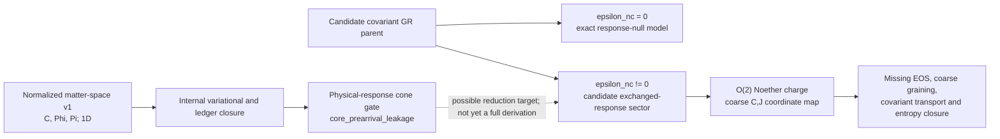

# Matter-Space Research Report Addendum: GR/Noether and Dependency Alignment

> **Evidence cutoff:** 2026-07-23 generated artifacts
> **Addendum date:** 2026-07-23
> **Scope:** post-Wave-10 alignment; the 2026-07-21 integrated report is retained as a historical snapshot
> **Alignment state:** `PASS_WITH_HISTORICAL_BASE_REPORT_WARN`
> **Claim ceiling:** class-B candidate mathematics plus internal dependency boundaries

## Outcome

The original matter-space report remains valid for its declared normalized,
one-dimensional program. Its failed compact-cone gate is still the controlling
physical-response issue in that lane. Later work did not erase that result. It
created a separate, broader GR/Noether program with a different controlling
blocker.

- Base matter-space controller: `core_prearrival_leakage`
- Extended GR controller: `physical_kubo_coefficient_evidence_and_curved_3p1_solver_missing`
- Global-universe closure: `UNRESOLVED`

The newer evidence supports a candidate covariant parent, an exact nested
response-null limit, a restricted causal constitutive sector, a partial
response reduction, an O(2) matter-action pilot, and an exact fixed-scale
hydrodynamic coordinate map. Wave 10 additionally supplies a tree-level,
finite-density O(2) mean-field equation of state and a zero-temperature ideal
covariant superfluid constitutive layer. It does not yet supply physical Kubo
coefficient values, a finite-temperature two-fluid completion, covariant
coarse-graining, a curved 3+1 solver, SI map, or external physical validation.

The machine-readable alignment record is
[`matter_space_report_alignment_gate.json`](./artifacts/matter_space_report_alignment_gate.json).

## 1. Two programs, two simultaneous controllers



These controllers answer different questions:

| Program layer | What is currently established internally | Current blocker |
|:--|:--|:--|
| Normalized matter-space v1 | Functional/derivative pairing, conserved lane, ledgers, trace invariance, convergence, and adiabatic controls | Pre-arrival leakage exceeds the frozen compact-cone threshold |
| Extended GR/Noether program | Candidate covariant response formulas, exact response-null branch, local exchange identity, restricted 1+1 causal kernel, partial reduction, O(2) current, and fixed-scale charge-coordinate map | Charge equation of state, covariant coarse-graining, susceptibility/transport matching, and entropy/Bianchi closure |

The first program remains controlled by
[`matter_space_research_program_gate.json`](./artifacts/matter_space_research_program_gate.json).
The extended program is controlled by
[`uet_gr_research_program_gate.json`](./artifacts/uet_gr_research_program_gate.json)
and
[`noether_phase_field_dependency_gate.json`](./artifacts/noether_phase_field_dependency_gate.json).

## 2. What “closed” and “open” mean in the current model

The repository now separates four meanings that must not be collapsed:

| Question | Current answer |
|:--|:--|
| Is the declared matter amount conserved? | Yes in the conserved matter lane, subject to the declared zero-net source condition. |
| Can an observed/effective subsystem exchange stress-energy? | Yes as a candidate local exchange-completed branch with an explicit ledger. |
| What happens when the additional response is switched off? | At `epsilon_nc = 0`, the candidate response contribution vanishes exactly and the evaluator retains the standard GR residual. |
| Is the complete universe globally open or globally closed? | `UNRESOLVED`; no exterior, global boundary, or alternative global conservation theorem has been established. |

The exact `epsilon_nc = 0` result is therefore a nested null-model statement.
It is not evidence that the real universe has that parameter value, and it is
not a derivation or empirical validation of Einstein gravity. This does not
prove that the complete universe is open or closed.

For `epsilon_nc != 0`, the current primary branch is local and
exchange-completed: one modeled sector may be non-closed while the modeled
total remains compatible with the local Bianchi ledger. A genuinely global
nonconservation branch would need an explicit exterior, boundary, broken
diffeomorphism contract, or alternative geometry and is not inferred here.

## 3. Matter, space response, and trace remain distinct

The post-Wave-9 map is

```text
microscopic O(2) fields
    -> Noether current N^mu
    -> frame density/current n, j
    -> declared coarse variables n_bar, j_bar
    <-> normalized coordinates C, J.
```

Only the final fixed-scale coordinate layer is bijective. Microscopic fields
and non-trivial coarse-grained profiles map many-to-one into the same current
or averages. Therefore `C` cannot reconstruct a unique microscopic state.

The accepted coordinate is a normalized signed O(2) charge coordinate. It is
not established mass, particle number, antimatter, positron, or neutrino
density. The finite-density charge equation of state is now derived at
tree-level mean-field order from the O(2) action. On the preregistered domain,
the symmetric double-well reduction has maximum relative residual `1.0`, above
the `1e-3` gate, so it remains a constitutive comparator rather than the derived
EOS.

`Phi` is not promoted to a metric tensor, ether, information, antimatter, or a
particle. The partial weak-field map covers the response-sector coefficient
structure only; it is not a full coupled spacetime derivation.

Trace `R` remains derived and has no backreaction. It records the retarded
history of a declared non-negative source and is not imported into the
Noether-state map, stress-energy exchange, or physical evolution.

## 4. Downstream status after Wave 10

- Topic 0.11: `Structured / Tier B`
  - Dependency result: `BLOCKED / CONDITIONAL_HYDRODYNAMIC_COORDINATE_COMPATIBILITY`.
  - The old `Draft` value in the 2026-07-21 report is a historical pilot
    snapshot, not current canonical metadata.
  - The core coordinate map does not identify Topic 0.11 `C` with signed charge
    without a system-specific mapping, equation-of-state match, and transport
    match.
  - Controlling artifact:
    [`0_11_noether_phase_field_dependency_gate.json`](../topics/0.11_Phase_Transitions/Result/artifacts/0_11_noether_phase_field_dependency_gate.json).

- Topic 0.19: `Draft / Tier B`
  - Dependency result: `BLOCKED / CORE_CANDIDATE_GR_PARENT_AVAILABLE_TOPIC_PHYSICAL_VALIDATION_OPEN`.
  - A candidate parent is now present, but classical GR tests, covariant
    completion, curved 3+1 dynamics, SI mapping, and holdout evidence remain
    missing.
  - Controlling artifact:
    [`0_19_core_gr_program_dependency_gate.json`](../topics/0.19_Gravity_GR/Result/artifacts/0_19_core_gr_program_dependency_gate.json).

- Topic 0.13: `Draft / Tier B`
  - Dependency result: `BLOCKED / THERMODYNAMIC_CONSTRAINT_EXPORTS_AVAILABLE_CORE_CLOSURE_NOT_DERIVED`.
  - Landauer and standard thermodynamic/gravity identities may be inherited as
    class-C constraints only. They do not derive `beta`, the charge equation of
    state, mobility, entropy current, or UET transport coefficients.
  - Cattaneo remains simulation-only and the thermal pilot retains its causal
    leakage and external-source blockers.
  - Controlling artifact:
    [`0_13_core_thermodynamic_constraint_gate.json`](../topics/0.13_Thermodynamic_Bridge/Result/artifacts/0_13_core_thermodynamic_constraint_gate.json).

All three dependency packets have `topic_status_impact = NONE`.

## 5. Drift repaired by this addendum

| Historical report statement | Current controlling evidence | Repair |
|:--|:--|:--|
| Topic 0.11 remains `Draft/B` | Canonical metadata and the dependency gate say `Structured/B` | Treat the old value as a dated pilot snapshot |
| No geometry or Lorentz-covariant derivation exists | A class-B candidate parent and partial mappings now exist, while physical completion remains blocked | Replace “entirely absent” with “candidate parent present; full derivation and validation absent” |
| Topic 0.13 is represented only by the thermal pilot | A later constraint-only dependency gate exists | Export only class-C constraints; retain the failed/simulation-only pilot separately |

The base report is intentionally not rewritten. Its numerical tables and
matter-space controller remain useful for the 2026-07-21 evidence snapshot;
this addendum controls claims that depend on later artifacts.

## 6. Claim audit

Allowed now:

- `candidate normalized matter-space model` for the original 1D program;
- `candidate covariant GR parent` and `exact response-null model limit` for the
  formula-evaluator scope;
- `partial fixed-scale hydrodynamic state-coordinate map` for the Noether lane;
- `tree-level finite-density O(2) mean-field EOS` for the signed-charge lane;
- `zero-temperature ideal covariant superfluid constitutive layer`;
- `internal dependency boundary` for Topics 0.11, 0.19, and 0.13;
- `global-universe closure remains unresolved`.

Blocked now:

- the universe is proved open or closed;
- Einstein equations are derived from, verified by, or validated by UET;
- the signed-charge coordinate map derives a microscopic state or equation of
  state;
- `Phi` is established spacetime geometry, a metric tensor, antimatter, ether,
  or a particle;
- `R` is a new substance, independent physical state, energy reservoir, or
  feedback source;
- physical GR validation, external thermodynamic validation, downstream topic
  promotion, galaxy dynamics, or dark-matter replacement.

## 7. Next controlling research package

The next scientific wave should not broaden to galaxies or particles. It must
target the current extended-program controller:

1. obtain provenance-complete physical Kubo coefficient records;
2. separate finite-temperature normal and superfluid components;
3. declare a covariant coarse-graining/frame prescription for the signed O(2)
   current;
4. close the full dissipative stress-energy and entropy-current ledger;
5. build the curved 3+1 solver;
6. only then run physical GR benchmarks and external holdouts.

In parallel, the original normalized matter-space program keeps its independent
causal-discretization task: reduce pre-arrival leakage to the frozen threshold
without clipping, cone padding, detector movement, or post-fit parameter
changes.
