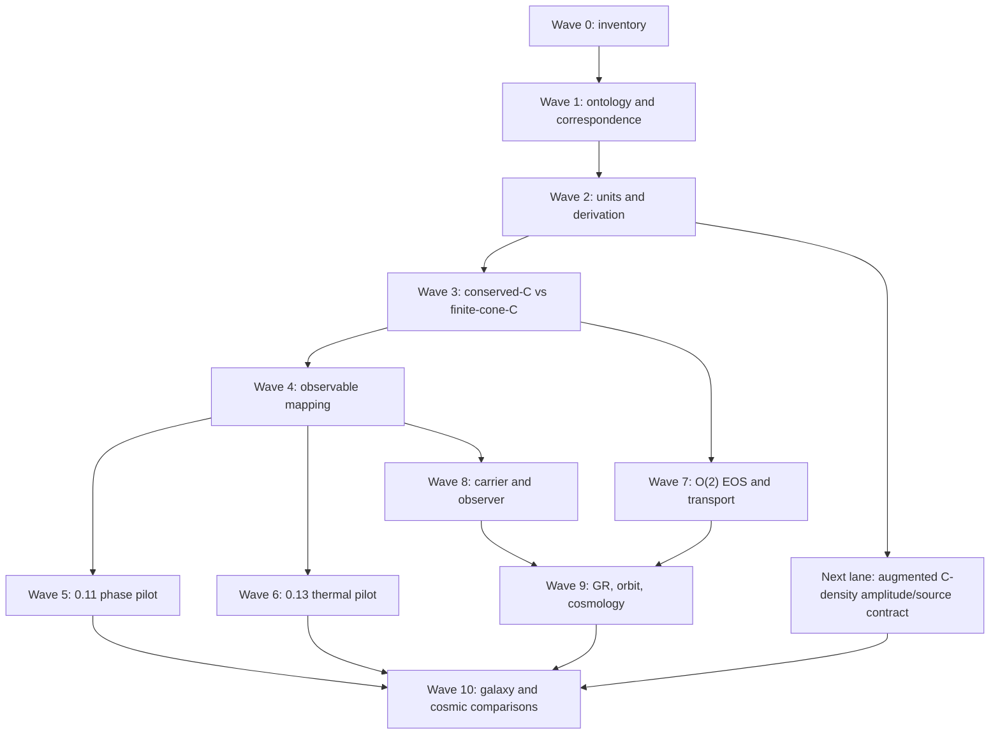

# UET Research Dependency Graph — Waves 0–10

The graph is a dependency map, not a statement that every arrow is already
closed. The current foundation gate is the controlling cut: downstream
artifacts may remain useful as diagnostics, but they cannot promote a claim
while the upstream ontology, units, correspondence, or numerical gate is
blocked.

## Latest plan update - 2026-08-28 generalized-harmonic nonlinear vacuum RHS

`CORE_CURVED_3P1_GH_NONLINEAR_VACUUM_RHS_READY` is `CLOSED_FOR_LANE`.
The complete source-locked vacuum Eqs. (35)-(40) operator, metric-derived
kinematics, first-order Christoffel/gauge reconstruction, and algebraic
`gamma0` damping pass independent constant-grid and variable-grid controls.

The parent advances to
`PARTIAL_CURVED_3P1_GH_NONLINEAR_VACUUM_RHS_READY`. The next physical edge
is time integration with a fixed CFL contract and propagated gauge/reduction
constraint convergence. Matter wiring, non-periodic boundaries, and detector
observables remain open; Gravity is not unlocked.

## Latest plan update - 2026-08-28 generalized-harmonic principal system

`CORE_CURVED_3P1_GH_PRINCIPAL_SYSTEM_READY` is `CLOSED_FOR_LANE`. The
source-locked GH principal matrix has a complete characteristic basis, a
positive analytic symmetrizer, causal normal-frame wave speeds, and a verified
reduction-constraint damping operator with second-order spatial convergence.

The parent remains `PARTIAL`. The next edge is the complete nonlinear GH RHS
and `gamma0` gauge-constraint damping, followed by time integration and full
constraint propagation. Gravity remains blocked; principal-system
hyperbolicity is not a numerical-relativity evolution result.

## Latest plan update - 2026-08-28 ADM evolution and formulation selection

`CORE_CURVED_3P1_ADM_EVOLUTION_RHS_READY` is closed for the nonlinear periodic
right-hand-side operator lane. The fixed-geodesic ADM strong-hyperbolicity
question is also closed as a branch-local no-go: the principal symbol has an
incomplete zero-speed eigenspace in every preregistered direction.

The next edge is no longer an open-ended ADM rerun. It is the source-locked
first-order generalized-harmonic branch with explicit characteristic-field,
constraint-damping/propagation, convergence, and boundary gates.
`CORE_CURVED_3P1_OBSERVABLE_PARENT_READY` remains `PARTIAL`, and Gravity
remains blocked.

## Latest plan update - 2026-08-28 curved 3+1 geometry operator

The second curved-parent subresult,
`CORE_CURVED_3P1_GEOMETRY_OPERATOR_READY`, is closed for its periodic-grid
lane. The standard Levi-Civita connection, spatial Ricci tensor/scalar, and ADM
momentum-tensor divergence are now computed from grid `gamma_ij` and `K_ij`;
independent analytic controls show second-order spatial convergence.

This removes `metric_to_ricci_operator` from the parent blocker but does not
close `CORE_CURVED_3P1_OBSERVABLE_PARENT_READY`. The next edge is a declared
lapse/shift and metric/`K` evolution formulation with a strong-hyperbolicity
boundary and constraint-propagation/convergence tests. Gravity remains blocked,
and periodic single-chart success is not promoted to a general curved-spacetime
solver claim.

## Latest plan update - 2026-08-28 curved 3+1 constraint interface

Topic 13 now unlocks construction of the Core curved 3+1 parent. The first
subresult, `CORE_CURVED_3P1_ADM_CONSTRAINT_INTERFACE_READY`, is closed for its
lane using source-linked Hamiltonian/momentum constraint formulas, Minkowski
and flat-FLRW analytic controls, and explicit negative controls.

`CORE_CURVED_3P1_OBSERVABLE_PARENT_READY` remains `PARTIAL`, not Core-closed.
The next edge is the differential-geometry/evolution/gauge/constraint-
propagation package. `GR_CLASSICAL_COMPATIBILITY_LANE` remains blocked until
the parent reaches `CLOSED_FOR_CORE`; no application edge is promoted by this
constraint-interface result.

## Two-arm C decision

The conserved-C branch and the finite-cone-C branch are deliberately separate:

1. conserved C is the phase/order comparator and retains its conservation
   interpretation;
2. finite-cone C is a non-conserved telegraph realization with a separate
   order/behaviour ontology;
3. a conserved Cattaneo current is a negative control until a derived UV or
   nonlocal regularization removes its high-(k) unbounded speed.

No edge in this graph maps (C) directly to mass, maps (R_{gen}) to a
particle, or promotes a detector record to a physical field.

## Latest plan update — 2026-08-01 Wave 8 photon comparator

Wave 8 now has a deterministic normalized standard-photon comparator. The new
`photon_observer_baseline.py` implementation and
`photon_observer_baseline_verification.json` verify the declared relations
`p=E*n`, `t_arrival=t_emit+L/c`, source energy/momentum ledger closure, causal
speed, and detector-record separation from propagation. Focused tests pass.

This closes only the local standard-comparator subgate. Wave 8 remains
`BLOCKED` because the SI detector/observable package, external provenance,
the neutrino/positron comparator packages, and any UET source-to-carrier
transition law are still missing. No photon identity was assigned to
`R_gen`, and no massless transition was inferred.

The active execution order is now:

1. keep the photon comparator as a fixed standard control;
2. close or explicitly bound the dimensional detector/observable lane;
3. audit Wave 9 gravity/orbit/cosmology correspondence and its curved-solver
   controller;
4. audit Wave 10 galaxy/cosmic data gates and Wave 11 particle prerequisites;
5. regenerate the all-wave closure and preserve the foundation gate as the
   controlling claim boundary.
## Latest plan update — 2026-08-01 Wave 9 and Wave 11 boundary repair

Wave 9 metadata now distinguishes the local exact closed-limit formula
comparator from a full covariant UET derivation. The GR claim gate records the
existing `gr_closed_limit_verification.json` as a local evaluator with `PASS`
status, while keeping the covariant parent action, Bianchi/exchange verifier,
curved 3+1 evolution, and physical GR benchmark package open.

Wave 11 now has `particle_dirac_program_gate.json`. Its six prerequisites are
machine-readable and all remain `MISSING`; the gate itself passes as a
boundary audit with status `DEFERRED_BLOCKED`. This closes the evidence and
controller bookkeeping for the particle/Dirac wave without deriving a spinor,
neutrino, positron, antimatter, or particle identity for `R_gen`.

The all-wave artifact remains `ALL_WAVE_STATUS_ACCOUNTING_CLOSED_FOUNDATION_PHYSICS_NOT_CLOSED` with 12 planned waves. The next work is not a claim upgrade: it is to close the remaining foundation correspondence/units/observable gates and only then revisit the blocked application lanes.
## Latest plan update — 2026-08-01 active-lane evidence synchronization

The active carrier/observer lane now references the verified normalized photon
source–propagation–detector comparator as a standard control. This is an
evidence-chain repair only: the lane remains `SIMULATION_ONLY`, the foundation
remains `BLOCKED`, and no `R_gen` particle identity or SI detector prediction
is enabled.
## Latest plan update — 2026-08-01 TTG source equation layer

The thermal dependency now has an explicit standard source-equation node:
g_n -> Delta_Tq -> y_TTG, with c_v kept distinct from UET C. This supports
observable correspondence only. It does not create a Phi -> temperature identity,
close the dimensional lane, or permit external fit/validation.
## Latest plan update — 2026-08-01 central registry addenda synchronization

The registry graph now treats impact/effect, cosmology, persistence/resource
selection, and characteristic-wave addenda as merged candidate nodes. Their
claim ceilings are unchanged, and every downstream edge remains blocked by the
foundation correspondence, units, observable, or physical-source gates.
## Latest plan update — 2026-08-01 publisher supplementary route audit

The thermal source dependency now distinguishes a publisher data statement from
a locally reproducible numeric package. The captured supplementary description
is provenance evidence only; it does not satisfy the numeric-data or dimensional
observable gates.

## Latest plan update - 2026-08-02 Wave 1 wording disposition

The wording audit is now a routed dependency rather than one undifferentiated review bucket:
archive/legacy paths, code/test literals, canonical contract literals, and active prose are
reported separately. The active controller is the 242-row active-prose review together with
the still-open F2 correspondence and measurement-operator matrix. No downstream edge is
promoted by this metadata repair.

## Latest plan update - 2026-08-02 F2 row-complete manifest

Wave 1 now has a generated manifest indexing all 263 topic formula rows. The dependency
graph can distinguish lane/comparator relations from rows with no central relation, while
all measurement-operator records remain explicitly open. The next edge is lane-specific
correspondence closure, not a universal C-to-mass or trace-to-particle mapping.

## Latest plan update - 2026-08-02 pilot observable contracts

The F2 edge now has seven named pilot operators, but all remain blocked from physical
closure. The graph still routes 0.11 through replicate/temporal acquisition and 0.13
through dimensional TTG mapping/source provenance before any data claim.

## Latest plan update - 2026-08-02 selected finite-cone integration

Wave 3 now distinguishes the passing normalized characteristic integration from the failing
full nonlinear candidate. The selected edge can feed pilot diagnostics, but it cannot bypass
the full-candidate leakage, units, or external-observable gates.

## 2026-08-02 dependency update ? Topic 0.11 execution result

The dependency graph now treats Topic 0.11's finite-size replication execution as completed evidence with `WARN`, not as an unexecuted plan. Its active edge is `spectral_core_finite_size_replication_not_robust` (`L=16` 4/6; fresh seed set 7/9 overall and 1/3 at `L=16`). Estimator acceptance and exponent/universality promotion remain downstream-blocked. This edge does not alter the independent core pre-arrival leakage or foundation correspondence blockers.

## 2026-08-02 dependency update ? Wave 7?8 verifier refresh

Wave 7 is supported by an internally passing tree-level O(2) EOS and ideal/synthetic covariant transport control, but its physical Kubo/finite-temperature/curved-dynamics edge remains blocked. Wave 8 has a locally passing impact/effect core and normalized photon comparator, but carrier-specific conservation, SI detector mapping, and UET source-to-carrier derivation remain open. No downstream dependency is promoted by this rerun.

## 2026-08-02 dependency update ? Wave 9?11 downstream audit

Wave 9, Wave 10, and Wave 11 have been re-audited with explicit blockers. Wave 9 depends on physical transport and curved covariant dynamics; Wave 10 depends on source/provenance, units, and residual policies for galaxy/cosmic comparisons; Wave 11 depends on the full covariant particle/Dirac prerequisite chain. These edges remain downstream of the blocked foundation and cannot promote claims.

## 2026-08-08 dependency update ? 0.19 artifact consistency repair

The 0.19 edge now has a reproducible branch-claim input and regenerated scientific-input hashes. Its physical dependency remains blocked on source-backed classical GR tests, curved covariant completion, and independent validation; the repair does not promote the GR or cosmology lane.

## 2026-08-08 dependency update ? Wave 10 payload consistency repair

Wave 10's persisted artifact family now matches its deterministic generator under a shared timestamp. This removes repository payload drift only; the dependency edge remains blocked on physical transport coefficients, curved dynamics, and downstream correspondence.

## 2026-08-08 dependency update ? F2 explicit row-disposition closure

The F2 edge now has complete row-level disposition coverage: 263/263 rows are indexed, with 256 explicitly blocked placeholders and no accepted physical measurement maps. The remaining dependency is physical correspondence and lane-specific observable acceptance, not missing row records.

## 2026-08-08 dependency update ? F2 standard-counterpart contract mapping

The F2 edge now separates 106 declared standard/comparator contracts from 150 unmatched/candidate placeholders. Both classes remain downstream-blocked until lane-specific units, derivation, and measurement operators are accepted.

## 2026-08-08 dependency update - F3/F7 normalized subgates

The graph now distinguishes internal contract closure from physical closure. F3 records four normalized/natural-unit lanes with an explicit subgate, while three dimensional lanes remain open. F7 records seven declared internal observable operators with zero accepted physical maps. The foundation edge remains blocked and no downstream edge is promoted.

Next edge: derivation-origin audit, followed by a source-locked dimensional thermal map with uncertainty and no target-data fitting.
## 2026-08-08 dependency update - F4 derivation-origin audit

The F4 edge now consumes `uet_derivation_origin_audit.json`. All 20 central registry rows have an explicit origin family and derivation-readiness label; six are declared relation derivations, five are checked comparators, and nine remain open/candidate. The edge is still blocked because relation-level derivation is not the same as dimensional correspondence or physical validation.

Next edge: resolve assumptions/limiting cases for open rows and close lane-specific units and measurement operators.
## 2026-08-08 dependency update - 0.13 quasi-temperature source review

The 0.13 edge now records the standard observable as `Delta_Tq` / normalized `y_TTG`, interpreted as a quasi-temperature or collective-phonon-energy response. This prevents an invalid direct `Phi = T` identification. The source-data statement is externally confirmed, but no permitted local numeric package or `alpha_Phi_K` map is available; the holdout and external-validation edge remain blocked.
## 2026-08-08 dependency update - C-to-mass-density identifiability

The mass-density edge now has a reproducible constructive non-identifiability result: same geometry and same relational `C` admit different density amplitudes under mass rescaling. The dependency is therefore not “find a better direct C=rho fit”; it is “derive/source-lock a separate matter amplitude/source state and its units.” Galaxy and dark-matter edges remain blocked until that augmented lane has an observable operator and holdout policy.

## 2026-08-08 dependency update - augmented C-density amplitude/source contract

The augmented lane now exposes the missing degree of freedom as an explicit
source contract: `rho=A_m*rho_hat`. The normalized shape has unit integral and
the declared amplitude scales the density without changing the shape. The
artifact is an internal correspondence diagnostic with no fitted parameter.
The lane remains blocked for dimensional units, source provenance, uncertainty,
and holdout policy; it does not promote `C` to mass density.

## 2026-08-08 dependency update - synthetic SI 1D density-unit contract

The augmented C-density lane now closes a limited unit conversion: an explicit
kg amplitude and metre coordinate scale produce a kg/m line-density observable
with integral closure. The 3D physical density operator, source provenance,
uncertainty, calibration, and holdout gates remain open. This is a unit-contract
result, not a mass derivation or galaxy-ready observable.

## 2026-08-08 dependency update - synthetic SI 3D density operator

The C-density edge now has a checked synthetic 3D measurement/operator contract: `rho_3D=A_m*rho_hat/(L_x L_y L_z)` in `kg/m^3`, with finite-volume integral closure and explicit source metadata. This closes a unit/operator bookkeeping layer only. The shape is not derived from `C`, `A_m` is an explicit source input, and external source provenance, calibration, propagated uncertainty, and holdout remain open. The galaxy/dark-matter edges therefore remain blocked.
