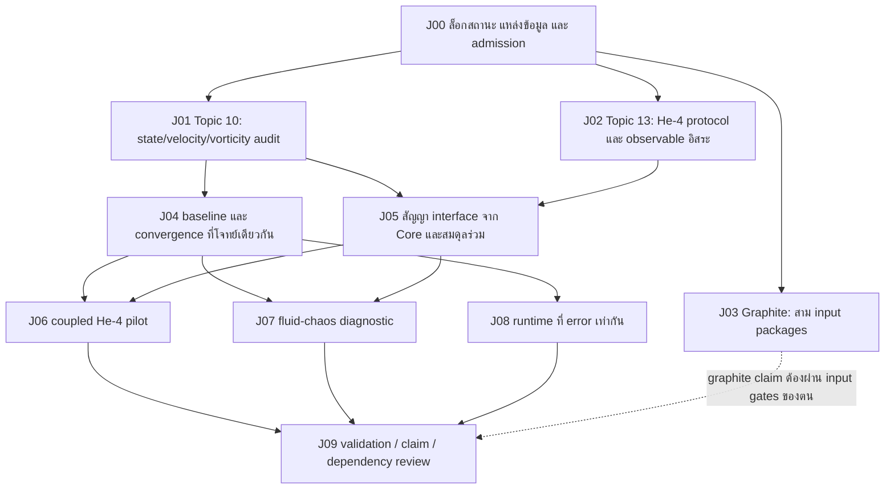

# แผนวิจัยร่วม Topic 0.10–0.13 และ Core

วันที่: 2026-09-26 · สถานะ: **ข้อเสนอแผนวิจัย ยังไม่ใช่ผลทดลองใหม่**

## เป้าหมายและขอบเขต

พัฒนา Topic 0.10 ให้ตอบได้ว่าแบบจำลอง UET แทนการไหลชนิดใดได้จริง เชื่อมสมดุลมวล โมเมนตัม พลังงาน และเอนโทรปีกับ Topic 0.13 ได้ภายใต้เงื่อนไขใด และต่างจากแบบจำลองมาตรฐานอย่างไร โดยใช้ Core เป็นเจ้าของ ontology, equation registry และ dependency admission การปิดงานอาจเป็นผลผ่านเฉพาะขอบเขต ผล no-go หรือการจำกัดแบบจำลองอย่างมีหลักฐาน ไม่จำเป็นต้องได้คำตอบสนับสนุน UET ทุกข้อ

เอกสารนี้เป็นแผนหลักของงานร่วม มี [รายการงานที่เครื่องอ่านได้](Data/03_Research/fluid_thermal_joint_research_plan.json) เป็นตัวควบคุมลำดับงาน **ไม่ใช่ physical acceptance gate ใหม่** ทุกงานวิจัยยัง NOT_STARTED; การเขียนแผนไม่เลื่อน readiness, ไม่เปลี่ยนเกณฑ์เดิม และไม่ปลด Core dependency

ฐานเผยแพร่ที่ตรวจ: `d069507651964c0f963d1568667e2a9218400e42` บน `origin/main` หลัง fetch วันที่ข้างต้น ตรวจ working tree เดิมประกอบด้วย แต่ไม่ย้ายผลที่ยังไม่ commit มาปะปนกับหลักฐานบน main รายการ evidence ใน manifest บันทึก SHA-256 ของไฟล์บนฐานเผยแพร่และระบุว่าต่างจาก working tree เดิมหรือไม่ ต้องอ่านสถานะใหม่เมื่อเริ่มแต่ละ wave

## 1. สถานะตั้งต้นและสิ่งที่ต้องต่อยอด

| งานเดิม / แหล่งควบคุม | สิ่งที่ใช้ต่อได้ | สิ่งที่ยังห้ามสรุป |
| --- | --- | --- |
| Topic 10 [speed artifact](Result/artifacts/fluid_benchmark_validation.json) | gate เดิม FAIL, speedup 1.914085 เทียบเกณฑ์ >2; finite-output diagnostic | ไม่ใช่ความแม่นยำ CFD ไม่ใช่ข้อพิสูจน์ smoothness |
| Topic 10 [chaos method](Result/artifacts/chaos_method_validation.json) | QR/tangent และ shadow ผ่าน standard controls | ยังไม่พบหลักฐาน physical fluid chaos ของ UET |
| Topic 13 [normalized pilot](../0.13_Thermodynamic_Bridge/Result/artifacts/t13_thermal_dynamical_regime_audit.json) | มี pilot แล้ว ไม่ต้องเริ่ม control เดิมใหม่โดยไม่มีเหตุผล | ไม่ใช่ SI chaos หรือ transport ที่วัดจริง |
| Topic 13 [closure matrix](../../core/07_artifacts/topic13/t13_topic13_closure_matrix.json), `core_ready_track` | O(2)/He-4 bounded composition CLOSED_FOR_CORE | ไม่ครอบคลุม graphite, complete two-fluid transport หรือ global UET |
| He-4 [matching independence](../../core/03_lanes/topic13_support/T13_HE4_MATCHING_INDEPENDENCE.md) | ใช้ calibrated effective interface โดยประกาศ protocol | equality หลัง matching ไม่ใช่ independent validation; ต้องทดสอบ observable ที่ไม่ใช้สร้าง Z/alpha |
| He-4 [shear Kubo](../../core/07_artifacts/topic13/t13_he4_normal_viscosity_kubo_audit.json) | external normal-component shear-viscosity input กับ scoped stress/FDT/entropy channel | ไม่ใช่ UET-predicted viscosity, bulk thermal conductivity หรือทั้ง transport tensor |
| Topic 13 [graphite full gate](../0.13_Thermodynamic_Bridge/Result/artifacts/topic13_full_thermodynamic_bridge_core_ready_gate.json) | แยกสาม input packages ที่ขาดได้ | ยัง BLOCKED_OPEN_T13_FULL_BRIDGE; shape fit ไม่ตรึง absolute Phi/temperature scale |
| Core [curved parent](../../core/07_artifacts/gates/core_curved_3p1_parent_gate.json) | infrastructure และ prescribed-source interfaces เฉพาะขอบเขต | parent PARTIAL; boundary และ dimensional-observable mapping ยังควบคุม |
| Core [research-room contract](../../core/00_governance/UET_RESEARCH_ROOM_BRIEF.md) | เจ้าของงานและการส่งต่อเดิม | full Topic 10 constitutive transport ต้องผ่าน relevant Core admission ก่อน |

มี drift ที่ต้องเก็บไว้ให้เห็น: topic index/metadata ยังพูดถึง latest speed pass หรือรายการงานเก่า ขณะที่ artifact ที่อ่านเป็น FAIL; report เก่าบางไฟล์ใช้คำว่า full bridge แม้ขอบเขตจริงแยก He-4/graphite ห้ามใช้ชื่อ status หรือค่า unlock ตัวเดียวตัดสินทั้งหมด แผนนี้อ่าน lane, claim boundary และ underlying evidence ประกอบ และไม่ regenerate canonical gates เพียงเพื่อให้ข้อความตรงกัน

## 2. คำถามวิจัยที่กำหนดลำดับงาน

1. **Representability:** state และ velocity map ของ Topic 10 แทน rotational/incompressible flow ได้หรือเป็นเพียง scalar relaxation/gradient-flow model?
2. **Correspondence:** ถ้าจำเป็นต้องมี momentum/phase/current state เพิ่ม จะ derive หรือประกาศ constitutive ansatz อย่างไร และเชื่อมกับ Core โดยไม่เปลี่ยนความหมาย C/Phi?
3. **Thermodynamic consistency:** coupling ให้การแลกเปลี่ยนพลังงานครบทั้งสองทิศทางและ entropy production ที่ถูกต้องหรือไม่?
4. **Independent physics:** เมื่อตรึง coefficient/normalization แล้ว ยังอธิบาย response ที่ไม่ได้ใช้ปรับเทียบได้หรือไม่?
5. **Fluid/chaos evidence:** หลังผ่าน numerical verification แล้ว dynamics เป็น stable, unresolved หรือ chaotic และสถิติต่างจาก baseline อย่างมีนัยต่อ uncertainty หรือไม่?
6. **Efficiency:** ที่ปัญหาและ error budget เดียวกัน ค่าใช้จ่าย เวลา และหน่วยความจำดีกว่าหรือไม่?

**ตัวควบคุมงานวิจัย Topic 10 ที่เสนอ:** `fluid_state_and_velocity_observable_correspondence_unestablished` ไม่ใช่การพยายามทำให้ speedup เกิน 2 ก่อนตรวจว่าสองโปรแกรมแก้โจทย์เดียวกัน

## 3. ข้อค้นพบจาก code review ที่ทำให้ต้องเริ่มตรงนี้

[Engine_UET_2D.py](Code/01_Engine/Engine_UET_2D.py) ใช้ `u=-M grad(C)` โดย M เป็น spatial scalar คงที่ใน run นั้น ใน continuum ที่ C เรียบจึงได้ `curl(u)=0` และ `div(u)=-M Laplacian(C)` โดยทั่วไปไม่เท่ากับศูนย์ นี่เป็นข้ออนุมานทางคณิตศาสตร์จาก mapping ที่เห็น ไม่ใช่ผล benchmark ที่รันแล้ว และไม่ใช่ no-go ของทุก UET realization กรณี M แปรตามตำแหน่ง singular phase หรือขอบเขตต้องวิเคราะห์แยก

การไหล periodic ที่มีวอร์ทิซิตีไม่เป็นศูนย์จึงเป็น falsification control ที่เหมาะกว่าการดูภาพ vortex ต้องตรวจ stencil/ขอบเขตว่าค่า curl ที่เห็นเป็น truncation หรือ boundary artifact หรือไม่ และตรวจการแทน initial velocity field ก่อน integration

ยังพบจุด audit เฉพาะที่ต้องเก็บเป็น counterexample tests ใน wave แรก:

- `_derive_uet_parameters` ตั้ง mobility จาก property แต่ constructor ตั้ง `mobility_M=0.5` ภายหลัง: ตรวจ actual value และเส้นทาง params/physical ทั้งสองแบบก่อนกล่าวว่าใช้ physical mobility
- `kappa=min(mu/rho, stability_limit)` อาจเปลี่ยน physical coefficient ตาม grid/time step: physical lane ต้องลด dt หรือใช้วิธีที่เหมาะสม; ห้าม cap coefficient แล้วนับว่าเป็นวัสดุเดิม
- `C=np.maximum(C,0.01)` ต้องบันทึก clip events; numerical acceptance ต้องไม่ใช้ clipping ปกปิด instability
- benchmark comparator มี diffusion, pressure sweeps แบบ homogeneous และ zero initial fields; ไม่มี full nonlinear momentum/advection และ pressure RHS จาก divergence แบบ matched incompressible solver ความเร็วเดิมจึงเป็น implementation timing เท่านั้น
- benchmark เรียก `UETMasterEquation` ไม่ใช่ `UETFluidSolver` ตัวเดียวกับ physical-property path ห้ามใช้ผล timing รับรอง engine อีกตัว
- legacy `I` ต้องระบุว่าเป็น legacy state หรือ derived trace ให้ชัด ห้ามตีความเป็น `R_gen` แล้วป้อนกลับโดยเงียบ

ทางออกที่ยอมรับได้คือ (ก) จำกัด legacy engine เป็น gradient-flow comparator หรือ (ข) ลงทะเบียน candidate state/current/momentum extension แยกต่างหากและผ่าน F0–F8 ก่อน claim การพบ no-go ของ mapping เดิมยังเป็นความคืบหน้าที่มีคุณค่า

## 4. โครงสร้างงานที่พัฒนาไปพร้อมกัน

ลูกศรคือ dependency ของการ **ยอมรับผล** อนุญาตให้เตรียม source, comparator และ specification ล่วงหน้าได้ แต่ห้ามรัน candidate full constitutive lane ก่อน Core admission ที่เกี่ยวข้อง การเตรียม ordinary-fluid comparator ไม่ต้องรอ curved GR ทั้งหมด ส่วนการอ้าง self-consistent curved evolution ต้องรอ parent จริง

| ID / เจ้าของตามหน้าที่ | ผลส่งมอบที่ต้องได้ | เกณฑ์ปิดเฉพาะงาน / ทางออกเมื่อไม่ผ่าน |
| --- | --- | --- |
| J00 · Core + ทั้งสอง topic | source/hash inventory, lane map, F0–F8 obligation table, acceptance configuration และรายชื่อ gate ที่ต้องผ่านต่อ lane | ทุก dependency มี source locator, scope, status, hash; unresolved thresholds/source rows แสดง BLOCKED; ไม่ใช้ global boolean unlock |
| J01 · Topic 10 | representability audit ของ 2D/3D, mapping/units, negative controls, mobility/cap/clip report | ได้ admissible fluid state map หรือ scoped no-go พร้อมขอบเขต legacy; ไม่ยอมรับ vortex ที่มาจาก numerical error |
| J02 · Topic 13 + Core | He-4 frozen-parameter protocol card และ independent-response source manifest | ล็อก Z, theta_T, e0, alpha พร้อม covariance; ระบุ fixed variables, normal component/full material, response timescale; มี observable ที่ไม่ใช้ matching หรือบันทึก acquisition blocker |
| J03 · Topic 13 | graphite anchor/alpha, Ding-compatible C_src, physical transport เป็นสาม record แยกกัน | ใช้ existing minimal-input validators; derived/calibrated/no-go disposition ชัด; ไม่ยืม He-4 coefficient มาเติม graphite |
| J04 · Topic 10 | analytic/manufactured controls, matched NS comparator, convergence/error budget | state admission ผ่านก่อนทดสอบ physical candidate; mass/divergence/momentum/energy residual และ spatial/temporal error อยู่ใน budget ที่ล็อกก่อนผล |
| J05 · Core เจ้าของ admission; Topic 13 เจ้าของ thermal/transport; Topic 10 เจ้าของ flow | registered interface และ conservation/reciprocity tests | หน่วย/state/flux สอดคล้อง; exchange terms ยกเลิกใน total ledger; entropy accounting และ limiting cases ผ่าน; required Core gate ต้องผ่านจริง |
| J06 · ทั้งสอง topic | bounded He-4 flow–response pilot พร้อม source uncertainty และ ablations | ทำ independent held-out response หลัง freeze; thermal response ที่ต้อง conductivity/noise เพิ่มยัง BLOCKED จนมี record; no-go/limited validity รับได้ |
| J07 · Topic 10 ใช้ diagnostic Core | tangent/shadow spectrum และ stationarity/boundedness/convergence report | resolved sign เหนือ resolution budget, method agreement; positive exponent อย่างเดียวไม่ใช่ turbulence หรือ external physics validation |
| J08 · Topic 10 | work–precision curves, runtime trials, memory และ failure table | เปรียบเทียบที่ QoI/error/horizon เดียวกันก่อน timing; ถ้า accuracy ไม่ผ่าน ไม่รายงาน physical speed advantage; gate >2 เดิมแยกไว้ |
| J09 · ผู้ทบทวนด้านวิธีและหลักฐาน | lane-by-lane closure review, external comparison package, claim map | แยก standard comparator, calibrated UET candidate, independent observation และ external replication; ผลลบอยู่ในสรุป; ไม่ auto-promote topic |

การแบ่งเจ้าของเป็นหน้าที่วิจัย ไม่ใช่การอ้างว่าได้มอบหมายบุคคลหรือเปิด agent แล้ว

## 5. สัญญาเชื่อม Core–fluid–thermal

ก่อน implementation ใหม่ ต้องกรอกสัญญา F0–F4 ตาม [มาตรฐานสมการ](../For%20Work/EQUATION_RESEARCH_AND_PHYSICAL_CORRESPONDENCE_STANDARD.md) แล้วผ่าน F5–F8 ตามลำดับ:

| ช่องสัญญา | สิ่งที่ต้องบันทึก | ข้อห้าม / falsification |
| --- | --- | --- |
| State | C, Phi, Pi และ momentum/current/phase ที่จำเป็น; algebraic constraints; canonical equation IDs | C ไม่เท่ากับ mass/charge โดยอัตโนมัติ; R_gen/R_obs เป็น output ไม่ใช่ dynamical reservoir |
| Material state | material/specimen, T, P, chemical potential, equilibrium path, phase, normal/superfluid fractions และ geometry | He-4 SVP equilibrium derivative ไม่เท่ากับ finite-frequency response จนแสดง correspondence |
| SI map | length/time/energy scales, field normalization, Jacobian และ uncertainty/covariance | Phi energy-dimension E^1 กับ E^0 ต้องมี explicit conversion; ห้ามใช้ normalized shape ตรึง amplitude |
| Transport | shear/bulk viscosity, heat conductivity, relaxation, mutual friction เฉพาะที่ model ต้องใช้; frame, Kubo operator, frequency/wavenumber limits | shear coefficient ไม่แทน conductivity; static susceptibility ไม่แทน dynamic Landau density; missing coefficient ทำให้ branch BLOCKED |
| Energy | kinetic/internal/response/storage terms, source work, boundary flux, dissipative conversion | normalized availability ไม่ใช่ SI total energy; viscous loss ต้องไม่สูญหายจาก total budget หรือถูกนับซ้ำ |
| Entropy | thermodynamic entropy, entropy flux, production, bath exchange; uncertainty | ต้องตรวจ total balance ที่ตรงกับ closed/open ensemble ไม่ใช่บังคับ subsystem entropy เพิ่มทุก timestep |
| Observation | velocity/pressure/temperature/flux operator, detector response, averaging และ units | TTG normalized trace ไม่ใช่ absolute thermometer; no circular parameter use |
| Stochastic response | noise covariance, discretization, FDT/KMS scope และ common-noise tangent/shadow protocol | ไม่สร้าง synthetic noise แล้วเรียก physical bath; unresolved physical noise ทำให้ stochastic physical claim BLOCKED |

สมการ continuity, momentum, energy และ entropy ของ standard physics ให้เป็น **reference obligations** ก่อน ไม่ประกาศเป็น UET-derived เพียงเพราะต่อ solver มาตรฐานกับ Phi ได้ ถ้าผลที่ดีที่สุดเป็น thermodynamically consistent hybrid ให้เรียก hybrid และแสดง source ของทุก term

## 6. ลำดับการทดลองและเกณฑ์ที่ล็อกก่อนรัน

ค่าด้านล่างเป็น **ข้อเสนอสำหรับ preregistration รุ่นแรก** ไม่ใช่ตัวเลขที่ตรวจผ่านแล้ว J00 ต้องตรวจ feasibility จาก analytic controls และล็อก configuration ก่อน production; ถ้าเปลี่ยนภายหลังให้ version ใหม่และระบุ exploratory ห้ามปรับ threshold เพื่อให้ผล candidate ผ่าน

### A. ความสามารถแทนการไหลและความถูกต้องเชิงตัวเลข

- เริ่ม periodic nonzero-vorticity field และตรวจ representation residual ก่อน evolve; scalar constant-mobility map ต้องถูกคัดออกจาก general rotational-flow claim หากแทนไม่ได้
- ตั้ง 2D periodic vortex/decay control, shear diffusion และ manufactured mass/momentum/energy source โดย derive exact forcing จาก analytic fields แยก implementation ที่ตรวจ
- Couette/Poiseuille ให้เป็น wall/forcing controls หลัง boundary contract พร้อม; lid-driven cavity ต้องมี source benchmark ที่ระบุ Re/geometry/precision; ไม่ใช้ scalar boundary gradient แทน moving-wall velocity โดยไม่พิสูจน์
- เสนอ periodic grids 32/64/128 และ time-step refinements dt, dt/2, dt/4 แยก spatial/temporal errors บนช่วงเวลาและ physical coefficients เดียวกัน ใช้ observed order/GCI เมื่ออยู่ใน asymptotic regime; ไม่บังคับสูตรนี้กับ discontinuities
- สำหรับ smooth second-order spatial candidate เสนอ observed order >=1.8 บนสอง finest refinements; method คนละ order ต้องใช้ declared order ของตัวเอง ไม่ให้ RK/Euler ได้เกณฑ์เดียวกันโดยพลการ
- เสนอ finest-grid relative L2 velocity error <=1e-2; incompressible normalized divergence <=1e-6; periodic closed mass drift <=1e-8; normalized integrated energy-budget residual <=1e-4 และต้องลดตาม refinement ทั้งหมดต้องนิยาม nonzero reference scale ก่อนรัน
- Pressure error ต้องจัดการ additive gauge; open-domain mass/energy ต้องหัก integrated source/boundary flux ก่อนคำนวณ drift ไม่มี NaN, hidden coefficient cap, clip หรือ fallback ที่นับผ่าน
- Numerical budgets เหล่านี้ใช้กับ manufactured/analytic tests เท่านั้น ไม่แทน experimental uncertainty หรือ theorem bound

แนวทาง three-grid convergence และข้อจำกัด Richardson/GCI อ้างอิง [NASA NPARC spatial-convergence tutorial](https://www.grc.nasa.gov/www/wind/valid/tutorial/spatconv.html) อ่าน 2026-09-26 ตัวเลข acceptance ข้างต้นเป็นข้อเสนอของแผนนี้ ไม่ได้อ้างว่า NASA กำหนดไว้

### B. He-4 pilot ที่ทำได้โดยไม่ลัดขั้น

1. เลือก normal-component shear relaxation เป็น candidate แรกเพราะมี source-locked shear viscosity อยู่แล้ว แต่ต้องระบุ inertia/density ของ subsystem และการ coupling กับ superfluid ให้ชัดก่อน derive decay rate
2. ทดสอบ standard shear reference ก่อน UET coupling; ทดสอบ zero coupling, zero drive, equilibrium, inviscid/zero-dissipation limits ที่สมการอนุญาต และ response ต่อ forcing เล็ก
3. Freeze theta_T, Z, e0 และ source coefficients จาก calibration set; ห้าม rematch ต่อ state/frequency ของ test เพื่อรักษาความตรงกัน
4. ใช้ response derivative หรือ time/frequency response ที่ไม่ได้ใช้สร้าง calibration; ระบุ thermodynamic constraints ให้ตรงแหล่งวัด ถ้า source ไม่มีให้ผลเป็น source-blocked ไม่ใช้ matching identity เป็นข้อมูลใหม่
5. เพิ่ม thermal pulse/finite-wavevector หรือ counterflow หลังมี required conductivity/relaxation/mutual-friction/EOS และ protocol source ครบเท่านั้น ไม่อนุมานว่าหนึ่ง shear channel ทำให้ two-fluid hydrodynamics สมบูรณ์
6. Propagate source, scale, numerical และ measurement uncertainty รวม covariance; หาก covariance ไม่ทราบใช้ sensitivity bounds ที่ติดป้าย ไม่เรียก confidence interval

### C. Chaos และ turbulence

นำ method ที่ผ่านแล้วกับ normalized Topic 13 pilot มา reuse ให้ชัดว่าอะไรยังเดิม อะไรเปลี่ยน ก่อนคำนวณ exponent ของ candidate ใหม่ต้องผ่าน state, ledger และ numerical gates; positive exponent จาก clipping/unstable timestep ถูกคัดออก

เสนอ perturbations 1e-8, 1e-7, 1e-6 ใน normalized state metric; state ที่มีหลายหน่วยต้องกำหนด scale/inner product ก่อน QR ตรวจ timestep/grid, transient window, block length, seed และ tangent/shadow agreement ใช้ resolution budget เดิม `max(delta_dt, delta_dx, 2*SE_block, delta_method)` รายงาน sign ว่า resolved หรือ unresolved ไม่ปัด unresolved เป็น chaos

สำหรับ turbulence ให้เพิ่ม kinetic energy, enstrophy ในมิติที่เหมาะสม, dissipation, energy spectrum และ stationarity diagnostics; 2D ผลไม่ครอบคลุม 3D stretching ใช้ 3D เฉพาะหลัง 2D control และ state admission ผ่าน ระยะยาวควรเปรียบเทียบสถิติ/uncertainty ไม่บังคับ trajectory ให้ตรงหลัง predictability horizon

[JHTDB](https://turbulence.idies.jhu.edu/home) เป็น **candidate source catalog ที่ตรวจพบ** ไม่ใช่ dataset ที่รับเข้าแล้ว J09 ต้องเลือก dataset/version, Re, forcing, domain, viscosity, query coordinates/times, interpolation method, license/citation และ query log ก่อนนำมาเป็น external numerical reference ข้อมูล DNS ของผู้อื่นไม่ใช่การวัดทดลองและไม่ใช่ external replication ของ UET

### D. Runtime และการทดสอบกลไกเพิ่มจาก baseline

ตรึง observable error budget, physical end time, boundary/initial state, dtype, hardware, threads และ output cadence ให้ตรงกัน ทำ warm-up แล้วเสนออย่างน้อย 10 paired timing trials สลับลำดับเพื่อบรรเทา drift รายงาน median, dispersion/interval, peak memory และ unsuccessful runs เปรียบเทียบหลาย grid และ time-to-accuracy รวม setup ที่จำเป็นสำหรับวิธีนั้น ไม่มีการตัดงาน pressure/observation ออกจากฝั่งเดียว

เกณฑ์ >2 ของ legacy artifact คงเดิม สำหรับ matched benchmark ใหม่ speed improvement เป็นผลตาม error budget ไม่ใช่เกณฑ์รับรองฟิสิกส์ ทดสอบ baseline, UET candidate และ coupling-off ด้วย parameter freedom ที่เปิดเผย ถ้า UET ไม่เพิ่ม out-of-sample skill ให้รายงานว่า standard baseline เพียงพอในขอบเขตนั้น

## 7. Graphite ทำขนานอย่างไรโดยไม่ลากทุกงานให้รอ

แยก J03 เป็นสาม input records ตาม [minimal-input contract](../../core/07_artifacts/topic13/t13_full_closure_minimal_input_contract.json):

1. **Phi–SI/alpha/beta:** dimensionful action anchor หรือ paired calibration อิสระ พร้อม field scale/Jacobian และ covariance; normalized TTG ใช้ตรึง amplitude ไม่ได้
2. **Ding-compatible C_src:** authorized numeric source หรือ independently reproduced same-regime package; specimen/state, modal weighting, thermodynamic correction และ uncertainty ต้องเข้ากัน comparator คนละวัสดุ/สภาวะไม่ผ่านโดยอัตโนมัติ
3. **Physical transport:** Kubo/current operator, state, units, FDT/KMS/entropy และ uncertainty ต้องเชื่อมกัน ไม่ใช้ synthetic positive matrix แทน physical coefficient

Axial Raman ต้องได้ independent matched-state strain/Raman row พร้อม uncertainty; DFT comparison ไม่เพิ่ม empirical rank แผนนี้ไม่เปิดดู Xie 2026 และไม่ค้นผล held-out เพื่อเลือกแบบจำลอง ต้องตรวจ exposure declaration และกำหนด fresh holdout หรือ label retrospective หากมี prior exposure ห้ามอ้าง pristine blind validation จาก no-access flag เก่า

หากไม่มี source ใหม่ ให้หยุดสแกนกลุ่มเดิมและบันทึก exact missing fields/eligible acquisition route การติดต่อผู้เขียนขอข้อมูลเป็นงานแยกที่ต้องได้รับคำสั่งส่งข้อความก่อน ขณะรอให้ J01/J04 และ protocol design เดินได้โดยไม่ใช้ graphite calibration ปลอม

## 8. การปิดประเด็น การเผยแพร่ และวงรอบงาน

แยกผลปิดเป็น: source-ready, representation admitted/no-go, numerical-control accepted, bounded constitutive interface, independent physical validation และ external replication ห้ามบวกจำนวนทุกประเภทเป็นเปอร์เซ็นต์ theory completion

ในแต่ละ wave ให้มีหนึ่ง controlling blocker, artifact ที่คำนวณจาก input จริง, verdict กับ reason, hash ของ source/code/config, metric/threshold, claim boundary, UPDATE_LOG และ scoped commit ก่อนเริ่ม wave ถัดไป Rerun เฉพาะ evidence-producing state เปลี่ยน; missing record ต้องให้ BLOCKED ไม่ใช่ PASS จาก `all([])` หรือ manual checkbox

เส้นทางปิดเชิงวิจัยมีสามแบบที่บันทึกได้: (1) ผ่านเฉพาะ domain ที่ล็อก (2) no-go พร้อมสมมติฐานและ counterexample (3) deferred/source-blocked พร้อมสิ่งที่จะเปิดงานใหม่ ไม่เรียกแบบที่สามว่า scientific closure

**ลำดับเริ่มทำจริง:** J00 แล้ว J01 เป็น pilot แรก; พร้อมกันเตรียม J02 และ source admission ของ J03; J04 ตามหลังการตัดสิน representation; J05/J06 ต้องมี Core admission; J07/J08 ตามหลัง numerical/physical prerequisites; J09 ทบทวนผลแยก lane ไม่มีเส้นตายที่รับประกันแก้ปัญหาทางฟิสิกส์ได้

**หน่วยงานแรกที่พร้อมลงมือ:** source-hashed representability audit ของ Engine_UET_2D/3D และ baseline contract โดยยังไม่เปลี่ยนสมการ Core ผลส่งมอบคือ admissibility/no-go report, mobility/cap/clip counterexamples, exact next candidate contract และ update log ผลนี้จะบอกว่าควรปรับ implementation หรือออกแบบ state ใหม่ ไม่ใช่เริ่มเพิ่ม benchmark จำนวนมากบน mapping ที่ยังไม่ผ่าน

## 9. การเชื่อมงานก่อนหน้าและขอบเขต rollout

- Core matter-space/Noether/O(2): reuse registry, tangent/JVP, EOS, energy and entropy interfaces พร้อม version/hash; ใหม่ทุก term ต้องมี origin และ mapping
- Topic 13: reuse normalized regime pilot, causal named-branch/no-go และ reciprocal material/entropy lessons ตาม material scope; อย่าย้าย graphite thermoelastic coupling ไป He-4 โดยไม่มี derivation
- Topic 0.11: เป็น optional diagnostic-method consumer หลัง source/estimator gate ของตนผ่าน ไม่รับ phase-transition exponent มาเป็น fluid transport input
- Topic 0.4: ใช้ได้เฉพาะ source/phase context ที่ถูกตรวจ admission; ชื่อ superfluid ไม่ทำให้ static natural-unit response กลายเป็น full physical two-fluid dynamics
- Topic 0.23: sync dependency แบบแยก lane เมื่อผลร่วมยอมรับแล้ว; ไม่เปิด universal scale claim มาปิด fluid blocker
- Curved 3+1/Topic 0.19: ใช้ prescribed stress interface เป็น diagnostic ได้ตาม gate แต่ conservation ของ dynamically coupled source และ boundary admission ต้องผ่านก่อน self-consistent gravitational claim
- Navier–Stokes theorem: แยกเป็น optional future proof program พร้อม exact PDE/domain/forcing/regularity/solution class และ proof obligations ของตน ไม่อยู่ใน acceptance ของแผน benchmark นี้; formal checker ของ lemma ไม่แทนหลักฐาน physical correspondence

ครอบคลุมในแผนนี้หมายถึงมีทางตัดสินทุกชั้นของคำอ้าง ไม่ใช่เปิดทุก topic หรือทุก physical regime พร้อมกัน ผลของการออกแบบครั้งนี้คือ dependency และ acceptance ที่ชัดขึ้น ยังไม่มี fluid/thermal scientific blocker ใดถูกประกาศว่าปิดใหม่

## Source review: OpenAI Navier–Stokes relevance to Topic 10

The [paper applicability assessment](OPENAI_NAVIER_STOKES_APPLICABILITY_2026-09-26.md)
prioritizes the theorem-scope card and rotational-flow representability checks
inside J00/J01. A finite-window forcing stress case is conditional on later
source and model admission. It does not add a scientific dependency, alter
numerical thresholds or close any work package.
