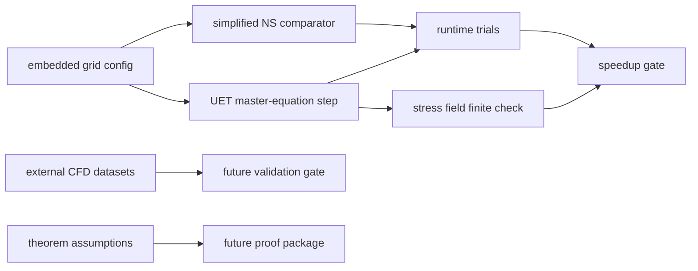

# 0.10 Fluid Dynamics and Chaos

## Problem

This topic studies whether UET-based fluid solvers can provide useful internal benchmark
behavior relative to repository Navier-Stokes comparators and canonical fluid references.

## Assumptions and scope

- Scope: internal speed, stability, and benchmark comparisons
- Out of scope: claiming closure of the Navier-Stokes Millennium problem
- Current topic materials mix solver engineering claims, mathematical interpretation, and
  benchmark comparisons; public summaries must keep those categories separate

## Conceptual Diagram

## Evidence Matrix

| Layer | Current status | Evidence / artifact | Claim allowed |
| :-- | :-- | :-- | :-- |
| Embedded speed benchmark | Runnable internal gate | `Result/artifacts/fluid_benchmark_validation.json` | implementation speed comparison |
| Stress finite-output check | Runnable internal gate | same artifact | stress-test diagnostic |
| UET fluid formulas | Formula-audited | `FORMULA_AUDIT.md` | model/component description |
| External CFD validation | Not yet packaged | `DATA_MANIFEST.md` | future validation target |
| Millennium proof target | Not part of current gate | `LIMITATIONS.md` | no mathematical-proof claim |

## Data sources

- Canonical reference citation: Reynolds 1883 in [docs/references.bib](/C:/Users/santa/Desktop/uet_harness/docs/references.bib:1)
- Topic benchmark configs and result folders under `Data/` and `Result/`

## Method summary

- 2D solver: `Code/01_Engine/Engine_UET_2D.py`
- 3D solver: `Code/01_Engine/Engine_UET_3D.py`
- Benchmark proof script: `Code/02_Proof/Proof_Turbulence_Benchmarks.py`
- Additional research scripts under `Code/03_Research/`

Supporting standard files:

- [METHOD.md](/C:/Users/santa/Desktop/uet_harness/docs/topics/0.10_Fluid_Dynamics_Chaos/METHOD.md:1)
- [DATA_MANIFEST.md](/C:/Users/santa/Desktop/uet_harness/docs/topics/0.10_Fluid_Dynamics_Chaos/DATA_MANIFEST.md:1)
- [VERIFICATION_SPEC.md](/C:/Users/santa/Desktop/uet_harness/docs/topics/0.10_Fluid_Dynamics_Chaos/VERIFICATION_SPEC.md:1)
- [BASELINE_COMPARISON.md](/C:/Users/santa/Desktop/uet_harness/docs/topics/0.10_Fluid_Dynamics_Chaos/BASELINE_COMPARISON.md:1)
- [LIMITATIONS.md](/C:/Users/santa/Desktop/uet_harness/docs/topics/0.10_Fluid_Dynamics_Chaos/LIMITATIONS.md:1)

## Parameters and fitting status

- Current topic wording should describe speed and stability as internal benchmark outputs
- Public summaries should not claim global smoothness or Millennium-problem closure
  unless a separate proof package is documented and independently reviewed

## Metrics and thresholds

- Internal metrics currently include runtime speedup and stability checks
- `Proof_Turbulence_Benchmarks.py` uses an internal benchmark target of speedup greater
  than `2.0x` together with finite stress-test output

## Baselines

- Comparator model: simplified Navier-Stokes solver in the benchmark proof script
- Supporting references: classical fluid-dynamics literature listed in repository citations

## Limitations and open risks

- Benchmark comparator is simplified and should be described honestly as such
- Internal speedups are implementation-specific and environment-sensitive
- Topic claims about proof-level consequences remain far stronger than the current
  repository benchmark evidence

## Reproducibility

- Verification command: `python docs/topics/0.10_Fluid_Dynamics_Chaos/Code/02_Proof/Proof_Turbulence_Benchmarks.py`
- Artifact contract: see [VERIFICATION_SPEC.md](/C:/Users/santa/Desktop/uet_harness/docs/topics/0.10_Fluid_Dynamics_Chaos/VERIFICATION_SPEC.md:1)

## Current readiness status

`Structured`

The latest embedded speed comparator remains `FAIL` at approximately `1.914x`
against the unchanged `2.0x` threshold. The separate chaos-method artifact is
`PASS_CHAOS_METHOD_VALIDATION`; it validates the diagnostic implementation on
standard controls and does not change the fluid comparator or external-CFD
status.
