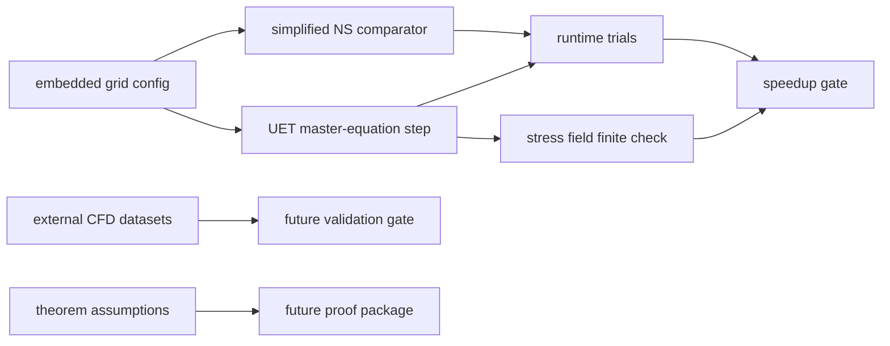

# 0.10 Fluid Dynamics and Chaos

## Problem

This topic studies whether UET-based fluid solvers can provide useful internal benchmark
behavior relative to repository Navier-Stokes comparators and canonical fluid references.

## Assumptions and scope

- Scope: internal speed, stability, and benchmark comparisons
- Out of scope: claiming closure of the Navier-Stokes Millennium problem
- Current topic materials mix solver engineering claims, mathematical interpretation, and
  benchmark comparisons; public summaries must keep those categories separate

## Conceptual Diagram

```mermaid
flowchart LR
    A["embedded grid config"] --> B["simplified NS comparator"]
    A --> C["UET master-equation step"]
    B --> D["runtime trials"]
    C --> D
    C --> E["stress field finite check"]
    D --> F["speedup gate"]
    E --> F
    G["external CFD datasets"] --> H["future validation gate"]
    I["theorem assumptions"] --> J["future proof package"]
```

## Evidence Matrix

| Layer | Current status | Evidence / artifact | Claim allowed |
| :-- | :-- | :-- | :-- |
| Embedded speed benchmark | Runnable internal gate | `Result/artifacts/fluid_benchmark_validation.json` | implementation speed comparison |
| Stress finite-output check | Runnable internal gate | same artifact | stress-test diagnostic |
| UET fluid formulas | Formula-audited | `FORMULA_AUDIT.md` | model/component description |
| Periodic velocity representability | Scoped source and analytic-control audit | Result/artifacts/fluid_state_velocity_representability_audit.json | no-go only for the current constant-M scalar-gradient map on nonzero periodic incompressible vortical targets |
| External CFD validation | Not yet packaged | `DATA_MANIFEST.md` | future validation target |
| Millennium proof target | Not part of current gate | `LIMITATIONS.md` | no mathematical-proof claim |

## Data sources

- Canonical reference citation: Reynolds 1883 in [docs/references.bib](/C:/Users/santa/Desktop/uet_harness/docs/references.bib:1)
- Topic benchmark configs and result folders under `Data/` and `Result/`

## Method summary

- 2D solver: `Code/01_Engine/Engine_UET_2D.py`
- 3D solver: `Code/01_Engine/Engine_UET_3D.py`
- Benchmark proof script: `Code/02_Proof/Proof_Turbulence_Benchmarks.py`
- Additional research scripts under `Code/03_Research/`

Supporting standard files:

- [METHOD.md](/C:/Users/santa/Desktop/uet_harness/docs/topics/0.10_Fluid_Dynamics_Chaos/METHOD.md:1)
- [DATA_MANIFEST.md](/C:/Users/santa/Desktop/uet_harness/docs/topics/0.10_Fluid_Dynamics_Chaos/DATA_MANIFEST.md:1)
- [VERIFICATION_SPEC.md](/C:/Users/santa/Desktop/uet_harness/docs/topics/0.10_Fluid_Dynamics_Chaos/VERIFICATION_SPEC.md:1)
- [BASELINE_COMPARISON.md](/C:/Users/santa/Desktop/uet_harness/docs/topics/0.10_Fluid_Dynamics_Chaos/BASELINE_COMPARISON.md:1)
- [LIMITATIONS.md](/C:/Users/santa/Desktop/uet_harness/docs/topics/0.10_Fluid_Dynamics_Chaos/LIMITATIONS.md:1)

## Parameters and fitting status

- Current topic wording should describe speed and stability as internal benchmark outputs
- Public summaries should not claim global smoothness or Millennium-problem closure
  unless a separate proof package is documented and independently reviewed

## Metrics and thresholds

- Internal metrics currently include runtime speedup and stability checks
- `Proof_Turbulence_Benchmarks.py` uses an internal benchmark target of speedup greater
  than `2.0x` together with finite stress-test output

## Baselines

- Comparator model: simplified Navier-Stokes solver in the benchmark proof script
- Supporting references: classical fluid-dynamics literature listed in repository citations

## Limitations and open risks

- Benchmark comparator is simplified and should be described honestly as such
- Internal speedups are implementation-specific and environment-sensitive
- Topic claims about proof-level consequences remain far stronger than the current
  repository benchmark evidence

## Reproducibility

- Verification command: `python docs/topics/0.10_Fluid_Dynamics_Chaos/Code/02_Proof/Proof_Turbulence_Benchmarks.py`
- Artifact contract: see [VERIFICATION_SPEC.md](/C:/Users/santa/Desktop/uet_harness/docs/topics/0.10_Fluid_Dynamics_Chaos/VERIFICATION_SPEC.md:1)

## Current readiness status

`Structured`

The latest embedded speed comparator remains `FAIL` at approximately `1.914x`
against the unchanged `2.0x` threshold. The separate chaos-method artifact is
`PASS_CHAOS_METHOD_VALIDATION`; it validates the diagnostic implementation on
standard controls and does not change the fluid comparator or external-CFD
status.

## Joint fluid–thermal research design (2026-09-26)

The [Topic 10–13 research plan](JOINT_RESEARCH_PLAN_TOPIC10_TOPIC13.md) and
[machine-readable work packages](Data/03_Research/fluid_thermal_joint_research_plan.json)
start with state/velocity representability, then matched numerical controls,
Core-admitted thermodynamic coupling, independent He-4 response, chaos and
work–precision comparisons. Graphite input acquisition proceeds on its own
three-package track. The work plan now includes a scoped J01 result; its unexecuted
packages remain proposed. This audit is not physical validation or a readiness
upgrade, and the existing speed, method-validation and physical-dependency gates
remain authoritative.

## OpenAI Navier–Stokes applicability review (2026-09-26)

The [source-backed applicability review](OPENAI_NAVIER_STOKES_APPLICABILITY_2026-09-26.md)
compares OpenAI's forced 3D incompressible blowup theorem and Lean release with
the actual 2D/3D Topic 10 state, equations and verification gates. Its method
guidance informed the completed J01 periodic rotational representability control.
A paper-derived 3D adversarial numerical case remains conditional on an admitted
velocity/momentum/forcing lane and reproducible source package.
The source review informed a scoped J01 control; no physical result, threshold, readiness, or claim status changed.

## J01 execution note (2026-09-26)

The periodic representability control now has a scoped result. The current 2D constant-M
scalar-gradient velocity map cannot represent a nonzero periodic incompressible vortical
target; the current 3D source does not define a vector velocity state. See the machine-readable
audit for source hashes, refinement metrics, mobility reset, unit boundary, and the missing
SciPy runtime limitation. This does not upgrade readiness or change existing gates.

## Vector-state reference follow-up (2026-09-30)

The [candidate state/derivation contract](VECTOR_STATE_RESEARCH_CONTRACT.md) separates
an independent incompressible velocity from C and distinguishes material rate Q
from Core Eulerian Pi. The [reference audit](Result/artifacts/fluid_vector_state_contract_audit.json)
passes 150 checks across three instantaneous Fourier grids, invalid-input rejection
and claim-boundary checks. Reciprocal scalar/fluid work and stress identities close
under the declared assumptions. This is not time integration, spatial/time PDE
convergence, an admitted UET operator, physical validation or a formal-kernel proof.

The initial control had cancelling work and failed negative-control sensitivity.
Its FAIL artifact is retained; amended controls detect missing force, reversed force
and silent Pi/Q substitution without relaxing tolerances. Merely starting at rest
does not recover parent Pi dynamics; the frozen-flow limit also requires zero
acceleration. The next controller is
vector_momentum_constitutive_origin_and_material_frame_admission_open.
Legacy speed, chaos-method, J04/J05 and Core admission boundaries are unchanged.

## OpenAI applicability update (2026-09-30)

The [additional review](OPENAI_APPLICABILITY_UPDATE_2026-09-30.md) maps OpenAI's
classical 3D results to the current 2D vector-reference boundary, records pinned
formalization/Comparator metadata and a newly screened explanatory source, and
proposes scoped P0-P5 work within the existing joint plan. These are design inputs,
not executed theorem, trajectory, physical or performance results. The
vector_momentum_constitutive_origin_and_material_frame_admission_open controller
and all Core/Topic 13 admission boundaries remain unchanged.
## Conditional conservative-action reference (2026-09-30)

A [separate derivation card](VECTOR_VARIATIONAL_ORIGIN.md) and
[action audit](Result/artifacts/fluid_vector_variational_origin_audit.json)
give a conditional first-variation origin for the reversible vector/material-rate
equations from one declared action. All 72 spacetime/fibre checks pass, including
finite differences, transport chain rules, rate momenta and Hamiltonian inversion.
This is a constitutive action choice, not a microscopic UET derivation or physical
admission. The canonical velocity derivative includes h Q grad Phi; its use does
not redefine physical mass or mechanically measured momentum. Local transport
errors can be invisible in integrated work. The physical controller is unchanged;
material/configuration and SI observable correspondence remain the next admission
requirements. Diffusion, viscosity, damping, entropy/FDT and He-II response are
not derived or validated by this conservative reference.

## Second-sound structural checkpoint (2026-09-30)

The [mode eligibility derivation](SECOND_SOUND_MODE_ELIGIBILITY.md) and
[139-check artifact](Result/artifacts/fluid_second_sound_mode_eligibility_audit.json)
exclude a hydrodynamic counterflow acoustic pair for the current stable,
homogeneous, finite-coefficient isothermal single-velocity candidate.
Its long-wave scalar mode is diffusive; its material oscillator stays gapped.
This is a scoped linearized exclusion, not an all-UET or nonlinear no-go.

A separate synthetic two-fluid positive control does have the acoustic pair.
Massless-undamped scalar and bulk-advection controls prevent overbroad conclusions.
The initial nominal PASS used an invalid complex norm and is retained as an
unaccepted diagnostic; the repaired 139 checks use a complex magnitude norm and
post-preview sign-error sensitivity controls without relaxing thresholds.

The coupled blocker is
isothermal_single_velocity_candidate_counterflow_acoustic_mode_missing.
Register and justify independent entropy/temperature, relative motion and
superfluid phase/chemical-potential dynamics before second-sound prediction.
No table-speed fit, He-II validation, physical J04/J05 execution or Core unlock
is implied. The overall physical controller remains
vector_momentum_constitutive_origin_and_material_frame_admission_open.

## Compressible two-fluid/EOS reference checkpoint (2026-09-30)

The [two-fluid state/EOS reference](TWO_FLUID_STATE_EOS_REFERENCE.md) supplies a
standard comparator with mass density, entropy density, total mass current and
superfluid potential flow. Its 59 checks cover both acoustic branches, reciprocal
quadratic work, finite-expansion mixing and the zero-expansion counterflow limit.
This is a standard-physics reference, not an admitted UET extension.

SVP density/heat-capacity tangents do not identify a complete fixed-pressure EOS.
Two synthetic positive EOS witnesses reproduce the same local path but yield
different sound poles. The narrower input controller is
two_fluid_fixed_pressure_EOS_and_UET_state_mapping_missing.
[Material requirements](Data/03_Research/he4_two_fluid_thermodynamic_input_requirements.json)
keep real values/uncertainties unassigned and separate saturation-path, constant
pressure and constant volume heat capacities, plus source ancestry.

Core needs a material thermodynamic Legendre/state/SI mapping and independent
superfluid phase/relative-motion correspondence before this comparator can
validate a UET mode. Existing single-velocity exclusion and physical gates remain
unchanged; no He-II data fit, attenuation, trajectory or dependency unlock.

## He-II fixed-constraint source checkpoint (2026-09-30)

The [source card](HE4_FIXED_CONSTRAINT_EOS_SOURCE_CARD.md) and
[56-check source audit](Result/artifacts/he4_tn1334_fixed_constraint_eos_source_audit.json)
package three liquid He-II rows from NIST TN1334 revised (September 1998).
Fixed-pressure c_p/expansivity, fixed-volume c_v and fixed-temperature
compressibility exist at these SVP equilibrium states; the source columns
alpha_p*T and P*kappa_T need explicit SI conversion. This fills part of the
source-acquisition gap exposed by the earlier path-only reference.

The printing-compatibility diagnostics pass with all five interpretation-error
controls detected. Printing resolution is not physical uncertainty. These are
calculated fitted-EOS rows; source sound/superfluid-density ancestry and primary
response protocol are unresolved. Modern NIST IR8474 excludes He-II. No two-fluid
speed, UET parameter fit or independent prediction was calculated.

The source controller is
he4_fixed_constraint_EOS_source_found_but_covariance_entropy_anchor_and_independence_open.
Per-row uncertainty/covariance, absolute entropy anchor and exact training/test
ancestry, plus the physical Core state/SI/phase mapping remain required.
Original admitted material requirements stay null. Overall physical admission
and J04/J05/J06 remain unchanged.

## He-II entropy source/reference checkpoint (2026-09-30)

The [entropy source/coordinate contract](HE4_ENTROPY_SOURCE_AND_REFERENCE_CONTRACT.md)
and [116-check audit](Result/artifacts/he4_entropy_source_reference_audit.json)
package three recommended fountain-pressure and three heat-capacity-integrated
entropy values from Donnelly-Barenghi Tables 8.3/8.5. The calorimetric table
explicitly integrates from 0 K; this is its own reference convention, not closure
of TN1334's selected-edition anchor. Primary Singsaas-Ahlers metadata resolves the
review's publication-year discrepancy to 1984. Full primary protocol remains missing.

A complete ideal two-fluid entropy-coordinate change preserves sound poles.
An incomplete substitution can change them while passing its own positive-work
check. This is a normalized standard reference; no physical entropy offset is
fitted and no numerical He-II acoustic prediction is made. Four regression tests
pass. Nominal entropy differences are descriptive; temperature scales and
physical uncertainty/covariance are not reconciled.

The source controller now distinguishes the found integration anchor from
unresolved transfer:
he4_entropy_integration_anchor_found_but_TN1334_reference_transfer_covariance_and_independence_open.
The overall material/frame controller, frozen Topic 13 constants, null material
requirements and physical J04/J05/J06 gates remain unchanged.

## Core O(2) common-flow composition checkpoint (2026-09-30)

[The current Core source contract](CORE_O2_COMMON_FLOW_COMPOSITION_CONTRACT.md)
tests a proposed shortcut: identify the formal static Doppler response as normal
inertia and combine it with tree phase stiffness. The [69-check diagnostic](Result/artifacts/fluid_core_o2_common_flow_composition_audit.json)
passes execution/normal/tree/refinement controls, but the distinct condensed
composition gate is FAIL_REQUIRED_COMMON_FLOW_IDENTITY at all three declared
finite-T points. Relative defects are about 6.95e-5, 6.76e-4 and 4.88e-3, above
the locked 1e-5 target and observed component-refinement changes.

This rejects that shortcut only. Existing Core static lanes, the EOS and O(2)
as a whole are not rejected or promoted. A source-function AST execution is
used because the local full Core facade lacks scipy; five-point derivatives
are an independent wrapper, not a native Core state rerun. Four new regression
tests pass. No stiffness is fitted to force the target.

The narrower candidate controller is
finite_temperature_phase_stiffness_and_normal_momentum_common_action_match_missing.
Derive finite-T flow/current/stress/phase stiffness from one consistent effective
action before material/SI/second-sound admission. Physical gates, original null
material inputs and frozen Topic 13 constants remain unchanged.

## Independent finite-T phase-flow Hessian (2026-09-30)

[Derivation card](CORE_O2_FLOW_HESSIAN_DERIVATION.md) extends the tree-stationary
quadratic action to a small condensate phase gradient in the normal-bath rest
frame. A phase-pressure Hessian is calculated independently of enthalpy and the
formal momentum proxy. Its implicit-root integral agrees with a separate
finite-flow quartic-root pressure derivative at all three prior condensed points.

[The 98-check reference](Result/artifacts/fluid_core_o2_flow_hessian_audit.json)
passes controls, and the separately evaluated common-flow scalar target now
passes: relative defects below 8e-12 against the locked 1e-5 target. Derived
thermal phase corrections are approximately -4.44e-5, -4.32e-4 and -3.14e-3
in natural E^2 units. No stiffness was solved from the target identity.
The previous tree-only FAIL artifact remains unchanged.

This is a new topic-local Gaussian-flow reference, not a whole Core runtime
rerun or an admitted He-II operator. Full current/stress/entrainment and
longitudinal-mode consistency remain open, followed by material/SI mapping.
Physical J04/J05/J06, frozen Topic 13 constants and original null material
requirements remain unchanged. The new narrower candidate controller is
fixed_Phi_flow_scalar_correspondence_passed_but_two_fluid_current_stress_entrainment_modes_and_material_mapping_open.

## Local current/stress and conditional ideal modes (2026-09-30)

[The local two-fluid derivation](CORE_O2_LOCAL_IDEAL_TWO_FLUID_DERIVATION.md)
uses independently differentiated source-mode thermodynamics and phase curvature.
A local quadratic scalar pressure supplies current, stress and entrainment;
finite source/metric variations and frame transformations test the same model.

[The 171-check artifact](Result/artifacts/fluid_core_o2_ideal_modes_audit.json)
passes controls. Conditional ideal conservation gives two distinct real acoustic
pairs at each prior condensed control. Positive speeds in natural c=1 units are:

| Natural T (not K) | Lower positive speed | Higher positive speed |
| --- | --- | --- |
| 0.04 | 0.2646564 | 0.4038129 |
| 0.08 | 0.3050918 | 0.4039554 |
| 0.16 | 0.3620211 | 0.4067927 |

These are local ideal-mode eligibility results, not physical He-II sound speeds.
Entropy conservation assumes local equilibrium; thermalization and the physical
frequency window are not derived. The local Taylor tensor is not a complete
nonlinear/interacting/live-Phi operator. Physical J04/J05/J06, material inputs,
Topic 13 constants and previous artifacts remain unchanged.
Next: nonlinear/thermalization/live-response completion, then material/SI and
independent EOS/entropy/measurement admission.

## Leading Goldstone collision preparation (2026-10-01)

[The collision derivation](CORE_O2_GOLDSTONE_COLLISION_DERIVATION.md) now
connects the fixed-response Core tree pressure to a derivative cubic phonon
vertex and a curved on-shell 1->2 decay channel.
[159 controls pass](Result/artifacts/fluid_core_o2_goldstone_collision_audit.json):
T=0 occupation decay approaches k^5, scales with the exploratory coupling and
has the correct factor-two relation to pole damping and the nonrelativistic
leading coefficient. This is natural-unit low-energy evidence, not He-II data.

The first 153/159 diagnostic is retained with its exact source. Factored
triangle geometry repairs numerical endpoint cancellation without relaxing a
threshold; rate values are unchanged within floating-point precision.
Balanced triads conserve energy/momentum and have positive entropy form, but
retain eight null modes in a disconnected 12-node diagnostic. No transport
time, finite-T rate, thermalization or collective sound damping is assigned.
Next: connected collision/vector heat-current projection and interacting
thermal-state convergence; nonlinear/live response and material admission remain.

## Shared collision/current basis: measured refinement still open (2026-10-01)

[The Galerkin derivation](CORE_O2_GOLDSTONE_GALERKIN_DERIVATION.md) extends
the leading Goldstone channel into a shared scalar/vector 1<->2 gain/loss form
at exploratory natural T=.002/.004 and lambda=.01. Every event uses exact
curved kinematics and the same polynomial functions. Four conservation nulls
remain in the finite basis; no interpolation/diagonal-width/collision projection
is added. The kinetic energy-current source is constrained to zero momentum.

[The artifact](Result/artifacts/fluid_core_o2_goldstone_galerkin_audit.json)
passes454 structural/source/unit controls, but its separate 1% refinement gate
FAILS: current response changes18.66%/18.49% between the last two basis sizes
and6.31%/4.94% between the last two cutoffs. Quadrature order and source
representation pass. Source representation is not collision-solution convergence.
No finite response/time is accepted for physical transport or second-sound damping.
Next: stable higher-order basis and low-energy-valid cutoff/soft-current
convergence, then interacting physical heat-current/frame/material admission.

## Stable vector refinement: independent-family targets still open (2026-10-01)

[The stable-vector card](CORE_O2_GOLDSTONE_VECTOR_REFINEMENT.md) uses
two-pass weighted orthogonal recurrences shared by quadrature and every event
leg. The EVEN family retains the original polynomial space; SOFT enriches it
with bounded low-momentum angular profiles. Kernel, states and1% targets stay
unchanged. Same-span order5 matches the old independent G/Q/source/response.

[The artifact](Result/artifacts/fluid_core_o2_vector_refinement_audit.json)
passes541 structural controls with Gram condition approximately1. SOFT order,
cutoff, basis and source targets pass within its family. EVEN cutoff changes
3.2679%/2.7748% and basis changes9.4195%/8.6995%; cross-family response differs
20.4462%/19.5268%. The overall refinement gate therefore remains OPEN.
Next: independently soft-enriched trial space and infrared/continuum-current
bounds, then interacting physical heat-current/frame/material admission.

## Independent soft enrichment and smooth trials (2026-10-01)

[The independent trial card](CORE_O2_GOLDSTONE_INFRARED_TRIALS.md) adds a
bounded radial seed to the old EVEN space, independently of SOFT's recurrence.
HYBRID18/SOFT35 response differs0.04684%/0.04251%, below the unchanged1%
targets. HYBRID basis/cutoff and smooth-origin epsilon/order controls pass.
[The artifact](Result/artifacts/fluid_core_o2_infrared_trials_audit.json)
passes664 structural checks. Old EVEN/cross-family failures remain immutable.

First high-order execution stopped at rounded near-collinear geometry. The
[first output/source](Result/previews/fluid_core_o2_infrared_trials_first_execution.json)
are retained; [the precision repair](CORE_O2_GOLDSTONE_INFRARED_GEOMETRY_REPAIR.md)
keeps the collision measure/vertex/gain-loss AST, state and numerical targets.
Matched old G/Q/source/R differ below1.3e-13; no event clipping or fitted rates.
Finite trial agreement does not establish a continuum upper/error bound, collision
domain, physical heat-current/frame or material response. These now control.

## OpenAI method transfer follow-up (2026-10-01)

The [additional source/design review](OPENAI_FORMAL_TRANSFER_REVIEW_2026-10-01.md)
compares the pinned Lean reference definitions, submission and direct bridges.
Selected definition blocks match after lexical normalization; this is not a
Lean/Comparator or transitive proof audit. It maps formal-pilot obligations onto
the current selected collision-domain/current-response and material/frame
blockers. Proposed work remains unexecuted; physical J04/J05/J06, thresholds,
readiness and Core/Topic13 dependency boundaries are unchanged.

## Selected continuum form and soft noncoercivity (2026-10-01)

The [finite-cutoff derivation card](CORE_O2_GOLDSTONE_CONTINUUM_FORM.md) and
[292-check diagnostic](Result/artifacts/fluid_core_o2_continuum_form_audit.json)
support conditional internal statements for the same selected cubic kernel:
bounded vector trials have finite collision norm, smooth soft seeds converge
in both G/Q norms, the maximal radial domain is dense/closed, and momentum is
the only radial-vector null while no uniform positive vector Rayleigh gap exists.
Exact rational cubic algebra, original-source event inequalities and soft bump
bounds pass; this is not Lean/interval/independent proof verification.

The next selected controller is
source_weighted_continuum_current_upper_bound_and_microscopic_heat_current_correspondence_open.
No-uniform-gap does not imply divergent current response or exclude every
source-specific hydrodynamic window. Material heat-current/frame, interacting
channels/state, nonlinear/live response and SI/source admission stay open.
All historical finite refinement results and physical J04/J05/J06 remain unchanged.

## Conditional source-specific current finiteness (2026-10-01)

The [current-bound card](CORE_O2_GOLDSTONE_CURRENT_BOUND.md) and
[289-check artifact](Result/artifacts/fluid_core_o2_current_bound_audit.json)
derive an explicit positive event lower formula on two patches, a weighted
graph estimate and a finite dual norm for the exact momentum-orthogonal
kinetic source. The selected continuum ratio sup b^2/Q has an explicit finite
upper formula despite the unchanged absence of a uniform positive Q/G gap.
This supports conditional internal finiteness, not a strong Hilbert inverse.

The conservative bound is extremely loose: approximately2.89e70 and3.54e71
in naturalE4 at the two selected states. It does not provide a useful1%
response/error bracket or a material conductivity. Numerical patch checks are
not sampled-minimum certificates; no Lean/interval/independent proof ran.
The next selected controller is
useful_certified_continuum_current_error_and_microscopic_heat_current_correspondence_open.
Physical vector/material origin, Topic13 heat-current/EOS/frame/protocol and
interacting/nonlinear/live/SI/source admission remain open; J04/J05/J06 unchanged.

## Tree spatial current origin checkpoint (2026-10-01)

[The microscopic current card](CORE_O2_MICROSCOPIC_CURRENT_WARD.md) and
[303-check artifact](Result/artifacts/fluid_core_o2_current_ward_audit.json)
connect the selected kinetic flux to source-verbatim Core Noether/stress currents
at tree level and zero background flow. With action-normalized modes,
J_E=k, J_G=E*v_g and J_E=J_G+mu*J_N. The old momentum-projected source is
P_perp J_G, a rotating-generator H-mu Q flux. It is not admitted material heat flux.

Both positive branches, phase/amplitude/order controls, finite-flow derivatives,
index/charge/omitted-charge negative controls and scale diagnostics pass.
No complete condensate-adjusted density, interacting current, physical frame,
SI/He-II or J04/J05/J06 admission is made. The useful continuum error bracket
also remains open. New selected controller:
useful_certified_current_error_and_interacting_Noether_heat_frame_material_correspondence_open.
Overall physical controller is unchanged.

## Leading mean density response checkpoint (2026-10-01)

[The density card](CORE_O2_DENSITY_BACKREACTION.md) and
[398-check artifact](Result/artifacts/fluid_core_o2_density_backreaction_audit.json)
include the homogeneous order-A0^2 radial condensate response. Raw wave charge
alone disagrees with the thermodynamic mode charge. Adding the mean contribution
gives q/Nwave=-d_mu E and e/Nwave=E+mu*q/Nwave; rotating-generator density is E.
Original Core action/EOM/Noether/stress source and independent root derivatives
support these selected identities. Fixed-K lower-mode Gaussian pressure
derivatives provide separate bookkeeping controls.

This does not solve a full nonlinear wave or self-consistent interacting EOS.
The primary paper's T^2>>lambda*mu^2 accuracy regime is not met by these selected
states. Source errors report cancellation conditioning explicitly. Physical heat/
material frame, useful certified current error, Topic13 EOS/protocol/SI and
physical J04/J05/J06 remain open. The selected and overall controllers are unchanged.

## Condensed interacting method admission (2026-10-02)

The [method card](CORE_O2_INTERACTING_METHOD_ADMISSION.md) and
[source/branch/algebra artifact](Result/artifacts/fluid_core_o2_interacting_method_audit.json)
pass156/156 prelocked internal diagnostics. Current original normal Hartree and
renormalized Hartree definitions reject both selected condensate points at all
three orders (12 exact branch rejections), while a separate T=.2,mu=.3 normal
control returns six normal-only states. A branch rejection does not rule out
condensed solutions.

Exact conditional source residual algebra distinguishes original Hartree
stationarity from its Goldstone replacement. Synthetic rational tadpoles are
not a solved interacting thermal state. Ten independent condensed-method
obligations remain NOT_STARTED; no conserved/gapless method or material heat
frame is admitted. This narrows method selection before implementing a solver.
Overall/selected physical controllers and J04/J05/J06 remain unchanged.

## Current execution priority (2026-10-05)

Topic 10 is a secondary lane under explicit user direction. Prioritize shared
Core/Topic 13 derivations: functional stationarity/Goldstone consistency,
source-varied current/stress/thermodynamic response, then the material heat/frame
and EOS/protocol handoff. Advance one derivation wave at a time; new benchmark
expansion is deferred. See the [joint plan](JOINT_RESEARCH_PLAN_TOPIC10_TOPIC13.md)
and its machine-readable `execution_priority_policy`. This is a scheduling
change, not a new result, readiness upgrade or physical gate admission.

## SD01 completed within the secondary derivation boundary (2026-10-05)

The [shared handoff](CORE_O2_GAPLESS_FUNCTIONAL_HANDOFF.md) records an explicit
phenomenological gHF approximation with fixed-Q mean-field variation and static
Goldstone consistency. Its [artifact](Result/artifacts/fluid_core_o2_gapless_functional_audit.json)
passes 192/192 exact internal checks; four focused regressions pass. The original
186-check execution is retained. No thermal integral state or external vertex is
computed. All ten method gates and physical J04/J05/J06 stay NOT_STARTED.

SD01 is COMPLETED_SCOPED_DERIVATION_ONLY; SD02/SD03 remain PLANNED. The next method
controller is finite_density_gHF_integral_state_renormalization_and_external_source_vertex_not_admitted.
Overall and selected physical controllers are unchanged. Topic 10 stays secondary;
new benchmark expansion is deferred. Central foundation/path-reference failures
and scientific-link DRIFT remain disclosed in the handoff; this is not an all-Core
verification pass or admission of the candidate registry.

## SD02 conditional stationary source response (2026-10-05)

The [SD02 handoff](CORE_O2_STATIONARY_SOURCE_HANDOFF.md) and
[149-check artifact](Result/artifacts/fluid_core_o2_stationary_source_response.json)
complete the scoped coincident-tensor and stationary-source chain derivation.
gHF trace response agrees with Hartree while its traceless kernel changes sign;
static pressure curvature needs both direct and state-relaxation terms. Exact
synthetic/domain negatives and four regressions pass. Existing Topic13 curvature
is pinned as a separate parent/scope, not borrowed as interacting vertex evidence.
SD02 is COMPLETED_SCOPED_DERIVATION_ONLY; SD03 remains PLANNED. Method/physical
controllers, all ten method gates and physical J04/J05/J06 are unchanged.
No thermal state, full vertex, physical current/stress or new benchmark expansion.

## SD03 material frame and EOS handoff (2026-10-05)

[SD03 handoff](MATERIAL_FRAME_EOS_HANDOFF.md) connects the stationary source Hessian
to enthalpy heat subtraction, fixed-pressure c_p, entropy-reference/source changes,
SI particle/pressure/velocity maps and joint covariance/protocol requirements.
The [160-check artifact](Result/artifacts/fluid_material_frame_eos_handoff.json)
and four focused regressions pass after retaining and repairing the first two
entropy-current target failures. All three secondary handoffs SD01-SD03 are
COMPLETED_SCOPED_DERIVATION_ONLY. Existing material input values/scales remain null;
all ten method gates and physical J04/J05/J06 are unchanged. Full research remains
open under the shared finite-density state/source/renormalization controller.
Topic10 stays secondary; new benchmark expansion remains deferred.
