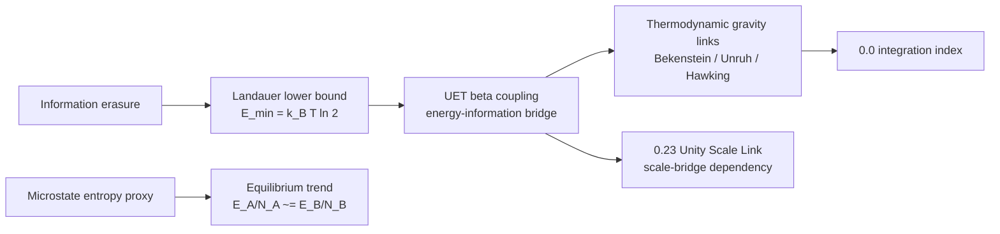

# Method

## Problem target

This topic studies whether UET can connect entropy, information cost, and dissipation benchmarks under one bridge model.

## Core components

### Engine components
- `Code/01_Engine/Engine_Thermodynamics.py`

### Proof-oriented components
- `Code/02_Proof/Proof_Entropy_Max.py`

### Research and comparison components
- `Code/03_Research/Proof_Vacuum_Entropy_Sink.py`
- `Code/03_Research/Research_Landauer.py`
- `Code/03_Research/Research_NonEquilibrium_Validation.py`

## Mechanism map

## Evidence matrix

| Layer | Current implementation | Evidence class | Use in theory |
|:--|:--|:--|:--|
| Landauer identity | Exact-constant calculation in engine and verifier | `C` | Supports information-energy lower-bound bridge. |
| Entropy/equilibrium proxy | Stirling entropy proxy and stochastic contact engine | `D/C` | Useful model sandbox; needs seeded ensemble acceptance. |
| Bekenstein/Unruh/Hawking links | Formula-consistency checks against standard identities | `D/C` | Context for thermodynamic gravity bridge; not independent UET validation. |
| Cattaneo heat-flux benchmark | Synthetic hysteresis dataset and Euler relaxation update | `D` | Demonstrates expected lag behavior only. |
| Vacuum entropy sink | Topic-local heuristic simulation | `E/D` | Hypothesis sandbox; cannot support core claims yet. |

## Variable framing

- Primary modeled quantities: entropy, dissipated work, information cost, relaxation terms, and bridge coefficients
- Physical-unit formulas use SI constants where available (`k_B`, `hbar`, `c`, `G`, `e`, `h`).
- Engine entropy/equilibrium quantities are dimensionless proxies unless an explicit physical scale is introduced.

## Assumptions

- The topic currently uses selected dissipation and information-thermodynamics benchmarks rather than a universal derivation.
- Landauer measurements are treated as lower-bound consistency checks, not exact predictions of total dissipated heat.
- Bekenstein, Unruh, and Hawking formulas are established theoretical identities used as bridge constraints, not as standalone proof of UET.

## Domain of validity

- Selected Landauer-style and nonequilibrium thermodynamics comparisons represented in topic-local files.

## Excluded cases

- A universal proof across all thermodynamic regimes or all coarse-graining choices.
- Direct experimental measurement of Hawking/Unruh temperatures in the regimes shown by the verifier.
- Physical proof that the proposed vacuum entropy sink exists.

## Parameter sensitivity note

- Reported behavior depends on coarse-graining choices and selected bridge coefficients.
- Synthetic non-equilibrium behavior depends on `tau`, `k_cond`, and the hand-built Cattaneo benchmark.

## Dependency layer

| Dependency | Direction | Status |
|:--|:--|:--|
| `0.0_Grand_Unification` | receives this topic as a bridge constraint | Integration-only until this topic's external data and formula audit are source-locked. |
| `0.23_Unity_Scale_Link` | depends on this topic for information-energy scale logic | Must inherit `0.13` limitations where scale links rely on Landauer/Bekenstein bridge claims. |
| `0.26_Cosmic_Dynamic_Frame` | may reference thermodynamic frame language | Cannot use synthetic/vacuum-sink sections as empirical support. |
## Lattice momentum-relaxing heat-parent method (2026-09-02)

The preferred-frame escape route is first tested as a standard-physics parent,
not inserted into the UET action. In natural units, isotropic acoustic modes use
`E(p)=c_s p` and the whitened temperature-gradient source
`S_T=sqrt[d^3p n_B(1+n_B)/3] beta E v`. The collision split is
`C_N=gamma_N(I-|P><P|)` and `C_R=gamma_R I`, where `C_N` preserves crystal
momentum and `C_R` is a declared synthetic resistive control.

The steady linearized PBTE is `(C_N+C_R)chi=S_T`, with
`kappa_natural=S_T^T chi` and entropy quadratic form
`sigma=chi^T(C_N+C_R)chi`. The diagnostic must fail closed at `gamma_R=0`
when `S_T` overlaps the momentum null. A positive finite result is admissible
only after symmetry, positivity, inverse-rate scaling, quadrature convergence
and `E^2` unit scaling pass. No physical rate or UET correspondence is inferred
from this parent.

## Umklapp correspondence decision method (2026-09-02)

Before adding a resistive kernel, compare the selection rule of the owning UET
collision lane with the standard lattice requirement. The current continuum
events use `p1+p2-p3-p4=0`; an Umklapp event requires
`p1+p2-p3-p4=G!=0`, with `G` derived from a reciprocal lattice. Inventory the
owning action/config fields and vertex arguments, then verify eventwise energy
and momentum residuals. If no reciprocal structure exists, close direct reuse
as a scoped no-go rather than inserting `gamma_U` into the UET action.

For TTG, proceed through a declared external material-lattice sector and derive
the interface to UET variables. Treat a UET-generated periodic background and
Bloch spectrum as a separate fundamental track with its own stability, units,
observable and homogeneous-limit gates.

## Material PBTE input-admission method (2026-09-02)

Inspect the archived binary schema rather than inferring transport content from
a PBTE filename. Admit mode arrays only when the source summary hash and size
match and the arrays are finite. Keep total RTA linewidth distinct from a
resistive-only rate. A physical momentum-relaxing parent requires either a
Normal/Umklapp-resolved decomposition or a complete admissible collision
operator whose null modes, positivity, entropy and convergence can be checked.

Collision eigenvalues alone cannot reconstruct that operator or its conserved
subspace. Source-backed frequency, velocity and heat-capacity arrays may enter
the material comparator interface while the collision split, Ding material
mapping, uncertainty and UET coupling remain blocked.

## Conditional UET-material interface method (2026-09-02)

Assign state ownership before coupling equations: UET owns `(C,Phi,Pi)` and
the material sector owns displacement, strain and phonon occupations. Introduce
a canonical response amplitude only through `Phi_E=Z_Phi DeltaPhi`. The
minimal scalar-strain candidate is
`L_int=-g_Phi_theta Phi_E div(u)`, which preserves uniform displacement shift
symmetry and gives equal-and-opposite energy exchange between subsystems.

Expose the observable dependency as
`alpha_Phi_K=chi_u_theta*g_Phi_theta*Z_Phi/C_src`, with SI conversion and
uncertainty still required. Test the coordinate degeneracy
`Z_Phi -> s Z_Phi`, `g -> g/s`; invariance means neither factor can be inferred
from normalized dynamics alone. Do not evaluate the formula until each factor
has a derivation or independent source role.

## Material-interface factor-resolution method (2026-09-02)

Resolve the conditional coefficient factor by factor before attempting a
number. Compare the field support and mass dimension of every existing action
operator with the proposed material operator. The current `h` coefficient
multiplies `delta_phi*chi^2` and has natural mass dimension one; the required
`g_Phi_theta` multiplies `Phi_E*div(u)` and has mass dimension three. A direct
substitution is inadmissible even though both complete terms have energy-density
dimension four.

Keep the action-derived `alpha_Phi_T^nat=(partial_Phi epsilon)/(partial_T
epsilon)` in the homogeneous O(2) lane. It is not the material-lattice product
and is not kelvin per normalized base `Phi`. Classify `Z_Phi`, `g_Phi_theta`,
`chi_u_theta`, `C_src` and `C_N+C_R` independently. Propagate uncertainty only
after all factors share one unit and material/state contract, using
`Var(alpha)=grad(alpha)^T Sigma grad(alpha)`; the independent-factor sum is a
special case, not a license to assume independence in physical data.
