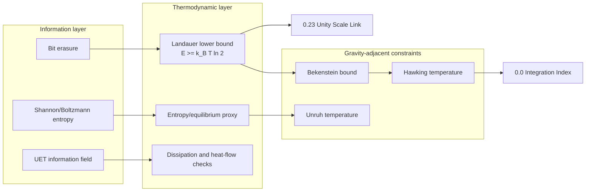

# 0.13 Thermodynamic Bridge

Current hardening result: an action-derived natural-unit Phi-to-thermal bridge and non-Landauer natural beta slope are CLOSED_FOR_LANE. Full Topic 13 remains blocked by the physical Phi/SI anchor, independent alpha_Phi_K, source-backed c_v or Ding C_src, EOS/transport/KMS/entropy, and dimensional TTG gates. The natural fixed-(mu,Phi) C_epsilon_T is not relabeled as source c_v.

Current hardening result T13-130: the covariant-action natural-unit to SI conversion contract is CLOSED_FOR_LANE as symbolic dimensional bookkeeping backed by exact SI defining constants. It does not select E_ref or Phi_scale, does not derive e0 or alpha_Phi_K, and does not unlock Core or external validation. Full Topic 13 remains BLOCKED_OPEN_T13_FULL_BRIDGE / PARTIAL.

Current hardening result T13-092: finite-temperature condensate/normal thermodynamic split, branch-resolved static quasiparticle response, condensed stiffness boundary, and the normal-branch formal heat-flux/entropy balance are CLOSED_FOR_LANE. The static susceptibility is not Landau density or retarded Kubo, condensed dissipative transport remains open, and physical Phi/SI, alpha_Phi_K, Ding C_src, and Full Topic 13 remain blocked.

Machine-readable lane artifact: docs/core/artifacts/t13_uet_o2_finite_temperature_two_fluid_response_audit.json.

Current hardening result T13-093: the declared finite-cutoff continuum-resolution sequence is CLOSED_AS_NO_GO for continuum promotion under the unchanged `1e-2` controller because its maximum adjacent response change is `0.47541462972440046`. This is scoped to the current discretization; no extrapolated continuum or physical Kubo claim is allowed.

Machine-readable boundary artifact: docs/core/artifacts/t13_uet_o2_continuum_limit_boundary_audit.json.

Current hardening result T13-094: condensed dissipative transport identifiability is CLOSED_AS_NO_GO for the current static lane. Two positive-semidefinite entropy-production witnesses agree on the declared static state but give different responses under a nonzero probe, so no unique condensed dissipative matrix can be inferred without a relative-flow/collision kernel or retarded correlator.

Machine-readable boundary artifact: docs/core/artifacts/t13_uet_o2_condensed_dissipative_transport_audit.json.

Source-route repair: the permitted Ding 2022 figure-derived normalized comparator now regenerates as PASS while raw author PBTE/C_src remains blocked; it is not a thermal prediction or calibration.

Machine-readable current status: docs/topics/0.13_Thermodynamic_Bridge/Result/artifacts/topic13_full_thermodynamic_bridge_core_ready_gate.json.

Current hardening result T13-160: Calorine model/state spread comparison is CLOSED_FOR_LANE and the current full-LBTE route is CLOSED_AS_NO_GO. The full gate remains BLOCKED_OPEN_T13_FULL_BRIDGE / PARTIAL with 9 open blocker groups; no Ding C_src, independent alpha_Phi_K, physical Kubo coefficient, holdout access, or downstream dependency is promoted.
Current hardening result T13-161: the formal EOS-to-SK/KMS-to-entropy-to-heat-flux integration is CLOSED_FOR_LANE. It proves cross-module internal consistency only; physical Kubo coefficients, independent alpha_Phi_K, Ding-compatible C_src, SI mapping, and Full Topic 13 remain open.
Machine-readable formal bridge artifact: docs/core/artifacts/t13_formal_thermodynamic_bridge_integration_audit.json.

Current hardening result T13-162: the Day 2012 preferred thermodynamic assessment route is CLOSED_FOR_LANE as a source-compatibility boundary. Table 2 records graphite B0 uncertainty and a thermal-expansion function, but it does not provide alpha uncertainty, a same-specimen alpha_V/K_T pair, or Ding TTG material mapping. Full Topic 13 remains BLOCKED_OPEN_T13_FULL_BRIDGE / PARTIAL.

Machine-readable Day route artifact: docs/core/artifacts/t13_day2012_preferred_thermodynamic_table_boundary_audit.json.

MAJOR_RESULT_CLOSURE: CLOSED_FOR_LANE for T13_DAY2012_PREFERRED_THERMODYNAMIC_ASSESSMENT_BOUNDARY.
WHAT_IS_ACTUALLY_CLOSED: Public Table 2 locator, graphite B0 and dB/dT uncertainty fields, the stated graphite volume-expansion function, source package hash, and the route-level no-go under the current same-state uncertainty contract.
WHAT_REMAINS_OPEN: alpha_V source uncertainty, same-grade and same-state alpha_V/K_T matching, Ding material-regime mapping, c_v source uncertainty, independent alpha_Phi_K, and the other eight full-gate blockers.
DEPENDENCY_UNLOCKED: Day thermodynamic-assessment boundary only; no Cp-to-Cv correction, Ding C_src, alpha calibration, Core, Gravity, transport, Galaxy, or external-validation dependency is unlocked.
STATUS: PASS_SCOPED_DAY2012_THERMODYNAMIC_ASSESSMENT_BOUNDARY; Full Topic 13 remains BLOCKED_OPEN_T13_FULL_BRIDGE.
WHAT_CHANGED: Added a source package, verifier, artifact, full-gate projection, closure-register/dependency evidence, and regression test. No numeric correction, fit, threshold change, or holdout access was used.
EQUATION_OR_MAPPING: V(T)/V0 = 1 + a0*(T - 298) - 20*a0*(sqrt(T) - sqrt(298)); K_T(T) = B0 + Bprime*(T - 298); c_p^V - c_v^V = T*alpha_V^2*K_T remains unevaluated.
VERIFICATION: Day audit passed all checks; focused Topic 13/registry regression passed 14 tests; full gate remains PARTIAL with 9 open blockers; claim_promotion=false; Xie 2026 remains unconsumed.
CONTROLLING_BLOCKER: same_grade_alpha_V_and_K_T_missing for this route; globally Ding-compatible C_src and independent alpha_Phi_K remain the nearest controllers.
NEXT_ACTION: Acquire a permitted same-state alpha_V/K_T record with uncertainty and Ding-regime mapping, or retain this no-go and continue the independent Ding C_src and Phi/SI acquisition routes.
CLAIM_BOUNDARY: This is a route-level source boundary, not a numeric Cp-to-Cv correction, Ding C_src, alpha_Phi_K calibration, TTG prediction, physical transport, external validation, or Full Topic 13 closure.


<!--
{
  "@context": "https://schema.org",
  "@type": "ScholarlyArticle",
  "name": "UET Topic 0.13: Thermodynamic Bridge",
  "description": "Thermodynamic and information-energy bridge module for Unity Equilibrium Theory.",
  "about": "Thermodynamics, Information Theory, Landauer Limit, Entropy, Information-Energy Equivalence, UET"
}
-->

> [!NOTE]
> **AI-Digest**: UET Topic 0.13 is the core information-energy bridge. Its strongest current support is source-backed Landauer lower-bound consistency (`E >= k_B T ln 2`) plus formula-consistency checks for Bekenstein/Unruh/Hawking thermodynamic links. The UET-specific bridge mechanism remains a hardening target that depends on source-locked data, explicit units, verifier artifacts, and cross-topic dependency control.


> **Research role:** this topic constrains how UET may connect information, entropy, and energy cost. Strong claims must cite the formula audit, data manifest, and verifier artifact rather than relying on the conceptual bridge alone.

---

## 1. 5x4 Grid Structure

| Pillar | Purpose |
| :--- | :--- |
| **Doc/** | Analysis of information-energy equivalence and thermodynamic bridge assumptions. |
| **Ref/** | Landauer, Berut, Jacobson, Bekenstein, and related source anchors. |
| **Data/** | Topic-local Landauer, black-hole, constants, and synthetic heat-flux working copies with open source-lock tasks. |
| **Code/** | `01_Engine` microstate/thermodynamic helpers, `02_Proof` entropy proxy, and `03_Research` bridge checks. |
| **Result/** | Verifier artifact, entropy plots, and Landauer/Bekenstein/Jacobson visual outputs. |

---

## Theory Connection



---

## Research Hardening Matrix

| Layer | Current status | Evidence path | What strengthens the theory next |
| :-- | :-- | :-- | :-- |
| Core mechanism | Information-erasure energy bridge via Landauer-style relation | `METHOD.md`, `FORMULA_AUDIT.md` | Map each thermodynamic term to units, constants, and verifier roles. |
| Data | Berut/CODATA source records plus topic-local working copies with hashes | `DATA_MANIFEST.md`, `docs/data/external/thermodynamics/landauer/berut_2012/source_record.json`, `docs/data/external/constants/codata/si_2019_exact_constants.json` | Archive raw/supplemental Berut numeric tables and add uncertainty-aware preprocessing notes. |
| Formula | Reviewed formula audit maps Landauer, entropy proxy, Bekenstein, Unruh, Hawking, Cattaneo, and vacuum-sink formulas | `FORMULA_AUDIT.md` | Add uncertainty propagation, audit duplicate helper constants, and separate identity checks from UET-specific bridge claims. |
| Verification | Primary script writes structured artifact with metrics, thresholds, hashes, and warning reasons | `VERIFICATION_SPEC.md`, `Result/artifacts/0_13_thermodynamic_bridge_verification.json` | Promote from `WARN` only after external source-lock and cross-topic proof dependencies are closed. |
| Theory dependency | Feeds UET's information-energy and entropy interpretation | `0.0_Grand_Unification`, `0.23_Unity_Scale_Link`, `0.26_Cosmic_Dynamic_Frame` | Define exactly which claims inherit this bridge and which remain open. |
| Limitation | Strong conceptual importance, incomplete provenance normalization | `LIMITATIONS.md` | Separate theoretical identity, experimental lower-bound benchmark, synthetic benchmark, and heuristic extension. |

---

## Problem And Current Result

- **The Problem:** Thermodynamics deals with heat and work, while Information Theory deals with bits and bandwidth. Landauer's Principle gives a concrete bridge (`E >= k_B T ln 2`), but UET still needs an explicit, checkable mapping from information-field variables to thermodynamic observables.
- **The Solution:** UET treats information as physical and uses Landauer/Bekenstein-style constraints as boundary conditions for the bridge. The current research task is to make each variable, unit, constant, formula, and dependency auditable.
- **The Result:** The present verifier checks exact-constant Landauer consistency and lower-bound behavior against pinned source records; broader UET thermodynamic claims remain tied to the open hardening tasks in `FORMULA_AUDIT.md`, `DATA_MANIFEST.md`, and `LIMITATIONS.md`.

---

## Test Results

| Category | Test | Result | Status |
| :--- | :--- | :--- | :--- |
| **01_Engine** | Thermo Solver | Entropy/equilibrium proxy, needs seeded ensemble gate | WARN |
| **02_Proof** | Entropy Max | Delta-S simulation check, not a formal proof | WARN |
| **03_Research** | Landauer Data | Exact-constant lower-bound consistency | PASS/WARN |
| **03_Research** | Black Hole Entropy | Formula-consistency with area law | WARN |

---

## 2. Quick Start

```powershell
.venv\Scripts\python.exe docs\topics\0.13_Thermodynamic_Bridge\Code\03_Research\Research_Landauer.py
```

## Spacetime trace lane (diagnostic)

- Core contract: docs/core/TRACE_RESEARCH_SPEC.md
- Ontology and formula artifacts: docs/core/artifacts/trace_ontology_contract.json and trace_kernel_formula_audit.json
- Synthetic benchmark: Code/03_Research/Research_Spacetime_Trace.py
- Benchmark artifact: Result/artifacts/cattaneo_benchmark_artifact.json
- Current status: normalized internal gates pass; SI closure and external benchmark remain open
- Claim boundary: candidate mechanism and simulation-only; no UET thermodynamic bridge proof claim

## Matter-space thermal control pilot (diagnostic)

- Pilot contract: [THERMAL_MATTER_SPACE_PILOT_SPEC.md](./THERMAL_MATTER_SPACE_PILOT_SPEC.md)
- Reproducible runner: [Research_Matter_Space_Thermal_Control.py](./Code/03_Research/Research_Matter_Space_Thermal_Control.py)
- Machine-readable result: [matter_space_thermal_control.json](./Result/artifacts/matter_space_thermal_control.json)
- External-source intake: [matter_space_second_sound_source_package.json](./Data/03_Research/matter_space_second_sound_source_package.json)
- Source/observable review: [THERMAL_SOURCE_OBSERVABLE_MAPPING_SPEC.md](./THERMAL_SOURCE_OBSERVABLE_MAPPING_SPEC.md)
- Readiness artifact: [matter_space_thermal_observable_map_readiness.json](./Result/artifacts/matter_space_thermal_observable_map_readiness.json)
- Current result: `SIMULATION_ONLY / FAIL`; analytical Cattaneo controls, source sign, core cross-check, arrival-speed error, and the disclosed refined ledger pass, while physical pre-arrival leakage (`0.01764` versus `1e-6`) and the external numeric-source gate remain failed.
- Numerical disclosure: the locked `dt=2.5e-4` run failed the per-step ledger threshold; a post-diagnostic amendment reduced only `dt` to `5e-5`, retained the original failure, and passed the unchanged ledger threshold. This is a numerical repair, not a blind confirmation.
- Dimensional claim boundary: `Phi` and `R` remain normalized internal variables, the trace has no backreaction, no dimensional map to kelvin/heat flux/entropy is closed, and Landauer remains an external lower-bound constraint only.
- New mapping result: the standard TTG observable is now locked as a normalized quasi-temperature difference, and the candidate UET operator is `Delta_Phi(t)/Delta_Phi(0)`; the dimensional `alpha_Phi_K`, local numeric source, heat-flux map, and entropy-production map remain blocked.
- Claim boundary: `Phi` and `R` remain normalized internal variables, the trace has no backreaction, the normalized TTG operator is a definition rather than validation, and Landauer remains an external lower-bound constraint only.

## Core thermodynamic constraint export (dependency-only)

- Contract: [CORE_THERMODYNAMIC_CONSTRAINT_SPEC.md](./CORE_THERMODYNAMIC_CONSTRAINT_SPEC.md)
- Reproducible gate: [Research_Core_Thermodynamic_Constraint_Gate.py](./Code/03_Research/Research_Core_Thermodynamic_Constraint_Gate.py)
- Machine-readable result: [0_13_core_thermodynamic_constraint_gate.json](./Result/artifacts/0_13_core_thermodynamic_constraint_gate.json)
- Current result: `BLOCKED / THERMODYNAMIC_CONSTRAINT_EXPORTS_AVAILABLE_CORE_CLOSURE_NOT_DERIVED`.
- Allowed inheritance: the Landauer lower bound and standard thermodynamic/gravity identities may be exported only as class-C constraints; the Cattaneo lane remains a synthetic control.
- Still blocked: a non-circular UET bridge, a derived `beta`, charge equation of state, covariant transport and entropy-current closure, a dimensional map from `Phi` or `R` to measured thermal observables, and external heat-transport validation.
- Status effect: none. Topic `0.13` remains `Draft / B`, its four source-row controllers remain unchanged, and this packet does not promote the foundation `WARN` state.

## Key Files

- [Engine_Thermodynamics.py](./Code/01_Engine/Engine_Thermodynamics.py): microstate and thermodynamic helper engine.
- [FORMULA_AUDIT.md](./FORMULA_AUDIT.md): formula registry with units, constants, proof status, verifier role, and failure modes.
- [DATA_MANIFEST.md](./DATA_MANIFEST.md): data provenance, local hashes, benchmark roles, and external source-lock targets.
- [VERIFICATION_SPEC.md](./VERIFICATION_SPEC.md): primary command, thresholds, artifact path, and interpretation rules.
- [Research_Landauer.py](./Code/03_Research/Research_Landauer.py): primary verifier for Landauer/Bekenstein/Jacobson formula checks.

---

*Core hardening status: formula-audited, verifier-artifact enabled, source records pinned, raw-table source-lock still open.*


## Latest Hardening Lane: T13-121

The declared finite-temperature 1<->3 and representative 2<->2 channels now expose numerical retarded, advanced, and Keldysh components with explicit spectral and FDT checks. This is internal natural-unit evidence only. The full off-shell all-channel 1PI object, physical renormalization anchor, dimensional `Phi` map, `alpha_Phi_K`, source closure, transport, entropy, and TTG validation remain open.

## Current Major Result: T13-122
`T13_UET_O2_FINITE_T_OFFSHELL_THRESHOLD_CROSSING_1PI_LANE` is `CLOSED_FOR_LANE`. This closes only the declared natural-unit response across the three-body threshold. Full Topic 13 remains `BLOCKED_OPEN_T13_FULL_BRIDGE` / `PARTIAL`; the independent `alpha_Phi_K` calibration remains open and no holdout was fit or read. The next research controller is complete off-shell all-channel 1PI plus an independent physical renormalization anchor.
## Current Major Result: T13-123
`T13_UET_O2_FINITE_T_ALL_22_PERMUTATION_IDENTITY_LANE` is `CLOSED_FOR_LANE`. The three equal-mass `2<->2` signed-cut patterns are covered by explicit unit-Jacobian relabeling and the action-level aggregate weight. Full Topic 13 remains `BLOCKED_OPEN_T13_FULL_BRIDGE` / `PARTIAL`; complete off-shell 1PI, physical renormalization, and independent `alpha_Phi_K` remain open.
## Current Major Result: T13-124
`T13_IAEA_GR280_SAME_STATE_CP_COMPARATOR` is `CLOSED_FOR_LANE`. The official IAEA GR-280 tables now provide a source-locked 300 C Cp row and 300 C density row, closing only the same-state Cp availability sub-blocker. The conditional comparator is `C_p^V = 2386800 J m^-3 K^-1`; density standard uncertainty, c_v correction, Ding material equivalence, physical dimensional mapping, independent `alpha_Phi_K`, and full EOS/transport/KMS/entropy closure remain open. Full Topic 13 is still `BLOCKED_OPEN_T13_FULL_BRIDGE` / `PARTIAL`, with claim promotion disabled.
## 2026-08-20 Evidence Wave T13-125

A source-locked Zenodo Hi-Trace workbook now closes a high-temperature same-block isotropic-graphite `C_p` comparator lane with 27 row identities and explicit uncertainty boundaries. It does not close `c_v`, Ding/TTG mapping, `alpha_Phi_K`, or Full Topic 13; the canonical full gate remains `BLOCKED_OPEN_T13_FULL_BRIDGE` / `PARTIAL`.

## T13-131 public PBTE source boundary

The Huberman 2019 public arXiv package is now source-locked as a comparator boundary. Its embedded supplementary methods provide BTE method context and reference Ding-derived force constants, but no accepted mode-resolved `C_src(T)` payload, uncertainty/convergence package, or raw force-constant/scattering input is available in the package. Full Topic 13 remains `BLOCKED_OPEN_T13_FULL_BRIDGE` / `PARTIAL`; this lane does not close `alpha_Phi_K` or promote any TTG curve to a prediction.

## Current Major Result: QH-15 Comparator Lane (2026-08-22)

MAJOR_RESULT_CLOSURE: `T13_QH15_GRAPHITE_CV_COMPARATOR_BOUNDARY` is `CLOSED_FOR_LANE`; Full Topic 13 remains `BLOCKED_OPEN_T13_FULL_BRIDGE` / `PARTIAL`.

WHAT_IS_ACTUALLY_CLOSED: QH-15 public archive provenance, raw-row hashes, the `SpecificC` to `J m^-3 K^-1` conversion, a separate isotope-control row, and non-fitting equilibrium-scale cross-checks against Calorine.

WHAT_REMAINS_OPEN: Ding mode-resolved `C_src`, source-grade uncertainty, Ding response/material mapping, independent `alpha_Phi_K`, and the remaining bridge/EOS/transport/KMS/entropy blockers.

DEPENDENCY_UNLOCKED: Comparator classification only; no downstream dependency is unlocked.

STATUS: `PASS_SCOPED_QH15_CV_COMPARATOR_BOUNDARY`.

WHAT_CHANGED: A machine-readable source package, verifier, regression, and full-gate lane were added. QH-15 is explicitly not accepted as Ding `C_src` and is not used to fit `Phi` or `alpha_Phi_K`.

EQUATION_OR_MAPPING: `C_v^QH15 = SpecificC * 1.0e9 J m^-3 K^-1`; no Phi-to-temperature map is emitted.

VERIFICATION: The full gate now reports `175` closed lanes, `10` open blockers, and downstream unlock `false`.

CONTROLLING_BLOCKER: `ding_pbte_C_src_numeric_or_accepted_independent_reproduction_missing`.

NEXT_ACTION: Continue source acquisition and independent Phi/SI calibration without reading the locked Xie 2026 holdout.

CLAIM_BOUNDARY: Candidate effective theory only; QH-15 is comparator evidence, not full Topic 13 closure or external validation.
