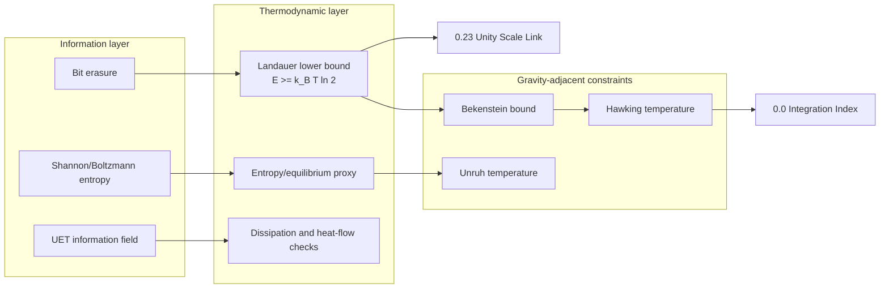

# 0.13 Thermodynamic Bridge

## Transition-Operator Rate-Dimension No-Go (2026-09-01)

The [dimension artifact](../../core/artifacts/t13_transition_kernel_rate_dimension_no_go.json)
finds that the existing finite-channel collision operator scales as `E^2`,
not as a rate `E`. Whole-action energy rescaling by `1.5,2,3` changes the
operator trace by `2.25,4,9`. It is therefore dimensionally invalid to use
this operator directly in `L-i*omega*I` with `omega` carrying energy units.

At scale `3`, the fixed absolute positive-eigenvalue cutoff also changes the
counted mode set, causing an additional covariance failure. Existing algebraic
BS/KMS identities remain diagnostics, but cannot support microscopic or
physical transport. Invariant phase space and the weighted single-particle
inner product must be re-derived before building the replacement rung.

## Dressed RA Pair and Microscopic Rung Boundary (2026-09-01)

The [RA-pair/rung artifact](../../core/artifacts/t13_dressed_ra_pair_microscopic_rung_boundary_audit.json)
shows that the dressed narrow-pole `G_R G_A` energy integral reproduces the
kinetic `1/Gamma` source normalization exactly. The propagator-to-Boltzmann
handoff is therefore closed for this pole approximation.

The four-point handoff fails for a concrete reason: the legacy transition/SK
rung uses `M=lambda`, whereas the charge-resolved production action gives
contact cross sections larger by factors `16` (unlike) and `8` (like), before
`Phi` exchange changes them to kinematic ratios about `13.28` and `5.09` at
the declared point. No constant multiplier repairs both channels. A new
charge-resolved contact-plus-`Phi` SK rung and a width derived from that same
kernel now control the microscopic ladder.

## Retarded/Advanced Mixed Current Vertex (2026-09-01)

The [RA vertex artifact](../../core/artifacts/t13_retarded_ra_mixed_current_vertex_audit.json)
fixes thermal residue weights before analytic continuation and declares the
current insertion as the latest-time leg. The proper bare, mixed thermal and
vacuum vertex satisfies the continued Ward identity at finite transfer with
maximum residual `1.84e-15`; its last eta-refinement change is `1.97e-6`.

An initial hypothesis that the proper zero-transfer triangle itself would
grow as `1/eta` failed: its norm converges to about `0.04429`. This correctly
relocates the transport pinch problem to the dressed current-current RA
propagator pair and its four-point ladder. The response-relaxed bath,
same-state LSZ residue, microscopic rung, continuum heat transport and SI map
remain open, so this result is `PARTIAL` and does not emit a Kubo coefficient.

## Microscopic Current-to-Ladder Boundary (2026-09-01)

The [matching-boundary artifact](../../core/artifacts/t13_microscopic_current_ladder_matching_boundary_audit.json)
closes the tree on-shell current-source handoff and a structural transverse
non-uniqueness result. The canonical spatial vertex satisfies
`Gamma_tree^i/(2E)=q*p^i/E`, exactly the unweighted source used by the kinetic
current lane. This establishes the normalization bridge at tree level only.

The audit also finds that the default older kinetic configuration is not the
same action state as the new one-loop lane: matter quartic, response coupling,
`epsilon_nc`, and response mass-squared differ. An explicit configuration
bridge removes every coefficient residual, but must be passed deliberately.

Finally, adding `F(P,Q)*(Qz,-Q0)` changes the finite-transfer vertex while
leaving its Ward contraction unchanged and vanishing at the static point.
Therefore the generic Ward match plus static closure cannot identify the
retarded transverse vertex. The next required evidence is a state-matched
retarded three-point spectral continuation and microscopic four-point kernel,
not another algebraic projection of the existing finite-cutoff operator.

## Static Confluent Charged Vertex (2026-09-01)

The [static-vertex artifact](../../core/artifacts/t13_charged_static_confluent_vertex_audit.json)
closes the thermodynamic Euclidean `P=Q=0` density-current vertex in the
declared normal one-loop lane. Coincident Landau terms are differentiated as
confluent Bose divided differences, so the result uses no pole splitting,
epsilon regulator, Ward projection, fit, or experimental input.

The bare, bath/response-mean, mixed thermal and vacuum-subtraction pieces are
derived separately. Their sum agrees with `-i partial_mu D_static^-1`; the
maximum nonzero relative discrepancy is `6.41e-11`, while the largest
symmetry-zero residual is `1.37e-21`. Charge conjugation, zero-density,
spatial isotropy, field covariance and quadrature refinement also pass.

`T13_CHARGED_STATIC_CONFLUENT_VERTEX_MATCH` is therefore `CLOSED_FOR_LANE`.
It unlocks only an internal static-density-response handoff. The real-time
finite-k transverse vertex, collision/heat-current ladder, material SI map,
and Full Topic 13 remain open with `full_core_unlock=false`.

## Explicit One-Loop Charged Current Vertex (2026-09-01)

The [current-vertex artifact](../../core/artifacts/t13_charged_one_loop_current_vertex_audit.json)
now evaluates the mixed response triangle and thermal-bath current insertion
as diagrams, instead of merely reconstructing a temporal vertex from the Ward
identity. At generic nonzero Euclidean Matsubara transfer, contraction of the
explicit vertex agrees with the independently evaluated self-energy difference.
The bath term is transverse and therefore invisible to that longitudinal check;
it is retained rather than dropped.

A routing audit also reconciles the legacy D_q,E^-1(R)=(R0+i*q*mu)^2+r^2+m^2
convention with the preceding charged bubble. The response loop carries K and
the charged line carries P-K, so the apparent minus sign at P=0 is a momentum
routing consequence, not a different charge convention. The earlier Matsubara
witness and documentation are corrected; its pole, pair/Landau cuts, thresholds
and physical/grand-frequency results are unchanged.

At the reference Euclidean point, norms of the bare, mixed thermal, relaxed
bath and vacuum/subtraction vertex pieces are approximately 4.834, 1.28e-6,
6.08e-6 and 1.69e-4 in natural-energy units. These are scheme-dependent
off-shell components, not physical current or rate ratios. Response relaxation
changes the bath coefficient from -0.4 to -0.38721 in the declared synthetic
configuration.

The static/confluent limit, real-time transverse continuation, collision ladder
and heat-current matching remain open. This result is PARTIAL, candidate-only,
and does not unlock physical Kubo, SI mapping or Full Topic 13.

## Charged One-Loop Propagator Match (2026-09-01)

The [charged mixed-bubble result](../../core/artifacts/t13_charged_one_loop_match_audit.json)
extends the response-axis calculation to the normal charged two-point sector.
At strict one-loop order it includes the response mean shift, O(2) quartic
tadpole and mixed charged/response bubble using canonical action coefficients.
Independent three-field determinant derivatives, complex Matsubara sums and
signed pair/Landau spectral dispersion agree.

At T=0.25, mu=0.2 in natural units, the Landau contribution is about 21.94%
of the mixed thermal bubble at physical frequency Omega=m=1. Omitting it
would change that self-energy correction, not just a reporting label.
The strict charged energies are 1.00002485755 and 1.00002825580 for q=+1
and -1; their grand-canonical excitations subtract q*mu. These are internal
model quantities, not material predictions.

Charged KMS uses Omega-q*mu. Spectral sign follows this grand frequency:
negative spectral weight at positive physical Omega below q*mu is not by
itself an instability. The real poles lie between the Landau and pair cuts,
so their width vanishes at this order only, not in the full collision problem.
The temporal Ward-required vertex is identified, not a completed microscopic
or transverse current vertex.

This narrows the previous charged-propagator blocker. Full finite-temperature
vertices/counterterms, collision-resummed finite-k current response and
physical heat/entropy/material matching remain open. The old collision
artifact is preserved; Full Topic 13 stays PARTIAL and full_core_unlock=false.

## Response-Axis One-Loop Match (2026-09-01)

The [one-loop response artifact](../../core/artifacts/t13_response_one_loop_match_audit.json)
now fixes response-axis vacuum and kinetic subtraction conditions and links
the thermal determinant to a collisionless k=0 retarded kernel. Independent
Matsubara sums and spectral dispersion integrals agree. The pair cut of the
declared cubic interaction obeys KMS/FDT without an inserted damping rate.

The static curvature and collisionless zero-frequency kernel differ by an
explicit positive occupation-redistribution term, not a numerical error to
remove. At T=0.25, mu=0.2 in natural units, that difference is 1.302338e-5
in energy squared; the strict one-loop pole squared is 0.5013499776.
The one-loop stationary mean differs from its strict first-order expansion
by 0.267% there and 21.1% at T=1. These are approximation-sensitivity witnesses,
not certified physical uncertainties.

This closes a response-sector matching calculation at a declared order,
not the full interacting thermal bridge. Charged-sector propagators and
vertices, finite-k/collision-resummed current response, physical heat/entropy
and material mapping remain open. The old collision artifact is not rerun.
Full Topic 13 remains PARTIAL and this result has full_core_unlock=false.

## Thermal Stationary Background and Vertex Handoff (2026-09-01)

The [thermal-background diagnostic](../../core/artifacts/t13_normal_thermal_background_audit.json)
now solves the normal response displacement using the tree polynomial plus
the thermal part of the one-loop Bose determinant. The old zero-displacement
background has a nonzero thermal force in this approximation; it remains a
valid fixed-background control, not an autonomous thermal stationary point.

At T=0.25 and mu=0.2 in natural units, the canonical displacement is about
8.539e-5. The matter tree mass squared changes by only -0.00171%, but a response
cubic vertex is induced. At the predeclared mixed-scattering kinematic points,
including that vertex changes the squared amplitude by up to about 22% relative
to a mass-only update. These are pointwise sensitivities, not transport rates.

Force/Hessian, stationary-pressure derivatives, independent Bose-series
integrals and unit/charge symmetries are checked. Full Topic 13 remains open:
the field-dependent vacuum determinant, interacting thermal self-energies,
complete phase stability and physical current/heat mapping are not closed.
Static effective curvature must not be substituted for a quasiparticle pole
mass. The old collision artifact is preserved; no thermal transport rerun or
physical dependency unlock is claimed.

## Coupled Gain/Loss and Relative Momentum (2026-09-01)

The [coupled collision diagnostic](../../core/artifacts/t13_coupled_gain_loss_operator_audit.json)
now assembles seven representative reversible normal-state 2-to-2 channels,
including matter/response scattering and pair conversion. Independent tests
cover action vertices, reaction counting, Bose gain/loss, charge/energy/momentum
invariants, nonlinear event entropy and natural-unit covariance.

An important limitation is now measured, not just listed: on the same collision
grid, extending the trial-current basis changes the projected charge response
from about 773 to 10637 natural energy squared. A slow relative sector-momentum
mode was missing from the smallest basis. Its collision form scales as G^4;
its charge-current overlap vanishes at zero charge chemical potential.
Further basis and quadrature changes are reported separately in the artifact.

This remains PARTIAL. It is a finite-basis tree kinetic diagnostic, not physical
heat conductivity or complete two-fluid/SK-KMS closure. Total quasiparticle
number is a spurious invariant of the 2-to-2 truncation. No additional physical
dependency is unlocked; the original conserved-C causal baseline, He-4/graphite
source distinctions and Xie holdout policy are unchanged.

## Normal Elastic Action Diagnostic (2026-09-01)

A named research branch now computes charge-resolved elastic contact plus
nonresonant Phi exchange from the declared action. It does not overwrite the
older comparator or repair every legacy vertex consumer.
The [elastic artifact](../../core/artifacts/t13_action_normalized_elastic_scattering_audit.json)
reports Bose factors, final-state counting, interference and tagged loss-rate
refinement. At the declared synthetic state, exchange lowers the two tagged
rates relative to contact-only; this is not an SI transport result.

The candidate registry addendum is not merged into central acceptance.
Full Topic 13 still needs the coupled gain/loss collision operator, response
inelastic channels, finite-temperature self-consistency, current/entropy/KMS
and material mapping. Tagged loss is not the transport relaxation rate.

## Active Implementation Review (2026-08-31)

Full Topic 13 remains open under the requested full thermodynamic-bridge scope.
The older bounded O(2)/He-4 handoff below is not evidence of complete two-fluid
transport or full interacting SK/KMS closure. Its calibration/source records
are not discarded by this implementation review.

The fixed-Phi EOS spectrum and static transverse response now use canonical
field normalization. Independent action eigenvalues, small-momentum EOS sound,
field-rescaling covariance and normal-gas enthalpy checks pass. This repairs
two implementations; it does not close the full topic.

See [the repair artifact](../../core/artifacts/t13_fixed_phi_spectrum_repair_audit.json).
Its source-only import inventory identifies downstream review candidates, not
automatic numerical failures. Condensed spectrum-dependent outputs and
general-Z normal outputs require review before reuse. The kinetic input
normalization is now repaired, including signed chemical potential; full
action/channel matching remains open. The acceptance artifact containing
pre-existing work was not regenerated; no physical dependency is unlocked.

The [kinetic/action audit](../../core/artifacts/t13_kinetic_canonical_action_match_audit.json)
distinguishes a repaired comparator from the unresolved physical derivation.
Fourth differences of the production potential give V1111=6*lambda_c and
V1122=2*lambda_c, whereas the legacy tensor called with lambda_c gives
3*lambda_c and lambda_c. Formal self-consistency of that legacy tensor is
not a match to the declared action. Do not rescale all historic rates by one
guessed factor; species/channel and phase-space matching remain necessary.

## Canonical Current Gate (2026-08-28)

MAJOR_RESULT_CLOSURE: `T13_FULL_THERMODYNAMIC_BRIDGE_CORE_READY` is `CLOSED_FOR_CORE`; this is a bounded O(2)/He-4 thermal-bridge result, not external-ready or global UET closure.
WHAT_IS_ACTUALLY_CLOSED: The named causal flux/Phi branch and scoped conserved-gradient no-go; He-4 SVP response anchor; independent `alpha_Phi_K`; signed `Z_Phi`; ITS-90/SI energy scale; non-Landauer `beta_T13` and `beta_SI`; finite-temperature normal EOS; formal SK/KMS/Onsager interface; entropy current and dissipative balance; one source-locked He II normal-component shear Kubo/FDT/entropy channel; Landauer controller disposition; and Xie 2026 holdout isolation.
WHAT_REMAINS_OPEN: Graphite TTG external validation, raw-author Ding `C_src`, raw Landauer numeric parity, the original conserved-`C` local-gradient baseline, a complete physical two-fluid transport tensor, curved 3+1, Gravity, and global UET closure. The permitted Ding Fig. 1d package is comparison-only.
DEPENDENCY_UNLOCKED: `CORE_CURVED_3P1_OBSERVABLE_PARENT_READY` research may start. Gravity remains blocked until that separate Core result is `CLOSED_FOR_CORE`.
STATUS: `PASS_T13_FULL_CORE_READY_ACCEPTANCE`; `13/13` acceptance criteria pass; `full_core_unlock=true`; `claim_promotion=false`; `holdout_accessed=false`.
WHAT_CHANGED: Added independent He-4 calibration and SI-scale packages, a physical shear-Kubo input, Landauer Core-role disposition, state-interface composition, closure-matrix v3, registry/dependency integration, and a requirement-by-requirement final acceptance audit.
EQUATION_OR_MAPPING: `y_TTG=Delta_Tq(t)/Delta_Tq(0)`; `y_TTG^UET=Delta_Phi(t)/Delta_Phi(0)`; `Delta_Tq=alpha_Phi_K*Delta_Phi_norm`; `Delta_Phi_norm=Z_Phi*Delta_Phi_natural`; `f_SI=e0*f_natural`; `beta_T13=beta_natural/Z_Phi^2`; `beta_SI=e0*beta_T13`.
VERIFICATION: Named causal leakage is `0.0 <= 1e-6`; `alpha_Phi_K=-1.02237987858849 K` per normalized base Phi with uncertainty bound `0.056753979576408715`; `beta_T13=-0.007936042649802305`; `beta_SI=-4071.143625305366 J m^-3` per normalized Phi squared; physical `eta=(1.29e-6 +/- 5e-8) Pa s`; the permitted TTG comparison package has `432` rows with hashes, units, uncertainty, preprocessing, and license; Xie 2026 numeric data remain unread.
CONTROLLING_BLOCKER: None for the bounded Topic 13 Core handoff. The next Core controller is `CORE_CURVED_3P1_OBSERVABLE_PARENT_READY`; the separate graphite external track remains controlled by missing raw/accepted `C_src`, graphite-specific alpha, and dimensional mapping.
NEXT_ACTION: Start the curved 3+1 parent and constraint package. Keep graphite TTG/raw Landauer acquisition in external comparison tracks and do not use Xie 2026 until preregistered validation is authorized.
CLAIM_BOUNDARY: `CLOSED_FOR_CORE` means internally integrated and ready for Core handoff only. It is not a prediction of imported He-4 coefficients, graphite validation, a complete external transport validation, curved 3+1, Gravity, or global UET closure.
EVIDENCE: `docs/core/artifacts/t13_full_core_ready_acceptance_audit.json` (`846d2bfbc819c1b6f700f109645a451b5d3647a570527af5dc0e21240dacae41`); `docs/core/artifacts/t13_he4_core_thermodynamic_bridge_composition_audit.json` (`13f444f3bf14edca27e8a7af8ff957d2447c5dc0d0dc24a4d8cb77e2cfa82418`); `docs/core/artifacts/t13_topic13_closure_matrix.json` (`ba42d8a9c1745398ec0ee04300a792d18416fccae9205bc376a96f68d423036d`).

## Canonical Current Gate (2026-08-26)

MAJOR_RESULT_CLOSURE: T13_DING_C_SRC_HEATING_BACKCALCULATION_IDENTIFIABILITY is CLOSED_AS_NO_GO for the captured incident-heating/normalized-TTG route only; Full Topic 13 remains PARTIAL and BLOCKED_OPEN_T13_FULL_BRIDGE.
WHAT_IS_ACTUALLY_CLOSED: Ding reports incident pump energy/fluence and a surface-temperature upper bound, while the figure-derived TTG lane is normalized. The audit proves that these inputs do not identify absorbed energy density, absolute Delta_Tq, C_src, or alpha_Phi_K without independent absorption, thermalized-volume, and absolute-response records.
WHAT_REMAINS_OPEN: accepted_numeric_csrc, material_and_uncertainty_closure, base_phi_si_anchor, independent_alpha_record, normalized_beta_si_map, physical_source_backed_eos, physical_uet_kubo_record, physical_sk_transport_match, physical_entropy_production_mapping, and physical_heat_flux_entropy_map remain open.
DEPENDENCY_UNLOCKED: None from this no-go. The bounded causal branch remains the only named Core handoff; curved 3+1, Gravity, constitutive transport, and Galaxy remain locked.
STATUS: PASS_SCOPED_NO_GO_DING_C_SRC_HEATING_BACKCALCULATION; 15/15 checks passed; matrix is 21 CLOSED_FOR_LANE, 6 CLOSED_AS_NO_GO, 0 CLOSED_FOR_CORE, 10 OPEN across 37 required subresults; full_core_unlock=false; claim_promotion=false.
WHAT_CHANGED: Added a hash-linked source-boundary no-go artifact, reproducible audit, regression test, closure-contract subresult, and regenerated matrix/progress/map projections.
EQUATION_OR_MAPPING: Delta_u_abs = eta_abs * F_incident / l_th; Delta_Tq = Delta_u_abs / C_src; y_TTG = Delta_Tq(t) / Delta_Tq(0). The scale transformation (C_src, eta_abs/l_th) -> (s*C_src, s*eta_abs/l_th) leaves the back-calculated response unchanged, while normalization removes the overall amplitude.
VERIFICATION: Incident fluence is 6.189358898018153 J m^-2; the captured temperature statement is <3 K as a bound, not a point estimate; no numeric C_src or alpha was emitted; no fit, Landauer inference, or Xie 2026 holdout access occurred.
CONTROLLING_BLOCKER: ding_pbte_C_src_numeric_or_accepted_independent_reproduction_missing remains the source controller; independent base-Phi/SI/alpha/beta and physical transport packages are also blocked.
NEXT_ACTION: Obtain an authorized Ding mode-resolved C_src package or accepted same-regime PBTE reproduction with material mapping, convergence, uncertainty, and permission. Do not infer C_src from incident fluence, the <3 K bound, or normalized TTG rows.
CLAIM_BOUNDARY: Scoped route no-go only. This does not prove that an authorized raw Ding payload or accepted same-regime reproduction cannot supply C_src; it is not numeric C_src, alpha calibration, TTG prediction, external validation, Core closure, or global UET closure.
EVIDENCE: docs/core/artifacts/t13_ding_csrc_heating_backcalculation_identifiability_no_go.json (0a3b785b0a75e72a41ef9ef4521879ef74cc191d5d46271eaa2a08f6b87e657b); docs/core/artifacts/t13_topic13_closure_matrix.json (10d8a400e8e58d74e24f61f94e304227613fa8d1140726b84d620a5df16b49f6); docs/core/artifacts/t13_full_closure_progress.json (870d17180a03e31d19c1cfffc7ebcace39893d8484f5036d403a630e6620e239).
## 2026-08-24 - Causal Core handoff and MP48 mode diagnostic

MAJOR_RESULT_CLOSURE: `T13_CAUSAL_FLUX_PHI_COUPLED_CORE_COMPATIBILITY` is `CLOSED_FOR_CORE` as a bounded named normalized branch; the Full Topic 13 gate remains `BLOCKED_OPEN_T13_FULL_BRIDGE`.
WHAT_IS_ACTUALLY_CLOSED: The scoped conserved-C local-gradient no-go remains explicit. The named coupled C/Phi branch passes the unchanged `1e-6` leakage threshold, nonzero arrivals, convergence, shared ledger, ontology, no-clipping/no-padding/no-fit, and holdout-preservation checks. MP48 now also has a row-addressable harmonic mode-resolved C_src diagnostic at `35x35x14`.
WHAT_REMAINS_OPEN: The original conserved-C `kappa_C>0` baseline remains blocked and is not replaced. MP48 is harmonic `DERIVED_COMPARISON`, not Ding PBTE acceptance: third-order PBTE/material-state equivalence and source-grade uncertainty are missing. The independent base-Phi SI anchor/alpha/beta package and physical Kubo/SK/KMS/entropy package remain open.
DEPENDENCY_UNLOCKED: Named causal branch as a bounded Core input only. No Full Topic 13, curved 3+1, Gravity, constitutive transport, Galaxy, external validation, or claim promotion is unlocked.
STATUS: Causal `PASS_CAUSAL_NAMED_BRANCH_CORE_COMPATIBILITY`; MP48 `PASS_MP48_MODE_RESOLVED_DERIVED_COMPARISON`; matrix `21 CLOSED_FOR_LANE / 5 CLOSED_AS_NO_GO / 0 required Core subresults / 10 OPEN`; `full_core_unlock=false`; `holdout_accessed=false`.
WHAT_CHANGED: Added the causal Core compatibility artifact and rerun synchronization, plus a phonopy-derived compressed MP48 mode payload and manifest. The canonical gate still reports exactly 7 open blocker groups.
EQUATION_OR_MAPPING: `C_src^vol(T)=N_A/(N_q V_mol) * sum_(q,mu)c_mu(q,T)`; the named causal flux/Phi equations remain normalized. No numeric `alpha_Phi_K` or SI Phi scale was inferred.
VERIFICATION: Causal compatibility checks pass. MP48 aggregate harmonic rows differ from deposited rows by `1.97e-6` to `2.13e-6` under diagnostic tolerance `1e-5`; this is not source uncertainty or Ding acceptance. Xie 2026 remains unread.
CONTROLLING_BLOCKER: Ding-compatible numeric C_src/material uncertainty, independent alpha_Phi_K/SI scale, normalized beta/SI correspondence, physical Kubo provenance, dimensional Phi map, TTG material mapping, and c_v uncertainty.
NEXT_ACTION: Obtain one admissible Ding-compatible/permissioned PBTE package with source-grade uncertainty, or an independently fixed base-Phi SI anchor and paired alpha record. Keep MP48 as `DERIVED_COMPARISON` only.
CLAIM_BOUNDARY: The causal result is Core-ready only for the named normalized branch. The MP48 result is a harmonic comparator. Neither closes Full Topic 13 or establishes an SI/external UET prediction.
EVIDENCE: `docs/core/artifacts/t13_causal_named_branch_core_compatibility.json` (`6fccc88a1c8e9f75865c3d3246f829666f59db9980c42b4b503db99f756fd76a`); `docs/core/artifacts/t13_mp48_mode_resolved_csrc_diagnostic.json` (`c4f1b4ecb22c97bdb0e6cc61b595eca51f394f5ad05456227f38b6420d7e562b`); `docs/core/artifacts/t13_mp48_mode_resolved_csrc_diagnostic.npz` (`fd535acd474382daf8c12bcd8d58b100a7d2fee63ba1c67913ca5556a1e33007`); matrix (`f5201be4da502f8622fffb9a07e8f779da20a04029313282d049b300469b2638`); full gate (`592b992713ffe0870cafc9e4e7cf64e392316a303dc7f5a3d1ad00e67215a7c4`).

## Canonical Current Gate (2026-08-24)

MAJOR_RESULT_CLOSURE: `CLOSED_FOR_LANE` for `T13_LOWITZER_GRAPHITE_ALPHA_V_K_T_FULL_SOURCE_PAIR`; Full Topic 13 remains `PARTIAL` / `BLOCKED_OPEN_T13_FULL_BRIDGE`.
WHAT_IS_ACTUALLY_CLOSED: A byte-preserved full-text source package supplies source-reported numeric `alpha_V` and `K_T` rows from the same Lowitzer study, sample, and 300 K state. The source identity, locators, units, uncertainty fields, raw hash, and `c_p^V-c_v^V` correction witness are machine-readable.
WHAT_REMAINS_OPEN: Lowitzer synthetic graphite is not established as Ding natural-graphite TTG material. Ding-compatible PBTE `C_src`, source-grade `c_v`, the base-`Phi` SI energy anchor, independent `alpha_Phi_K`, beta/SI correspondence, and physical EOS/transport/SK/KMS/entropy completion remain open.
DEPENDENCY_UNLOCKED: Only the source-state thermodynamic correction-input lane. `full_core_unlock=false`; Gravity, full constitutive transport, Galaxy, and external-validation dependencies remain blocked.
STATUS: `PASS_SCOPED_SOURCE_LOCKED_LOWITZER_ALPHA_V_K_T_PAIR` for the lane; canonical Full Topic 13 gate remains `BLOCKED_OPEN_T13_FULL_BRIDGE`; `claim_promotion=false`.
WHAT_CHANGED: Added the archived full-text source package, source-pair verifier, matched-source projection, closure-contract evidence, registry/dependency synchronization, and regression coverage. No fit, synthetic replacement, threshold change, Landauer inference, or Xie 2026 access was introduced.
EQUATION_OR_MAPPING: `c_p^V-c_v^V=T*alpha_V^2*K_T`; the HTV9 300 K correction witness is `11,673.6 J m^-3 K^-1` with first-order alpha/K uncertainty `1,583.27 J m^-3 K^-1`. This is not a `c_v`, Ding `C_src`, or `Phi` calibration row.
VERIFICATION: Source-pair audit and matched-source audit pass; canonical gate SHA-256 `26a2498870919f02efc2bada07a400536a348f7d77ed4d7c4b20969cb18c2c81`; closure matrix SHA-256 `0c2ea83747eab080f2025f794ed2a8e0f119f5cd13039abcbff599c607b8379d` reports 10 major results, 36 subresults, 192 closed lanes, 16 scoped no-go lanes, and 7 open blocker groups; focused regression `10 passed`; `holdout_accessed=false`.
CONTROLLING_BLOCKER: `material_regime_mapping_to_TTG_not_closed` for the Lowitzer route; topic-level control remains `dimensional_phi_energy_anchor_or_independent_alpha_calibration_missing`, with Ding `C_src` and physical Kubo evidence also open.
NEXT_ACTION: Obtain an authorized Ding-compatible numeric package or accepted same-regime PBTE reproduction, a source-grade `c_v`/volume uncertainty record, and an independent paired base-`Phi`/SI observable anchor. Do not use Lowitzer to calibrate `alpha_Phi_K`.
CLAIM_BOUNDARY: This is a source-pair correction-input lane only. It is not Ding `C_src`, independent `alpha_Phi_K`, a `Phi`-to-temperature prediction, Core closure, external validation, or global UET closure.


## Latest Hardening Update (2026-08-23) - NIMS MP-990448

MAJOR_RESULT_CLOSURE: CLOSED_FOR_LANE for T13_NIMS_MP990448_PHONON_PAYLOAD_BOUNDARY; Full Topic 13 remains PARTIAL / BLOCKED_OPEN_T13_FULL_BRIDGE.
WHAT_IS_ACTUALLY_CLOSED: The public NIMS MP-990448 graphite phonon archive is hash-locked. It contains structural/displacement inputs, VASP settings, and figure outputs, but no machine-readable force constants, frequency mesh, or thermal-property rows; this route is a payload boundary, not numeric C_src evidence.
WHAT_REMAINS_OPEN: Ding-compatible numeric C_src, source-grade uncertainty, material/state mapping, the base-Phi SI anchor, independent alpha_Phi_K, and physical transport/KMS/entropy closure remain open.
DEPENDENCY_UNLOCKED: NIMS payload boundary only; full_core_unlock=false and no downstream dependency is opened.
STATUS: PASS_SCOPED_NIMS_MP990448_PHONON_PAYLOAD_BOUNDARY for the lane; canonical Full Topic 13 gate remains blocked.
WHAT_CHANGED: Added the NIMS archive/source package, nested payload audit, full-gate projection, closure-register/dependency sync, focused test, and wave note. No figure digitization, fit, threshold change, or holdout access occurred.
EQUATION_OR_MAPPING: C_src(T)=sum_mu c_mu(T) in J m^-3 K^-1 and Delta_Tq=Delta_u_ph/C_src(T) remain uninstantiated by this route; Delta_Tq=alpha_Phi_K*Delta_Phi remains uncalibrated.
VERIFICATION: Archive SHA-256 eea6ca7569c9442754ce5492ddb2f545186f97ad8b82b209d95f1a80b0158767; six-member inventory and nested payload checks pass; focused regression 5 passed; holdout_accessed=false.
CONTROLLING_BLOCKER: nims_mp990448_archive_lacks_machine_readable_force_constants_or_frequency_mesh; globally the Ding-compatible C_src and independent alpha_Phi_K controllers remain open.
NEXT_ACTION: Obtain an authorized Ding numeric package or permitted same-regime PBTE reproduction with uncertainty and state mapping. Do not digitize the NIMS figure or use it for alpha_Phi_K.
CLAIM_BOUNDARY: Payload boundary only; not numeric C_src, Ding validation, alpha calibration, TTG prediction, physical transport, or Full Topic 13 closure.
## Latest Hardening Update (2026-08-23)

MAJOR_RESULT_CLOSURE: `CLOSED_FOR_LANE` for `T13_C_SRC_EQUILIBRIUM_COMPONENT_QUALIFIED_SENSITIVITY`; Full Topic 13 remains `PARTIAL` / `BLOCKED_OPEN_T13_FULL_BRIDGE`.
WHAT_IS_ACTUALLY_CLOSED: The candidate equilibrium `C_src` denominator is separated from transport, with hash-linked SI rows at 200, 250, and 300 K, fixed-volume identity, 10x10x5 to 12x12x6 mesh tail, natural-isotope sensitivity, and a qualified max sensitivity envelope of `0.044805097064529766`.
WHAT_REMAINS_OPEN: The strict Ding numeric `C_src` or accepted same-regime reproduction, Ding TTG material/state mapping, source-grade uncertainty, `c_v` uncertainty, independent `alpha_Phi_K`, dimensional `Phi` map, and physical transport/KMS/entropy closure remain open.
DEPENDENCY_UNLOCKED: Candidate equilibrium `C_src` component lane only; `full_core_unlock=false` and no downstream dependency is opened.
STATUS: `PASS_SCOPED_C_SRC_EQUILIBRIUM_COMPONENT_QUALIFIED_SENSITIVITY` for the lane; canonical Full Topic 13 gate remains blocked.
WHAT_CHANGED: Added the machine-readable component audit, full-gate scoped closure, register/dependency projection, wave note, and regression coverage. The strict Ding acceptance contract and holdout policy were not relaxed.
EQUATION_OR_MAPPING: `C_src(T,V)=(partial u_ph/partial T)_V=V^-1 sum_mu c_mu(T,V)` and `Delta_Tq=Delta_u_ph/C_src(T,V)`; `Delta_Tq=alpha_Phi_K*Delta_Phi` remains open.
VERIFICATION: Source hashes, units, positivity, fixed-volume identity, convergence, sensitivity separation, no-fit, and holdout isolation pass; the eight Full Topic 13 blockers remain machine-readable.
CONTROLLING_BLOCKER: `ding_pbte_C_src_numeric_or_accepted_independent_reproduction_missing`; `alpha_Phi_K` remains independently open.
NEXT_ACTION: Obtain a permitted Ding-compatible numeric source or accepted same-regime PBTE reproduction with material/state mapping and source-grade uncertainty; do not use this component to calibrate `alpha_Phi_K`.
CLAIM_BOUNDARY: Candidate equilibrium component only; not Ding validation, source-grade uncertainty closure, `alpha_Phi_K` calibration, prediction, transport validation, or Full Topic 13 closure.
Machine-readable closure matrix: docs/core/artifacts/t13_topic13_closure_matrix.json. It reports nine major requirements separately and keeps full_core_unlock=false; it does not change the canonical readiness gate.

Current hardening result: an action-derived natural-unit Phi-to-thermal bridge and non-Landauer natural beta slope are CLOSED_FOR_LANE. Full Topic 13 remains blocked by the physical Phi/SI anchor, independent alpha_Phi_K, source-backed c_v or Ding C_src, EOS/transport/KMS/entropy, and dimensional TTG gates. The natural fixed-(mu,Phi) C_epsilon_T is not relabeled as source c_v.

Current hardening result T13-130: the covariant-action natural-unit to SI conversion contract is CLOSED_FOR_LANE as symbolic dimensional bookkeeping backed by exact SI defining constants. It does not select E_ref or Phi_scale, does not derive e0 or alpha_Phi_K, and does not unlock Core or external validation. Full Topic 13 remains BLOCKED_OPEN_T13_FULL_BRIDGE / PARTIAL.

Current hardening result T13-092: finite-temperature condensate/normal thermodynamic split, branch-resolved static quasiparticle response, condensed stiffness boundary, and the normal-branch formal heat-flux/entropy balance are CLOSED_FOR_LANE. The static susceptibility is not Landau density or retarded Kubo, condensed dissipative transport remains open, and physical Phi/SI, alpha_Phi_K, Ding C_src, and Full Topic 13 remain blocked.

Machine-readable lane artifact: docs/core/artifacts/t13_uet_o2_finite_temperature_two_fluid_response_audit.json.

Current hardening result T13-093: the declared finite-cutoff continuum-resolution sequence is CLOSED_AS_NO_GO for continuum promotion under the unchanged `1e-2` controller because its maximum adjacent response change is `0.47541462972440046`. This is scoped to the current discretization; no extrapolated continuum or physical Kubo claim is allowed.

Machine-readable boundary artifact: docs/core/artifacts/t13_uet_o2_continuum_limit_boundary_audit.json.

Current hardening result T13-094: condensed dissipative transport identifiability is CLOSED_AS_NO_GO for the current static lane. Two positive-semidefinite entropy-production witnesses agree on the declared static state but give different responses under a nonzero probe, so no unique condensed dissipative matrix can be inferred without a relative-flow/collision kernel or retarded correlator.

Machine-readable boundary artifact: docs/core/artifacts/t13_uet_o2_condensed_dissipative_transport_audit.json.

Source-route repair: the permitted Ding 2022 figure-derived normalized comparator now regenerates as PASS while raw author PBTE/C_src remains blocked; it is not a thermal prediction or calibration.

Machine-readable current status: docs/topics/0.13_Thermodynamic_Bridge/Result/artifacts/topic13_full_thermodynamic_bridge_core_ready_gate.json.

Current hardening result T13-160: Calorine model/state spread comparison is CLOSED_FOR_LANE and the current full-LBTE route is CLOSED_AS_NO_GO. The full gate remains BLOCKED_OPEN_T13_FULL_BRIDGE / PARTIAL with 9 open blocker groups; no Ding C_src, independent alpha_Phi_K, physical Kubo coefficient, holdout access, or downstream dependency is promoted.
Current hardening result T13-161: the formal EOS-to-SK/KMS-to-entropy-to-heat-flux integration is CLOSED_FOR_LANE. It proves cross-module internal consistency only; physical Kubo coefficients, independent alpha_Phi_K, Ding-compatible C_src, SI mapping, and Full Topic 13 remain open.
Machine-readable formal bridge artifact: docs/core/artifacts/t13_formal_thermodynamic_bridge_integration_audit.json.

Current hardening result T13-162: the Day 2012 preferred thermodynamic assessment route is CLOSED_FOR_LANE as a source-compatibility boundary. Table 2 records graphite B0 uncertainty and a thermal-expansion function, but it does not provide alpha uncertainty, a same-specimen alpha_V/K_T pair, or Ding TTG material mapping. Full Topic 13 remains BLOCKED_OPEN_T13_FULL_BRIDGE / PARTIAL.

Machine-readable Day route artifact: docs/core/artifacts/t13_day2012_preferred_thermodynamic_table_boundary_audit.json.

MAJOR_RESULT_CLOSURE: CLOSED_FOR_LANE for T13_DAY2012_PREFERRED_THERMODYNAMIC_ASSESSMENT_BOUNDARY.
WHAT_IS_ACTUALLY_CLOSED: Public Table 2 locator, graphite B0 and dB/dT uncertainty fields, the stated graphite volume-expansion function, source package hash, and the route-level no-go under the current same-state uncertainty contract.
WHAT_REMAINS_OPEN: alpha_V source uncertainty, same-grade and same-state alpha_V/K_T matching, Ding material-regime mapping, c_v source uncertainty, independent alpha_Phi_K, and the other eight full-gate blockers.
DEPENDENCY_UNLOCKED: Day thermodynamic-assessment boundary only; no Cp-to-Cv correction, Ding C_src, alpha calibration, Core, Gravity, transport, Galaxy, or external-validation dependency is unlocked.
STATUS: PASS_SCOPED_DAY2012_THERMODYNAMIC_ASSESSMENT_BOUNDARY; Full Topic 13 remains BLOCKED_OPEN_T13_FULL_BRIDGE.
WHAT_CHANGED: Added a source package, verifier, artifact, full-gate projection, closure-register/dependency evidence, and regression test. No numeric correction, fit, threshold change, or holdout access was used.
EQUATION_OR_MAPPING: V(T)/V0 = 1 + a0*(T - 298) - 20*a0*(sqrt(T) - sqrt(298)); K_T(T) = B0 + Bprime*(T - 298); c_p^V - c_v^V = T*alpha_V^2*K_T remains unevaluated.
VERIFICATION: Day audit passed all checks; focused Topic 13/registry regression passed 14 tests; full gate remains PARTIAL with 9 open blockers; claim_promotion=false; Xie 2026 remains unconsumed.
CONTROLLING_BLOCKER: same_grade_alpha_V_and_K_T_missing for this route; globally Ding-compatible C_src and independent alpha_Phi_K remain the nearest controllers.
NEXT_ACTION: Acquire a permitted same-state alpha_V/K_T record with uncertainty and Ding-regime mapping, or retain this no-go and continue the independent Ding C_src and Phi/SI acquisition routes.
CLAIM_BOUNDARY: This is a route-level source boundary, not a numeric Cp-to-Cv correction, Ding C_src, alpha_Phi_K calibration, TTG prediction, physical transport, external validation, or Full Topic 13 closure.


<!--
{
  "@context": "https://schema.org",
  "@type": "ScholarlyArticle",
  "name": "UET Topic 0.13: Thermodynamic Bridge",
  "description": "Thermodynamic and information-energy bridge module for Unity Equilibrium Theory.",
  "about": "Thermodynamics, Information Theory, Landauer Limit, Entropy, Information-Energy Equivalence, UET"
}
-->

> [!NOTE]
> **AI-Digest**: UET Topic 0.13 is the core information-energy bridge. Its strongest current support is source-backed Landauer lower-bound consistency (`E >= k_B T ln 2`) plus formula-consistency checks for Bekenstein/Unruh/Hawking thermodynamic links. The UET-specific bridge mechanism remains a hardening target that depends on source-locked data, explicit units, verifier artifacts, and cross-topic dependency control.


> **Research role:** this topic constrains how UET may connect information, entropy, and energy cost. Strong claims must cite the formula audit, data manifest, and verifier artifact rather than relying on the conceptual bridge alone.

---

## 1. 5x4 Grid Structure

| Pillar | Purpose |
| :--- | :--- |
| **Doc/** | Analysis of information-energy equivalence and thermodynamic bridge assumptions. |
| **Ref/** | Landauer, Berut, Jacobson, Bekenstein, and related source anchors. |
| **Data/** | Topic-local Landauer, black-hole, constants, and synthetic heat-flux working copies with open source-lock tasks. |
| **Code/** | `01_Engine` microstate/thermodynamic helpers, `02_Proof` entropy proxy, and `03_Research` bridge checks. |
| **Result/** | Verifier artifact, entropy plots, and Landauer/Bekenstein/Jacobson visual outputs. |

---

## Theory Connection



---

## Research Hardening Matrix

| Layer | Current status | Evidence path | What strengthens the theory next |
| :-- | :-- | :-- | :-- |
| Core mechanism | Information-erasure energy bridge via Landauer-style relation | `METHOD.md`, `FORMULA_AUDIT.md` | Map each thermodynamic term to units, constants, and verifier roles. |
| Data | Berut/CODATA source records plus topic-local working copies with hashes | `DATA_MANIFEST.md`, `docs/data/external/thermodynamics/landauer/berut_2012/source_record.json`, `docs/data/external/constants/codata/si_2019_exact_constants.json` | Archive raw/supplemental Berut numeric tables and add uncertainty-aware preprocessing notes. |
| Formula | Reviewed formula audit maps Landauer, entropy proxy, Bekenstein, Unruh, Hawking, Cattaneo, and vacuum-sink formulas | `FORMULA_AUDIT.md` | Add uncertainty propagation, audit duplicate helper constants, and separate identity checks from UET-specific bridge claims. |
| Verification | Primary script writes structured artifact with metrics, thresholds, hashes, and warning reasons | `VERIFICATION_SPEC.md`, `Result/artifacts/0_13_thermodynamic_bridge_verification.json` | Promote from `WARN` only after external source-lock and cross-topic proof dependencies are closed. |
| Theory dependency | Feeds UET's information-energy and entropy interpretation | `0.0_Grand_Unification`, `0.23_Unity_Scale_Link`, `0.26_Cosmic_Dynamic_Frame` | Define exactly which claims inherit this bridge and which remain open. |
| Limitation | Strong conceptual importance, incomplete provenance normalization | `LIMITATIONS.md` | Separate theoretical identity, experimental lower-bound benchmark, synthetic benchmark, and heuristic extension. |

---

## Problem And Current Result

- **The Problem:** Thermodynamics deals with heat and work, while Information Theory deals with bits and bandwidth. Landauer's Principle gives a concrete bridge (`E >= k_B T ln 2`), but UET still needs an explicit, checkable mapping from information-field variables to thermodynamic observables.
- **The Solution:** UET treats information as physical and uses Landauer/Bekenstein-style constraints as boundary conditions for the bridge. The current research task is to make each variable, unit, constant, formula, and dependency auditable.
- **The Result:** The present verifier checks exact-constant Landauer consistency and lower-bound behavior against pinned source records; broader UET thermodynamic claims remain tied to the open hardening tasks in `FORMULA_AUDIT.md`, `DATA_MANIFEST.md`, and `LIMITATIONS.md`.

---

## Test Results

| Category | Test | Result | Status |
| :--- | :--- | :--- | :--- |
| **01_Engine** | Thermo Solver | Entropy/equilibrium proxy, needs seeded ensemble gate | WARN |
| **02_Proof** | Entropy Max | Delta-S simulation check, not a formal proof | WARN |
| **03_Research** | Landauer Data | Exact-constant lower-bound consistency | PASS/WARN |
| **03_Research** | Black Hole Entropy | Formula-consistency with area law | WARN |

---

## 2. Quick Start

```powershell
.venv\Scripts\python.exe docs\topics\0.13_Thermodynamic_Bridge\Code\03_Research\Research_Landauer.py
```

## Spacetime trace lane (diagnostic)

- Core contract: docs/core/TRACE_RESEARCH_SPEC.md
- Ontology and formula artifacts: docs/core/artifacts/trace_ontology_contract.json and trace_kernel_formula_audit.json
- Synthetic benchmark: Code/03_Research/Research_Spacetime_Trace.py
- Benchmark artifact: Result/artifacts/cattaneo_benchmark_artifact.json
- Current status: normalized internal gates pass; SI closure and external benchmark remain open
- Claim boundary: candidate mechanism and simulation-only; no UET thermodynamic bridge proof claim

## Matter-space thermal control pilot (diagnostic)

- Pilot contract: [THERMAL_MATTER_SPACE_PILOT_SPEC.md](./THERMAL_MATTER_SPACE_PILOT_SPEC.md)
- Reproducible runner: [Research_Matter_Space_Thermal_Control.py](./Code/03_Research/Research_Matter_Space_Thermal_Control.py)
- Machine-readable result: [matter_space_thermal_control.json](./Result/artifacts/matter_space_thermal_control.json)
- External-source intake: [matter_space_second_sound_source_package.json](./Data/03_Research/matter_space_second_sound_source_package.json)
- Source/observable review: [THERMAL_SOURCE_OBSERVABLE_MAPPING_SPEC.md](./THERMAL_SOURCE_OBSERVABLE_MAPPING_SPEC.md)
- Readiness artifact: [matter_space_thermal_observable_map_readiness.json](./Result/artifacts/matter_space_thermal_observable_map_readiness.json)
- Current result: `SIMULATION_ONLY / FAIL`; analytical Cattaneo controls, source sign, core cross-check, arrival-speed error, and the disclosed refined ledger pass, while physical pre-arrival leakage (`0.01764` versus `1e-6`) and the external numeric-source gate remain failed.
- Numerical disclosure: the locked `dt=2.5e-4` run failed the per-step ledger threshold; a post-diagnostic amendment reduced only `dt` to `5e-5`, retained the original failure, and passed the unchanged ledger threshold. This is a numerical repair, not a blind confirmation.
- Dimensional claim boundary: `Phi` and `R` remain normalized internal variables, the trace has no backreaction, no dimensional map to kelvin/heat flux/entropy is closed, and Landauer remains an external lower-bound constraint only.
- New mapping result: the standard TTG observable is now locked as a normalized quasi-temperature difference, and the candidate UET operator is `Delta_Phi(t)/Delta_Phi(0)`; the dimensional `alpha_Phi_K`, local numeric source, heat-flux map, and entropy-production map remain blocked.
- Claim boundary: `Phi` and `R` remain normalized internal variables, the trace has no backreaction, the normalized TTG operator is a definition rather than validation, and Landauer remains an external lower-bound constraint only.

## Core thermodynamic constraint export (dependency-only)

- Contract: [CORE_THERMODYNAMIC_CONSTRAINT_SPEC.md](./CORE_THERMODYNAMIC_CONSTRAINT_SPEC.md)
- Reproducible gate: [Research_Core_Thermodynamic_Constraint_Gate.py](./Code/03_Research/Research_Core_Thermodynamic_Constraint_Gate.py)
- Machine-readable result: [0_13_core_thermodynamic_constraint_gate.json](./Result/artifacts/0_13_core_thermodynamic_constraint_gate.json)
- Current result: `BLOCKED / THERMODYNAMIC_CONSTRAINT_EXPORTS_AVAILABLE_CORE_CLOSURE_NOT_DERIVED`.
- Allowed inheritance: the Landauer lower bound and standard thermodynamic/gravity identities may be exported only as class-C constraints; the Cattaneo lane remains a synthetic control.
- Still blocked: a non-circular UET bridge, a derived `beta`, charge equation of state, covariant transport and entropy-current closure, a dimensional map from `Phi` or `R` to measured thermal observables, and external heat-transport validation.
- Status effect: none. Topic `0.13` remains `Draft / B`, its four source-row controllers remain unchanged, and this packet does not promote the foundation `WARN` state.

## Key Files

- [Engine_Thermodynamics.py](./Code/01_Engine/Engine_Thermodynamics.py): microstate and thermodynamic helper engine.
- [FORMULA_AUDIT.md](./FORMULA_AUDIT.md): formula registry with units, constants, proof status, verifier role, and failure modes.
- [DATA_MANIFEST.md](./DATA_MANIFEST.md): data provenance, local hashes, benchmark roles, and external source-lock targets.
- [VERIFICATION_SPEC.md](./VERIFICATION_SPEC.md): primary command, thresholds, artifact path, and interpretation rules.
- [Research_Landauer.py](./Code/03_Research/Research_Landauer.py): primary verifier for Landauer/Bekenstein/Jacobson formula checks.

---

*Core hardening status: formula-audited, verifier-artifact enabled, source records pinned, raw-table source-lock still open.*


## Latest Hardening Lane: T13-121

The declared finite-temperature 1<->3 and representative 2<->2 channels now expose numerical retarded, advanced, and Keldysh components with explicit spectral and FDT checks. This is internal natural-unit evidence only. The full off-shell all-channel 1PI object, physical renormalization anchor, dimensional `Phi` map, `alpha_Phi_K`, source closure, transport, entropy, and TTG validation remain open.

## Current Major Result: T13-122
`T13_UET_O2_FINITE_T_OFFSHELL_THRESHOLD_CROSSING_1PI_LANE` is `CLOSED_FOR_LANE`. This closes only the declared natural-unit response across the three-body threshold. Full Topic 13 remains `BLOCKED_OPEN_T13_FULL_BRIDGE` / `PARTIAL`; the independent `alpha_Phi_K` calibration remains open and no holdout was fit or read. The next research controller is complete off-shell all-channel 1PI plus an independent physical renormalization anchor.
## Current Major Result: T13-123
`T13_UET_O2_FINITE_T_ALL_22_PERMUTATION_IDENTITY_LANE` is `CLOSED_FOR_LANE`. The three equal-mass `2<->2` signed-cut patterns are covered by explicit unit-Jacobian relabeling and the action-level aggregate weight. Full Topic 13 remains `BLOCKED_OPEN_T13_FULL_BRIDGE` / `PARTIAL`; complete off-shell 1PI, physical renormalization, and independent `alpha_Phi_K` remain open.
## Current Major Result: T13-124
`T13_IAEA_GR280_SAME_STATE_CP_COMPARATOR` is `CLOSED_FOR_LANE`. The official IAEA GR-280 tables now provide a source-locked 300 C Cp row and 300 C density row, closing only the same-state Cp availability sub-blocker. The conditional comparator is `C_p^V = 2386800 J m^-3 K^-1`; density standard uncertainty, c_v correction, Ding material equivalence, physical dimensional mapping, independent `alpha_Phi_K`, and full EOS/transport/KMS/entropy closure remain open. Full Topic 13 is still `BLOCKED_OPEN_T13_FULL_BRIDGE` / `PARTIAL`, with claim promotion disabled.
## 2026-08-20 Evidence Wave T13-125

A source-locked Zenodo Hi-Trace workbook now closes a high-temperature same-block isotropic-graphite `C_p` comparator lane with 27 row identities and explicit uncertainty boundaries. It does not close `c_v`, Ding/TTG mapping, `alpha_Phi_K`, or Full Topic 13; the canonical full gate remains `BLOCKED_OPEN_T13_FULL_BRIDGE` / `PARTIAL`.

## T13-131 public PBTE source boundary

The Huberman 2019 public arXiv package is now source-locked as a comparator boundary. Its embedded supplementary methods provide BTE method context and reference Ding-derived force constants, but no accepted mode-resolved `C_src(T)` payload, uncertainty/convergence package, or raw force-constant/scattering input is available in the package. Full Topic 13 remains `BLOCKED_OPEN_T13_FULL_BRIDGE` / `PARTIAL`; this lane does not close `alpha_Phi_K` or promote any TTG curve to a prediction.

## Current Major Result: QH-15 Comparator Lane (2026-08-22)

MAJOR_RESULT_CLOSURE: `T13_QH15_GRAPHITE_CV_COMPARATOR_BOUNDARY` is `CLOSED_FOR_LANE`; Full Topic 13 remains `BLOCKED_OPEN_T13_FULL_BRIDGE` / `PARTIAL`.

WHAT_IS_ACTUALLY_CLOSED: QH-15 public archive provenance, raw-row hashes, the `SpecificC` to `J m^-3 K^-1` conversion, a separate isotope-control row, and non-fitting equilibrium-scale cross-checks against Calorine.

WHAT_REMAINS_OPEN: Ding mode-resolved `C_src`, source-grade uncertainty, Ding response/material mapping, independent `alpha_Phi_K`, and the remaining bridge/EOS/transport/KMS/entropy blockers.

DEPENDENCY_UNLOCKED: Comparator classification only; no downstream dependency is unlocked.

STATUS: `PASS_SCOPED_QH15_CV_COMPARATOR_BOUNDARY`.

WHAT_CHANGED: A machine-readable source package, verifier, regression, and full-gate lane were added. QH-15 is explicitly not accepted as Ding `C_src` and is not used to fit `Phi` or `alpha_Phi_K`.

EQUATION_OR_MAPPING: `C_v^QH15 = SpecificC * 1.0e9 J m^-3 K^-1`; no Phi-to-temperature map is emitted.

VERIFICATION: The full gate now reports `175` closed lanes, `10` open blockers, and downstream unlock `false`.

CONTROLLING_BLOCKER: `ding_pbte_C_src_numeric_or_accepted_independent_reproduction_missing`.

NEXT_ACTION: Continue source acquisition and independent Phi/SI calibration without reading the locked Xie 2026 holdout.

CLAIM_BOUNDARY: Candidate effective theory only; QH-15 is comparator evidence, not full Topic 13 closure or external validation.

## Current Major Result: T13-163 Kim 2018 external Green-Kubo input (2026-08-22)

MAJOR_RESULT_CLOSURE: CLOSED_FOR_LANE for T13_KIM_2018_GRAPHITE_GREEN_KUBO_EXTERNAL_INPUT; Full Topic 13 remains BLOCKED_OPEN_T13_FULL_BRIDGE / PARTIAL.

WHAT_IS_ACTUALLY_CLOSED: A public primary-source locator, Green-Kubo equation locator, 300 K pristine-graphite directional rows, source-reported uncertainty, trajectory/integration convergence metadata, canonical transcription hash, and explicit external-input classification are machine-readable.

WHAT_REMAINS_OPEN: The record has no UET Phi or normalized space-response amplitude, no Ding TTG state equivalence, no raw heat-current correlator payload, and no independent alpha_Phi_K. It is not accepted as a physical UET Kubo coefficient.

DEPENDENCY_UNLOCKED: External standard-physics transport-input lane only; no UET physical transport, Ding C_src, alpha calibration, Core, Gravity, or Full Topic 13 dependency is unlocked.

STATUS: PASS_SCOPED_SOURCE_LOCKED_EXTERNAL_GREEN_KUBO_INPUT; full gate remains BLOCKED_OPEN_T13_FULL_BRIDGE with 9 open blocker groups and claim_promotion=false.

WHAT_CHANGED: Added a source package, provenance audit, regression, full-gate lane/evidence projection, closure-register/dependency regeneration, and this report. No holdout, fit, threshold change, or UET relabel was used.

EQUATION_OR_MAPPING: kappa_i(tau) = V/(k_B*T^2) * integral [<J_i(s)J_i(0)>/<J_i(0)J_i(0)>] ds; this remains a standard-physics directional transport input. No Phi -> kappa mapping is emitted.

VERIFICATION: Kim audit passed all checks; focused regression passed 2 tests; source payload hash is e33f0750db2f5bf16fc24a2cd8e84437f17cd77a3dfba3a5a9e63a2074f930c8; full gate remains PARTIAL, holdout remains unconsumed, and downstream dependency remains blocked.

CONTROLLING_BLOCKER: UET_space_response_and_base_Phi_mapping_missing for this lane; globally, independent alpha_Phi_K, Ding-compatible C_src, and the remaining SI/EOS/transport/KMS/entropy blockers remain open.

NEXT_ACTION: Derive or independently source-lock the UET space-response and base-Phi mapping; retain Kim 2018 only as an external comparator until that mapping exists.

CLAIM_BOUNDARY: This is source-locked standard-physics transport-input evidence only. It is not a UET Kubo coefficient, Ding C_src, alpha_Phi_K calibration, TTG prediction, external validation, or Full Topic 13 closure.

## Current Major Result: T13-164 Ding supplementary content boundary (2026-08-22)

MAJOR_RESULT_CLOSURE: CLOSED_FOR_LANE for T13_DING_SUPPLEMENTARY_CONTENT_BOUNDARY; Full Topic 13 remains BLOCKED_OPEN_T13_FULL_BRIDGE / PARTIAL.

WHAT_IS_ACTUALLY_CLOSED: The three archived MOESM PDFs are reviewed at page-level locators with fixed size/hash identity. MOESM1 is bounded to symbolic PBTE/TTG equations and method context; MOESM2 to review/computational clarification; MOESM3 to reporting summary. No reviewed PDF supplies a machine-readable mode-resolved C_src table, force constants, scattering matrix, or paired Phi/SI response row.

WHAT_REMAINS_OPEN: Numeric Ding C_src or an accepted same-regime independent reproduction, source-grade uncertainty/convergence, base-Phi SI mapping, independent alpha_Phi_K, and the remaining EOS/transport/KMS/entropy closure remain open.

DEPENDENCY_UNLOCKED: Page-level public supplementary content boundary only; no C_src, alpha, calibration, transport, Core, Gravity, or Full Topic 13 dependency is unlocked.

STATUS: PASS_SCOPED_DING_SUPPLEMENTARY_CONTENT_BOUNDARY_NO_NUMERIC_PAYLOAD; full gate remains BLOCKED_OPEN_T13_FULL_BRIDGE / PARTIAL with 9 open blocker groups; claim_promotion=false.

WHAT_CHANGED: Added a content-review package, page locators, source hashes, a verifier, focused regression, full-gate source-package projection, and closure/dependency regeneration. No PDF figure digitization, fit, threshold change, or Xie 2026 access was used.

EQUATION_OR_MAPPING: C_src(T) = sum_mu c_mu(T); Delta_Tq = Delta_u_ph / C_src; y_TTG = Delta_Tq(t) / Delta_Tq(0); Delta_Tq = alpha_Phi_K * Delta_Phi remains uncalibrated.

VERIFICATION: Ding content audit PASS; focused regression 4 passed; full gate reports 184 closed lanes and 9 open blocker groups; holdout_consumed=false; claim_promotion=false.

CONTROLLING_BLOCKER: ding_pbte_C_src_numeric_or_accepted_independent_reproduction_missing; alpha_Phi_K_independent_calibration_missing remains separate and still open.

NEXT_ACTION: Obtain an authorized author package or accepted same-regime PBTE reproduction with mode-resolved C_src, uncertainty, convergence, and material/state mapping; keep base-Phi calibration independent and do not use Xie 2026.

CLAIM_BOUNDARY: This closes only the page-level public supplementary content boundary. It does not create numeric C_src, calibrate alpha_Phi_K, produce a temperature prediction, validate UET externally, or close Full Topic 13.

EVIDENCE: docs/topics/0.13_Thermodynamic_Bridge/Data/03_Research/ding_2022_supplementary_content_review_package.json; docs/core/artifacts/t13_ding_supplementary_content_review_audit.json; docs/scripts/audit/audit_topic13_ding_supplementary_content_review.py; docs/topics/0.13_Thermodynamic_Bridge/Result/artifacts/topic13_full_thermodynamic_bridge_core_ready_gate.json.

## Current Major Result: T13-172 flat thermodynamic component closure (2026-08-23)

MAJOR_RESULT_CLOSURE: `CLOSED_FOR_LANE` for `T13_FLAT_THERMODYNAMIC_BRIDGE_COMPONENTS`; Full Topic 13 remains `BLOCKED_OPEN_T13_FULL_BRIDGE` / `PARTIAL`.
WHAT_IS_ACTUALLY_CLOSED: Formal flat/natural-unit normal EOS, SK/KMS, entropy-current, heat-flux balance, and a source-locked standard-physics Green-Kubo comparator are integrated with explicit ontology and claim boundaries.
WHAT_REMAINS_OPEN: Physical UET Kubo provenance, independent `alpha_Phi_K`, Phi/SI observable mapping, Ding-compatible `C_src`, material/state mapping, source-grade uncertainty, and Full Topic 13 closure.
DEPENDENCY_UNLOCKED: Flat component integration only. Curved 3+1 remains a later Core result; Gravity, full constitutive transport, Galaxy, and external validation remain blocked.
STATUS: `PASS_SCOPED_T13_FLAT_COMPONENTS_WITH_EXTERNAL_INPUT`; `claim_promotion=false`; `full_core_unlock=false`; `xie_2026_accessed=false`.
WHAT_CHANGED: Added the component gate and projected its lane-level closure into the full gate, closure matrix, register, and dependency evidence. The full gate now retains `physical_Kubo_coefficient_record_missing` as a separate controller instead of hiding it inside the legacy curved transport contract.
EQUATION_OR_MAPPING: `q^mu=kappa_natural X_T^mu`; `J_S^mu=s u^mu+q^mu/T`; `sigma>=0`; external Kim conductivity remains a comparator; `Delta_Tq=alpha_Phi_K*Delta_Phi` remains uncalibrated.
VERIFICATION: Component artifact and provenance checks pass; focused integration suite reports 19 passed; full gate reports 8 open blocker groups and downstream unlock remains false.
CONTROLLING_BLOCKER: `physical_Kubo_coefficient_record_missing`; `alpha_Phi_K_independent_calibration_missing` remains the nearest dimensional controller.
NEXT_ACTION: Obtain a state-matched UET response-space/Kubo record and an independent Phi/SI anchor without reading Xie 2026; continue authorized Ding `C_src` acquisition separately.
CLAIM_BOUNDARY: Component closure only. No temperature prediction, alpha calibration, physical UET transport proof, curved 3+1 result, external validation, or global UET closure is claimed.
Machine-readable artifact: `docs/core/artifacts/t13_flat_thermodynamic_bridge_components_gate.json`.

## Current Major Result: invariant-rate collision repair (2026-09-01)

MAJOR_RESULT_CLOSURE: `T13_INVARIANT_RATE_DIMENSION_COLLISION_OPERATOR_REPAIR` is `CLOSED_FOR_LANE`; Full Topic 13 remains open.

WHAT_IS_ACTUALLY_CLOSED: A separate finite representative operator now uses invariant `dPi` cells and the charge-resolved contact-plus-`Phi` action amplitude. Its operator has rate dimension `E`, is positive semidefinite, and preserves charge, energy, and momentum within the declared numerical gates.

WHAT_REMAINS_OPEN: Connected multi-shell/angular continuum construction, a width derived from the same kernel, number-changing/response channels, physical Kubo/SI normalization, independent `alpha_Phi_K`, and source closure.

DEPENDENCY_UNLOCKED: A dimensionally admissible finite precursor for continuum construction only.

STATUS: `PASS_SCOPED_INVARIANT_RATE_OPERATOR_REPAIR`; `full_core_unlock=false`; `claim_promotion=false`.

EQUATION_OR_MAPPING: `W_c=beta*dPi1*dPi2*dPhi2_cell*|M_contact+M_Phi|^2*f1*f2*(1+f3)*(1+f4)/S_final`; `L_rate=sum_c W_c v_c v_c^T`.

VERIFICATION: Nine focused tests pass. Whole-action scale factors 1.5, 2, and 3 produce operator-rate ratios 1.5, 2, and 3. No clipping, fitting, holdout access, or legacy-operator overwrite occurred.

CONTROLLING_BLOCKER: `connected_charge_resolved_multi_shell_invariant_collision_operator_missing`.

NEXT_ACTION: Replace representative angular cells with a connected multi-shell angular basis and derive the width from that same kernel.

CLAIM_BOUNDARY: Finite natural-unit structural repair only; not a continuum rung, physical width, Kubo/SI coefficient, external validation, or Full Topic 13 closure.

## Current Major Result: invariant scalar Galerkin collision operator (2026-09-01)

MAJOR_RESULT_CLOSURE: `T13_CHARGE_RESOLVED_INVARIANT_SCALAR_COLLISION_OPERATOR` is `CLOSED_FOR_LANE`; Full Topic 13 remains open.

WHAT_IS_ACTUALLY_CLOSED: The production contact-plus-`Phi` amplitude is integrated over multiple incoming radial shells and incoming/outgoing angles in a scalar isotropic Galerkin quadratic form. Charge and four-momentum close at each event without a posterior projector; the normalized operator has rate dimension `E`.

WHAT_REMAINS_OPEN: Same-kernel tagged/spectral width, vector/tensor heat-current basis, microscopic retarded ladder, number-changing/response channels, continuum/cutoff limit, Kubo/SI normalization, independent `alpha_Phi_K`, and source closure.

DEPENDENCY_UNLOCKED: Same-kernel width derivation and vector heat-current Galerkin extension.

STATUS: `PASS_SCOPED_INVARIANT_SCALAR_GALERKIN_COLLISION`; `full_core_unlock=false`; `claim_promotion=false`.

EQUATION_OR_MAPPING: `Q=(beta/4) integral dPi1 dPi2 dPhi2 |M|^2 f1f2(1+f3)(1+f4) DeltaF DeltaF^T/S_final`; `L_rate=G^(-1/2)QG^(-1/2)`.

VERIFICATION: Thirteen artifact checks and ten focused tests pass. Energy scales 1.5, 2, and 3 give rate ratios 1.5, 2, and 3. Radial last-refinement difference is 0.474%; angular difference is 0.00124%. The old mapped continuum vertex independently remains `E^2` and blocked.

CONTROLLING_BLOCKER: `self_consistent_width_and_vector_heat_current_basis_missing`.

NEXT_ACTION: Derive tagged and spectral widths from this same kernel, then extend the basis to vector heat/current modes before solving the retarded ladder.

CLAIM_BOUNDARY: Finite-cutoff scalar collision lane only; not complete transport, physical width, Kubo/SI coefficient, external validation, or Full Topic 13 closure.

## Major Result: same-kernel tree loss/gain and retarded width (repaired 2026-09-02)

MAJOR_RESULT_CLOSURE: `T13_SAME_KERNEL_TREE_TAGGED_SPECTRAL_WIDTH` is `CLOSED_FOR_LANE`; Full Topic 13 remains open.

WHAT_IS_ACTUALLY_CLOSED: Momentum- and charge-resolved tagged loss and inverse gain cuts come from the same production contact-plus-`Phi` kernel as the Galerkin operator. The loss cut matches an independent `v_Moller dSigma/dOmega` formula, while KMS closes `Gamma_R=Gamma_out-Gamma_in=Gamma_out/(1+f)`. The earlier use of `Gamma_out` itself as the retarded width is superseded.

WHAT_REMAINS_OPEN: Dressed/resonant self-consistency, tensor and independent heat-current channels, number-changing/response channels, physical Kubo/SI normalization, independent `alpha_Phi_K`, and source closure.

DEPENDENCY_UNLOCKED: Use of the KMS retarded width in the charge-current RA ladder and vector Galerkin extension.

STATUS: `PASS_SCOPED_SAME_KERNEL_TREE_LOSS_GAIN_RETARDED_WIDTH`; `full_core_unlock=false`; `claim_promotion=false`.

EQUATION_OR_MAPPING: `Gamma_R=Gamma_out-Gamma_in=Gamma_out/(1+f_q)`; `-Im Sigma_R=2E Gamma_R`.

VERIFICATION: Thirteen artifact checks and nine focused tests pass. KMS residual is `2.13e-16`; independent loss-form residual is `2.94e-14`; charge-conjugation residual is zero; radial and angular last-refinement differences are `1.292e-4` and `1.310e-4`; whole-action scaling is `E^1`.

CONTROLLING_BLOCKER: `dressed_self_consistency_and_independent_heat_carrier_missing`.

NEXT_ACTION: Use only `Gamma_R` in the RA pair; retain resonant/dressed self-consistency as a separate gate and add an independent heat carrier before heat transport.

CLAIM_BOUNDARY: Tree elastic loss/gain and KMS retarded width only; not complete damping, transport, Kubo/SI, external validation, or Full Topic 13 closure.

## Current Major Result: vector current and heat-rank boundary (2026-09-01)

MAJOR_RESULT_CLOSURE: `T13_VECTOR_CURRENT_GALERKIN_AND_HEAT_RANK_BOUNDARY` is `CLOSED_FOR_LANE`; the independent heat channel is `CLOSED_AS_NO_GO` in the declared elastic equal-mass Landau lane.

WHAT_IS_ACTUALLY_CLOSED: The invariant vector collision block preserves momentum eventwise and has a full-rank dissipative complement. Charge and grand-heat sources are projected to the Landau frame without altering the operator. The projected source identity `J_Q_perp=-mu J_charge_perp` is verified, so the source rank is one; at `mu=0` the projected heat source vanishes.

WHAT_REMAINS_OPEN: A genuinely independent normal/response heat carrier, same-width dressed RA charge-current ladder, tensor shear channel, number-changing/response cuts, Kubo/SI frame normalization, independent `alpha_Phi_K`, and source closure.

DEPENDENCY_UNLOCKED: Charge-current dressed RA ladder and multicomponent heat-channel design.

STATUS: `PASS_VECTOR_CURRENT_HEAT_RANK_BOUNDARY`; `full_core_unlock=false`; `claim_promotion=false`.

EQUATION_OR_MAPPING: `J_charge^i=q p^i/E`; `J_Q^i=(E-mu q)p^i/E=P^i-mu J_charge^i`; `P_perp J_Q=-mu P_perp J_charge`.

VERIFICATION: Fourteen artifact checks and four focused tests pass. Source-rank residual is `5.92e-14`; operator charge-conjugation residual is `1.53e-14`; radial last refinement is `0.585%`; angular maximum is `0.00126%`.

CONTROLLING_BLOCKER: `additional_heat_carrier_channel_and_dressed_RA_ladder_missing`.

NEXT_ACTION: Use the verified charge-current vector lane in the same-width dressed RA ladder. Reopen heat conductivity only after adding a physically independent normal/response carrier.

CLAIM_BOUNDARY: Vector charge-current lane and scoped heat-rank no-go only; not heat conductivity, complete normal component, Kubo/SI, external validation, or Full Topic 13 closure.

## Current Major Result: dressed RA charge-current ladder (2026-09-02)

MAJOR_RESULT_CLOSURE: `T13_SAME_KERNEL_DRESSED_RA_CHARGE_CURRENT_LADDER` is `CLOSED_FOR_LANE`; Full Topic 13 remains open.

WHAT_IS_ACTUALLY_CLOSED: The corrected KMS retarded width forms the RA diagonal `D_RA`; the event-expanded collision form supplies `K_gain` through `L_vector=D_RA-K_gain`. The direct momentum-deflated Bethe-Salpeter solution matches the kinetic Galerkin charge-current solution without a fitted relaxation time.

WHAT_REMAINS_OPEN: Self-consistent dressed/resonant width, continuum and cutoff closure, a genuinely independent normal/response heat carrier, tensor shear, number-changing/response cuts, physical Kubo/SI normalization, independent `alpha_Phi_K`, and external source closure.

DEPENDENCY_UNLOCKED: Charge-current continuum-ladder hardening and multicomponent heat-carrier ladder design.

STATUS: `PASS_SCOPED_SAME_KERNEL_DRESSED_RA_CHARGE_CURRENT_LADDER`; `full_core_unlock=false`; `claim_promotion=false`.

WHAT_CHANGED: Repaired the loss-versus-retarded-width semantics and completed a same-kernel finite-basis charge-current ladder rather than inserting a fitted damping time.

EQUATION_OR_MAPPING: `Gamma_R=Gamma_out-Gamma_in`; `L_vector=D_RA-K_gain`; `(D_RA-K_gain)chi=J_charge`.

VERIFICATION: All fourteen ladder checks pass. Event/width loss residual is `8.71e-4`; direct ladder/kinetic response residual is `1.22e-15`; radial and angular final changes are `0.785%` and `0.0154%`; the accepted reference rung radius is `0.636` and Neumann resummation converges in `46` iterations. The dressed response is `1.2507` times the free RA response.

CONTROLLING_BLOCKER: `independent_heat_carrier_and_continuum_physical_Kubo_mapping_missing`.

NEXT_ACTION: Harden the charge ladder toward continuum/cutoff independence, then introduce an additional normal or response carrier before constructing heat conductivity.

CLAIM_BOUNDARY: Finite-basis tree-elastic charge-current ladder only; not an independent heat channel, self-consistent dressed width, physical Kubo/SI coefficient, external validation, or Full Topic 13 closure.

## Current Major Result: coupled response heat-carrier route no-go (2026-09-02)

MAJOR_RESULT_CLOSURE: `T13_COUPLED_RESPONSE_HEAT_CARRIER_ROUTE_NO_GO` is `CLOSED_FOR_LANE/CLOSED_AS_NO_GO`; Full Topic 13 remains open.

WHAT_IS_ACTUALLY_CLOSED: The existing neutral response excitation and normal-component records were tested as a possible second heat carrier. The physical relativistic source still obeys `J_H=P-mu J_charge`, so Landau projection leaves rank one. The neutral trial direction is independent but its count is relaxed by conversion channels; the independent `E*p/T^2` trial direction is not the declared heat observable.

WHAT_REMAINS_OPEN: An admissible second conserved diffusion charge or a declared lattice/open-bath momentum-relaxing frame, followed by continuum, Kubo/SI, material observable and uncertainty closure.

DEPENDENCY_UNLOCKED: Lattice/Umklapp or open-bath heat-branch design, and separately an explicit-action second-conserved-charge design.

STATUS: `PASS_COUPLED_RESPONSE_HEAT_CARRIER_ROUTE_NO_GO`; `full_core_unlock=false`; `claim_promotion=false`.

WHAT_CHANGED: Tested the most immediate existing multicomponent route instead of assuming that a neutral response mode automatically supplies heat conductivity.

EQUATION_OR_MAPPING: `J_E=P`; `J_H=P-mu J_charge`; `P_perp J_H=-mu P_perp J_charge`.

VERIFICATION: All thirteen checks and five focused tests pass. Heat/charge identity residual is `8.21e-15`; physical source rank is one; neutral-trial rank is two but neutral-count relaxation is nonzero (`9.67e-6` relative); metric refinement changes the charge source by `3.67e-15`.

CONTROLLING_BLOCKER: `admissible_preferred_frame_or_independent_conserved_diffusion_charge_missing`.

NEXT_ACTION: Choose one explicit physical extension: derive a lattice/momentum-relaxing heat branch appropriate to TTG, or derive a genuinely conserved second diffusion charge from the action. Do not relabel the current neutral or energy-moment trial modes.

CLAIM_BOUNDARY: Structural no-go for the current relativistic coupled response-mode route only; not a theorem against lattice, open-bath or multicharge heat transport, and not Full Topic 13 closure.

## Current Major Result: lattice momentum-relaxing heat parent (2026-09-02)

MAJOR_RESULT_CLOSURE: `T13_LATTICE_MOMENTUM_RELAXING_HEAT_PARENT` is `CLOSED_FOR_LANE` as a standard comparator parent; Full Topic 13 remains open.

WHAT_IS_ACTUALLY_CLOSED: A declared lattice rest frame with symmetric normal and resistive collision blocks evades the current relativistic heat-rank no-go. Normal collisions preserve crystal momentum; a positive resistive rate removes the null and yields a finite positive response with nonnegative entropy production.

WHAT_REMAINS_OPEN: Physical lattice dispersion and collision-rate provenance, a UET-action-to-lattice quasiparticle/current map, material/TTG state mapping, physical Kubo/SI normalization, independent `alpha_Phi_K`, and source uncertainty.

DEPENDENCY_UNLOCKED: Physical lattice PBTE source/kernel audit and UET-to-lattice correspondence design only. No physical transport, Core, Gravity, Galaxy or external-validation dependency is unlocked.

STATUS: `PASS_SCOPED_LATTICE_HEAT_PARENT`; `full_core_unlock=false`; `claim_promotion=false`.

WHAT_CHANGED: Implemented the first explicit preferred-frame escape parent permitted by the coupled-response no-go instead of adding another inadmissible trial basis to the relativistic lane.

EQUATION_OR_MAPPING: `C_N=gamma_N(I-|P><P|)`; `C_R=gamma_R I`; `(C_N+C_R)chi=S_T`; `kappa_natural=S_T^T chi`; `sigma=chi^T(C_N+C_R)chi>=0`.

VERIFICATION: All 16 artifact checks and 14 focused tests pass. At `gamma_R=0` no finite steady response is emitted. At positive `gamma_R`, the analytic null-mode response agrees within the declared tolerance; inverse-rate residual is `2.45e-15`, final quadrature change is `5.75e-15`, and the natural-energy scaling exponent is `2.000000000000`.

CONTROLLING_BLOCKER: `physical_lattice_collision_kernel_and_uet_to_lattice_mapping_missing`.

NEXT_ACTION: Replace synthetic rates with a source-backed material collision kernel, then derive rather than assume the UET-to-lattice quasiparticle and heat-current correspondence.

CLAIM_BOUNDARY: Synthetic standard-physics parent only; not a UET transport derivation, physical Umklapp rate, material conductivity, TTG prediction, external validation or Full Topic 13 closure.

Machine-readable artifact: `docs/core/artifacts/t13_lattice_momentum_relaxing_heat_parent_audit.json`.

## Current Major Result: continuum-action direct Umklapp no-go (2026-09-02)

MAJOR_RESULT_CLOSURE: `T13_CONTINUUM_ACTION_UMKLAPP_DIRECT_ROUTE_NO_GO` is `CLOSED_FOR_LANE/CLOSED_AS_NO_GO`; Full Topic 13 remains open.

WHAT_IS_ACTUALLY_CLOSED: The current homogeneous continuum O(2)/`Phi` action and collision implementation cannot directly emit a nonzero reciprocal-lattice momentum transfer. Current events conserve exact continuum momentum, while Umklapp requires conservation modulo `G!=0`.

WHAT_REMAINS_OPEN: An explicit external material-lattice sector or a separately derived periodic UET background; phonon/current mapping; physical normal/Umklapp kernel; Kubo/SI, material uncertainty, `alpha_Phi_K`, and TTG source closure.

DEPENDENCY_UNLOCKED: External material-lattice interface design for the near-term TTG route, and a separate periodic-background/Bloch fundamental research track.

STATUS: `PASS_SCOPED_CONTINUUM_ACTION_UMKLAPP_DIRECT_ROUTE_NO_GO`; `full_core_unlock=false`; `claim_promotion=false`.

WHAT_CHANGED: Audited whether the new lattice heat parent could be generated by the existing UET action instead of silently inserting a synthetic Umklapp rate.

EQUATION_OR_MAPPING: Current lane `p1+p2-p3-p4=0`; Umklapp requires `p1+p2-p3-p4=G`, `G!=0`, with `G=2*pi*n/a` from a declared reciprocal lattice.

VERIFICATION: All 8 artifact checks and 3 focused tests pass. Eventwise momentum residual is `2.82e-14`; no lattice/reciprocal fields occur in the owning action configurations or amplitude interface; source and artifact hashes pass.

CONTROLLING_BLOCKER: `explicit_material_lattice_interface_or_periodic_background_missing`.

NEXT_ACTION: Build the external material-lattice interface first for TTG, keeping any UET-generated periodic/Bloch branch separate.

CLAIM_BOUNDARY: No-go only for direct Umklapp generation by the current homogeneous continuum lane; not a theorem against UET-material coupling or a future periodic UET branch, and not Full Topic 13 closure.

Machine-readable artifact: `docs/core/artifacts/t13_continuum_action_umklapp_direct_route_no_go.json`.

## Current Major Result: Calorine lattice-interface input boundary (2026-09-02)

MAJOR_RESULT_CLOSURE: `T13_CALORINE_LATTICE_INTERFACE_INPUT_BOUNDARY` is `CLOSED_FOR_LANE`; Full Topic 13 remains open.

WHAT_IS_ACTUALLY_CLOSED: The source-locked 12x12x6 Calorine/Phono3py binary provides finite frequency, q/weight, group velocity, heat capacity, total gamma and mode-kappa arrays for a material comparator interface.

WHAT_REMAINS_OPEN: Normal/Umklapp-resolved rates or a complete positive collision operator/eigenbasis, Ding material equivalence, source-grade uncertainty, UET-to-phonon/current coupling, Kubo/SI, independent `alpha_Phi_K`, and TTG closure.

DEPENDENCY_UNLOCKED: Source-backed material-mode comparator interface and targeted collision-decomposition acquisition only.

STATUS: `PASS_SCOPED_CALORINE_LATTICE_INTERFACE_INPUT_BOUNDARY`; `full_core_unlock=false`; `claim_promotion=false`.

WHAT_CHANGED: Inspected the actual local PBTE binary schemas instead of assuming that the archived `gamma` array was an Umklapp rate.

EQUATION_OR_MAPPING: Mode fields may construct comparator `S_T`; `gamma_total` remains total RTA linewidth and cannot substitute for `gamma_U` or `C_R`. A physical parent still requires `C_ph=C_N+C_R` with a verified momentum null and entropy positivity.

VERIFICATION: All 10 artifact checks and 3 focused tests pass. Twenty-nine HDF5 files were scanned; the source hash/size and required finite arrays match. Collision eigenvalue files exist, but no collision matrix/eigenvectors or Normal/Umklapp fields were found. The full-LBTE stability warning remains unchanged.

CONTROLLING_BLOCKER: `normal_umklapp_split_or_admissible_full_collision_operator_missing`.

NEXT_ACTION: Acquire or reproduce Normal/Umklapp-resolved rates or a positive full collision matrix with eigenvectors; meanwhile use existing mode arrays only as comparator inputs.

CLAIM_BOUNDARY: Source-backed Calorine comparator input boundary only; not physical UET transport, Ding equivalence, TTG prediction, external validation or Full Topic 13 closure.

Machine-readable artifact: `docs/core/artifacts/t13_calorine_lattice_interface_input_boundary.json`.
## Current Major Result: T13-173 causal gate semantics alignment (2026-08-23)

MAJOR_RESULT_CLOSURE: CLOSED_AS_NO_GO for the declared local conserved-C gradient finite-cone compatibility question; Full Topic 13 remains BLOCKED_OPEN_T13_FULL_BRIDGE / PARTIAL.
WHAT_IS_ACTUALLY_CLOSED: The full gate and closure matrix now agree that formal no-go plus passing named finite-cone/coupled branches closes the causal requirement for lane. The original conserved-C baseline remains BLOCKED with leakage 0.017639381271029236, above the unchanged 1e-6 threshold.
WHAT_REMAINS_OPEN: The full gate reports 8 blocker groups: Ding-compatible C_src, independent alpha_Phi_K, normalized beta/SI correspondence, physical UET Kubo, dimensional Phi mapping, matched alpha_V/K_T, TTG material mapping, and source-grade c_v uncertainty.
DEPENDENCY_UNLOCKED: Named normalized causal branch only. Full Topic 13, Core, Gravity, constitutive transport, Galaxy, and external validation remain blocked.
STATUS: BLOCKED_OPEN_T13_FULL_BRIDGE; causal gate_status=PASS; claim_promotion=false; full_core_unlock=false.
WHAT_CHANGED: The causal gate status is now explicitly based on either the original full-candidate pass or the formal no-go/named-branch route. This does not replace the baseline or alter any threshold.
EQUATION_OR_MAPPING: prearrival_leakage_fraction <= 1e-6; original conserved-C baseline and named local flux-relaxation branch remain separate equations.
VERIFICATION: Focused causal/closure regression passed 10 tests; full gate, closure matrix, register, and dependency projections regenerated; holdout_accessed=false.
CONTROLLING_BLOCKER: alpha_Phi_K_independent_calibration_missing; Ding-compatible C_src and physical UET Kubo provenance remain open.
NEXT_ACTION: Obtain an independent paired base-Phi/SI record or declared dimensionful action-to-SI map, while separately pursuing authorized Ding-compatible C_src evidence without reading Xie 2026.
CLAIM_BOUNDARY: Structural no-go and reporting alignment only. No original baseline pass, alpha calibration, TTG prediction, physical UET transport proof, or Full Topic 13 closure is claimed.
## Chaos Diagnostic Pilot (2026-08-26)

MAJOR_RESULT_CLOSURE: `T13_THERMAL_DYNAMICAL_REGIME_CLASSIFIED` is `CLOSED_FOR_LANE`; Full Topic 13 remains `PARTIAL`.

WHAT_IS_ACTUALLY_CLOSED: Fourier, Cattaneo, closed normalized matter-space, and periodically driven normalized matter-space have branch-separated Lyapunov classifications. `R_gen` is not a state.

WHAT_REMAINS_OPEN: Open/KMS common-noise input, SI state metric, independent `alpha_Phi_K`, Ding-compatible numeric `C_src`, physical transport, and external TTG validation.

DEPENDENCY_UNLOCKED: Topic 0.11 and Core O(2) diagnostic-method rollout only.

STATUS: `PASS_SCOPED_THERMAL_DYNAMICAL_REGIME_PILOT`; `full_core_unlock=false`.

EQUATION_OR_MAPPING: `(C,Phi,Pi) -> (delta_C,delta_Phi,delta_Pi) -> lambda_max`; `Delta_Tq=alpha_Phi_K*Delta_Phi` remains unchanged and uncalibrated.

VERIFICATION: Fourier `-0.20`, Cattaneo `-0.23`, and closed/driven matter-space approximately `-0.48`; ledger and tangent/shadow agreement pass; Xie 2026 remains unconsumed.

CONTROLLING_BLOCKER: Physical source, dimensional calibration, and transport closure remain the Topic 13 controllers; chaos is not controlling in this preregistered normalized range.

NEXT_ACTION: Roll the method to Topic 0.11/Core O(2); reopen Topic 13 chaos validity only for a newly accepted overlapping physical or open-system regime.

CLAIM_BOUNDARY: Normalized diagnostic lane only; not physical chaos evidence, TTG prediction, Full Topic 13 closure, or global UET closure.
