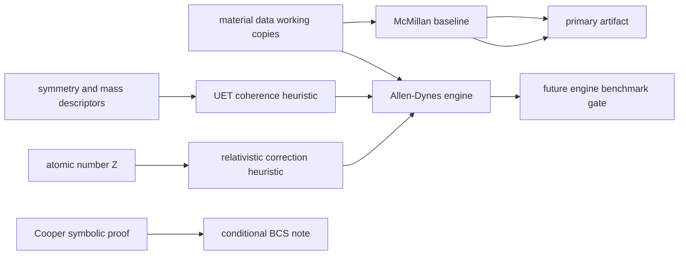

# 0.4 Superconductivity and Superfluids

> [!NOTE]
> **AI-Digest**: This topic currently contains McMillan/Allen-Dynes benchmark code, UET
> coherence-correction hypotheses, Cooper-pair symbolic notes, helium/superfluid diagnostics,
> and plasma scaling utilities. The current primary verifier is a raw McMillan baseline check
> and does not establish high-Tc prediction or a universal superconductivity theory.


## Current Claim Boundary

The current runnable gate is an internal benchmark over curated superconducting material
data. Raw McMillan formula performance is recorded as a diagnostic baseline; calibrated
or heuristic UET corrections must not be described as first-principles predictions until
their input provenance, out-of-sample tests, and acceptance thresholds are locked.

## Conceptual Diagram



## Evidence Matrix

| Layer | Current status | Evidence / artifact | Claim allowed |
| :-- | :-- | :-- | :-- |
| Raw McMillan baseline | Primary current verifier; artifact status remains `FAIL` | `Result/artifacts/0_4_superconductivity_superfluids_verification.json` | internal baseline diagnostic and blocker |
| Inverse-McMillan audit | New failure-localization diagnostic; 9/10 rows currently over-drive `lambda_ep` relative to observed `Tc` | `parameter_mismatch_audit` in artifact | data-normalization priority, not prediction evidence |
| Row normalization queue | Actionable per-material repair order generated from drift plus substitution sensitivity | `Data/03_Research/row_normalization_queue.json` | work queue only; not scientific evidence |
| Row normalization status ledger | Per-row work-control artifact with source status and next actions | `Data/03_Research/row_normalization_status.json` | operations aid only |
| Row normalization candidate pack | Internal triage of which rows have a stable local candidate versus which still need external resolution | `Data/03_Research/row_normalization_candidates.json` | internal triage only |
| Provisional normalized sensitivity table | Internal-only table that swaps in consensus candidates where available and reruns the McMillan gate | `Data/03_Research/provisional_normalized_superconductors.json`, `provisional_normalized_table` block in artifact | sensitivity study only; not source-backed normalization |
| Provisional residual-blocker map | Separates rows that still block the gate after provisional substitutions from rows that only need source locking | `Data/03_Research/provisional_residual_blockers.json` | workflow decomposition only |
| Residual blocker row dossiers | Per-row work packets for the remaining blockers, including source targets, unit questions, and decision gates | `Data/03_Research/residual_blocker_row_dossiers.json` | row-resolution workflow only |
| Residual blocker field-lock matrix | Field-by-field lock status for `Tc`, phonon proxy, `lambda_ep`, and `mu_star` across the remaining blocker rows | `Data/03_Research/residual_blocker_field_lock_matrix.json` | field-resolution workflow only |
| Residual blocker proxy sensitivity | Internal comparison of `Theta_D_K` versus `omega_log_K` under the same candidate coupling package | `Data/03_Research/residual_blocker_proxy_sensitivity.json` | proxy-decision workflow only |
| Vanadium source-lock packet | Focused action packet for the remaining borderline row with preferred proxy, candidate coupling, and source-lock checklist | `Data/03_Research/vanadium_source_lock_packet.json` | single-row execution workflow only |
| A15 external-resolution packet | Focused action packet for `Nb3Sn` and `Nb3Ge` with shared external-resolution requirements | `Data/03_Research/a15_external_resolution_packet.json` | pairwise execution workflow only |
| Vanadium candidate patch preview | Shows the exact working-copy change that would be made if the next source check confirms the row | `Data/03_Research/vanadium_candidate_patch_preview.json` | patch-preview workflow only |
| A15 candidate patch preview | Shows why `Nb3Sn` and `Nb3Ge` are still not patchable without external row evidence | `Data/03_Research/a15_candidate_patch_preview.json` | blocked patch-preview workflow only |
| Row evidence intake stub | Structured intake sheet for incoming row-level evidence before any working-copy edit is allowed | `Data/03_Research/row_evidence_intake_stub.json` | evidence-capture workflow only |
| Row evidence readiness matrix | Shows which rows still have pending evidence fields before patch review is allowed | `Data/03_Research/row_evidence_readiness_matrix.json` | evidence-gate workflow only |
| Row evidence execution queue | Orders the next evidence-collection pass row by row so source review can start from one concrete target at a time | `Data/03_Research/row_evidence_execution_queue.json` | evidence-sequencing workflow only |
| Row evidence source-review packets | Field-by-field attachment templates for the next real source pass | `Data/03_Research/row_evidence_source_review_packets.json` | source-review workflow only |
| Row evidence decision gate | Review-control checklist for deciding whether attached evidence is strong enough to enter patch review | `Data/03_Research/row_evidence_decision_gate.json` | patch-review gating only |
| Topic source-evidence workflow | Topic-level provenance intake and readiness gate | `Data/03_Research/source_evidence_intake_stub.json`, `source_evidence_readiness_matrix.json` | branch-hardening workflow only |
| Topic branch claim gate | Topic-level claim ceiling by branch | `Data/03_Research/branch_claim_gate.json` | keeps baseline FAIL from inflating stronger claims |
| Allen-Dynes engine | Model exists | `Engine_Superconductivity.py`, `FORMULA_AUDIT.md` | model formulation, not final proof |
| UET coherence / Z correction | Heuristic bridge | formula audit entries `SC-UET-COHERENCE`, `SC-REL-Z` | hypothesis / model component |
| Cooper pairing proof | Conditional symbolic note | `Proof_Cooper_Pairing.py` | BCS-style conditional relation |
| High-Tc and hydrides | Not primary-gated here | data files and research scripts only | future hardening target |

## 5x4 Grid Structure

| Pillar | Purpose |
| :-- | :-- |
| `Doc/` | phase-transition and superconductivity analysis notes |
| `Ref/` | McMillan, Allen-Dynes, high-Tc, hydride, and superfluid references |
| `Data/` | topic-local material and benchmark working copies |
| `Code/` | engine, proof, research, competitor, and visualization scripts |
| `Result/` | artifacts, plots, and run logs |

## Quick Start

```powershell
cd C:\Users\santa\Desktop\uet_harness
python docs/topics/0.4_Superconductivity_Superfluids/Code/03_Research/Experiment_Superconductor_Data.py
```

## Key Files

- `FORMULA_AUDIT.md`: formula, unit, constant, proof-status, and failure-mode registry.
- `VERIFICATION_SPEC.md`: primary command, metrics, thresholds, and artifact interpretation.
- `DATA_MANIFEST.md`: current dataset roles, hashes, and provenance gaps.
- `METHOD.md`: topic method scope and dependency policy.
- `LIMITATIONS.md`: blockers that prevent stronger claims.
- `Data/03_Research/row_normalization_queue.json`: current row-by-row normalization order derived from the FAIL artifact.
- `Data/03_Research/row_normalization_status.json`: current row-by-row status ledger for the normalization pass.
- `Data/03_Research/row_normalization_candidates.json`: internal candidate values for triage before source-backed normalization.
- `Data/03_Research/provisional_normalized_superconductors.json`: internal sensitivity package built from the candidate rows to estimate how much FAIL is driven by row-package drift.
- `Data/03_Research/provisional_residual_blockers.json`: post-provisional blocker map showing which rows still fail the gate and which rows mostly need source locking.
- `Data/03_Research/residual_blocker_row_dossiers.json`: targeted dossiers for `Nb3Sn`, `Nb3Ge`, and `Vanadium` so row-source checks can proceed without re-reading the whole artifact.
- `Data/03_Research/residual_blocker_field_lock_matrix.json`: field-level unlock status for the same three rows so the next provenance pass can work value by value.
- `Data/03_Research/residual_blocker_proxy_sensitivity.json`: internal-only proxy comparison to help decide whether `Theta_D_K` or `omega_log_K` deserves priority checking in the remaining rows.
- `Data/03_Research/vanadium_source_lock_packet.json`: focused packet for moving `Vanadium (V)` from borderline blocker to source-lock-ready row.
- `Data/03_Research/a15_external_resolution_packet.json`: focused packet for moving `Nb3Sn` and `Nb3Ge` from unresolved A15 blockers into explicit row-resolution work.
- `Data/03_Research/vanadium_candidate_patch_preview.json`: preview of the exact `Vanadium` row edit to apply if row evidence confirms the current internal candidate.
- `Data/03_Research/a15_candidate_patch_preview.json`: blocked preview showing exactly why the A15 pair still cannot be edited honestly.
- `Data/03_Research/row_evidence_intake_stub.json`: structured place to record future row evidence for `Vanadium`, `Nb3Sn`, and `Nb3Ge` before any patch is applied.
- `Data/03_Research/row_evidence_readiness_matrix.json`: quick gate showing whether each blocker row still has pending evidence before patch review can begin.
- `Data/03_Research/row_evidence_execution_queue.json`: next-action queue for the actual evidence pass so the row-source check can begin from a concrete target instead of a blank review loop.
- `Data/03_Research/row_evidence_source_review_packets.json`: per-row, per-field review template with slots for DOI/source title, table or figure, row locator, extracted value, unit basis, and compatibility note.
- `Data/03_Research/row_evidence_decision_gate.json`: row-level review gate listing the exact compatibility questions that must be answered before patch review can begin.
- `docs/data/external/condensed_matter/superconductivity/row_resolution_targets/source_target_manifest.json`: external-source acquisition manifest for the three residual blocker rows so future raw-table archiving starts from a pinned target list.
- `docs/data/external/condensed_matter/superconductivity/row_resolution_targets/source_evidence_intake_stub.json`: external landing zone for actual row-level table captures before they are translated into topic-local review packets.
- `docs/data/external/condensed_matter/superconductivity/row_resolution_targets/source_evidence_readiness_matrix.json`: external archive-readiness gate showing whether a residual row has enough archived evidence to hand back into topic-local compatibility review.
- `docs/data/external/condensed_matter/superconductivity/row_resolution_targets/local_archive_scan_report.json`: explicit report that the current repo scan found no exact local raw PDF/reference match for `Vanadium`, `Nb3Sn`, or `Nb3Ge`, so publication anchors must not be mistaken for archived row evidence.
- `docs/data/external/condensed_matter/superconductivity/row_resolution_targets/field_coverage_assessment.json`: field-by-field scope check showing that current publication anchors support `Tc` scope for the A15 pair and now support secondary-host `Tc` plus `Theta_D` text capture for `Vanadium`, while `lambda_ep` and `mu_star` still remain uncovered.
- `docs/data/external/condensed_matter/superconductivity/row_resolution_targets/field_source_gap_matrix.json`: field-by-field acquisition split showing which residual-row fields can stay on the primary publication anchor and which fields definitely need supplemental source capture.
- `docs/data/external/condensed_matter/superconductivity/row_resolution_targets/supplemental_source_candidates.json`: pinned candidate source families for `Theta_D/omega_log`, `lambda_ep`, and `mu_star` follow-up, especially for the A15 pair.
- `docs/data/external/condensed_matter/superconductivity/row_resolution_targets/supplemental_source_selection_matrix.json`: recommended first-choice source family per field so the next archive pass starts from one concrete literature decision instead of a candidate pool.
- `docs/data/external/condensed_matter/superconductivity/row_resolution_targets/a15_field_extraction_plan.json`: execution-ready extraction order for `Nb3Sn` and `Nb3Ge`, with preferred reference and success condition per field.
- `docs/data/external/condensed_matter/superconductivity/row_resolution_targets/a15_tc_capture_stub.json`: first-pass capture form for `Tc_observed` in `Nb3Sn` and `Nb3Ge`, ready for page/locator/value transcription.
- `docs/data/external/condensed_matter/superconductivity/row_resolution_targets/a15_tc_capture_manifest.json`: index of the materialized first-pass `Tc` text capture records for the A15 pair.
- `docs/data/external/condensed_matter/superconductivity/row_resolution_targets/a15_phonon_capture_stub.json`: second-pass capture form for the A15 phonon-proxy field so `Nb3Sn` and `Nb3Ge` can move directly into `Theta_D/omega_log` extraction.
- `docs/data/external/condensed_matter/superconductivity/row_resolution_targets/a15_lambda_capture_stub.json`: third-pass capture form for `lambda_ep`, prefilled with abstract-level field support from the A15 electron-phonon source.
- `docs/data/external/condensed_matter/superconductivity/row_resolution_targets/a15_support_capture_manifest.json`: manifest of the materialized A15 support captures for phonon-proxy and `lambda` fields.
- `docs/data/external/condensed_matter/superconductivity/row_resolution_targets/a15_numeric_row_value_gap_report.json`: explicit report showing which A15 fields still lack row-specific numeric values after the current text-layer pass.
- `docs/data/external/condensed_matter/superconductivity/row_resolution_targets/a15_web_numeric_extraction_blocker_report.json`: explicit report that the current web-accessible abstract and record layer is still insufficient for row-specific A15 numeric extraction.
- `docs/data/external/condensed_matter/superconductivity/row_resolution_targets/a15_secondary_numeric_hint_report.json`: weak secondary numeric hints that may guide the next A15 full-text pass without authorizing any benchmark row edit.
- `docs/data/external/condensed_matter/superconductivity/row_resolution_targets/nb3sn_fulltext_numeric_acquisition_packet.json`: execution packet for the first dedicated full-text numeric extraction pass on the strongest current A15 candidate.
- `docs/data/external/condensed_matter/superconductivity/row_resolution_targets/nb3ge_fulltext_numeric_acquisition_packet.json`: execution packet for the matching full-text numeric extraction pass on the weaker current A15 candidate.
- `docs/data/external/condensed_matter/superconductivity/row_resolution_targets/a15_fulltext_table_target_map.json`: map of the most likely full-text tables or sections to inspect for A15 phonon and lambda numeric extraction.
- `docs/data/external/condensed_matter/superconductivity/row_resolution_targets/nb3sn_raw_page_capture_checklist.json`: step-by-step capture checklist for the first real Nb3Sn full-text extraction pass.
- `docs/data/external/condensed_matter/superconductivity/row_resolution_targets/nb3ge_raw_page_capture_checklist.json`: matching step-by-step capture checklist for the first real Nb3Ge full-text extraction pass.
- `docs/data/external/condensed_matter/superconductivity/row_resolution_targets/vanadium_fulltext_numeric_acquisition_packet.json`: execution packet for the top-priority elemental row, including the citation-integrity gate that must be cleared before any Vanadium row is treated as stable.
- `docs/data/external/condensed_matter/superconductivity/row_resolution_targets/vanadium_raw_page_capture_checklist.json`: matching step-by-step capture checklist for the first real Vanadium full-text extraction pass, with page-confirmation baked in.
- `docs/data/external/condensed_matter/superconductivity/row_resolution_targets/vanadium_citation_integrity_report.json`: explicit weighing of the competing Vanadium page claims, showing that APS-style pagination is now better supported but still not fully page-confirmed.
- `docs/data/external/condensed_matter/superconductivity/row_resolution_targets/residual_extraction_dashboard.json`: one-file dashboard for the three unresolved rows, their current blockers, and their shortest next actions.
- those external intake rows are now prefilled with DOI/source anchors and expected units, so the next pass can focus on row locator, archived path, and extracted values.
- `docs/data/external/condensed_matter/superconductivity/row_resolution_targets/external_acquisition_queue.json`: external sequencing queue for which residual row should be archived first.
- `docs/data/external/condensed_matter/superconductivity/row_resolution_targets/topic_handoff_gate.json`: external-to-topic checkpoint for deciding when archived row evidence is complete enough to enter topic-local review.
- `docs/data/external/condensed_matter/superconductivity/row_resolution_targets/vanadium/archive_dossier.json`: per-row external archive checklist for the first residual blocker.
- `docs/data/external/condensed_matter/superconductivity/row_resolution_targets/nb3sn/archive_dossier.json` and `.../nb3ge/archive_dossier.json`: per-row external archive checklists for the A15 pair.
- `docs/data/external/condensed_matter/superconductivity/row_resolution_targets/candidate_local_source_anchors.json`: local repo citation hints that may help the next archive pass, without being misread as source-locked evidence.
- `docs/data/external/condensed_matter/superconductivity/row_resolution_targets/nb3sn/source_record.json` and `.../nb3ge/source_record.json`: pinned publication anchors for the A15 rows.
- `docs/data/external/condensed_matter/superconductivity/row_resolution_targets/vanadium/source_record.json`: bibliographic publication anchor for `Vanadium` until a direct row-level transcription is archived.
- `docs/data/external/condensed_matter/superconductivity/row_resolution_targets/vanadium/tc_text_capture_record.json`, `.../theta_text_capture_record.json`, `.../lambda_text_capture_record.json`, `.../mu_star_hint_record.json`, and `.../vanadium_numeric_hint_summary.json`: early Vanadium evidence captures and consolidated hint controls that improve intake readiness without clearing the primary raw-page gate or supplying row-usable values.
- the current local repo scan did not find any exact raw PDF or reference-file match for the three residual rows, so the next pass still has to archive row evidence from outside the repo even though publication anchors are now pinned.
- the current publication anchors are also not field-complete: `Nb3Sn` and `Nb3Ge` support `Tc` scope from abstract/record text, while `Vanadium` now has secondary-host `Tc` and `Theta_D` text capture; none of the three currently demonstrates `lambda_ep` or `mu_star` coverage.
- `Vanadium` now also has secondary-host text capture for `Tc` and `Theta_D`, which is stronger than title-only scope but still below primary raw-page evidence.
- `Vanadium` now also has abstract-level field support for electron-phonon interactions, which narrows the `lambda_ep` search but still does not provide a row-specific coupling value.
- `Vanadium` now also has a narrowed secondary hint range for `mu_star`, which helps convention control but still does not count as row-usable evidence.
- `Vanadium` now also has a consolidated secondary numeric hint layer across `Tc`, `Theta_D`, `lambda_ep`, and `mu_star`, but that layer is still below patch-review standard.
- `Vanadium` now also has open-fulltext numeric captures for `lambda_ep` and `mu_star`, but those still require compatibility review before they can be treated as benchmark-row inputs.
- the new Vanadium compatibility packet now makes the remaining conflict explicit: the captured `lambda` and `mu_star` values do not simply validate the current working row or the older internal `lambda=0.6` candidate.
- the new Vanadium patch-block decision now freezes that implication at the workflow level: the older lambda-only preview must not be executed unless the external conflicts are resolved.
- the new Vanadium primary-capture requirement packet now spells out exactly what the first primary page capture must prove before the row can even re-enter patch consideration.
- the Vanadium full-text packet, external queue, and topic handoff gate now all point to the same narrower endgame: primary raw-page confirmation for `Tc` and `Theta_D`, then row-usable upgrades for `lambda_ep` and `mu_star`.
- the new source-gap matrix now makes the next archive pass sharper: `Tc` can stay on the current publication anchors, but `Theta_D/omega_log`, `lambda_ep`, and most `mu_star` work must move to supplemental-source capture.
- the new supplemental-source candidate map now pins likely follow-up literature for those non-`Tc` fields, so the next pass can start from named source families instead of a blank search.
- the new supplemental-source selection matrix goes one step further and recommends which source family to inspect first for each unresolved field.
- the new A15 extraction plan turns that recommendation into an order of operations, so `Nb3Sn` and `Nb3Ge` can be worked field by field without reconstructing the logic.
- the new A15 Tc capture stub takes the first field in that plan and turns it into a direct extraction form, so the next pass can start with transcription rather than governance.
- `Nb3Sn` and `Nb3Ge` now also have first-pass `Tc` text capture populated from the primary abstract/record layer, but they are still not archive-complete because no raw page/PDF path has been mirrored into the repo yet.
- those first-pass `Tc` captures are now also materialized as per-material evidence records under the external layer, so the repo has a concrete artifact rather than only a shared stub.
- the next A15 field now has its own capture surface too, so the workflow can move from `Tc` into phonon-proxy extraction without inventing another format.
- the A15 `lambda` field now also has a capture surface with abstract-level support text, so the next pass can move toward row values instead of re-proving field relevance.
- the A15 phonon and `lambda` support texts are now also materialized as per-material evidence records, so the repo holds concrete artifacts rather than only shared stubs.
- the new numeric-gap report now draws the line clearly: `Tc` has text-layer numbers, but the phonon and `lambda` fields still do not have row-specific numeric captures.
- the new web-access numeric blocker report goes one step further and records that this is no longer just a search-planning gap: the current abstract/record layer itself is insufficient, so the next A15 pass has to move to full-text, full-table, or mirrored-raw extraction.
- the new secondary numeric hint report records one more nuance: `Nb3Sn` now has weak secondary numeric clues for `lambda` and Debye-scale temperature, but they remain below row-usable standard and only help prioritize the next full-text pass.
- the new `Nb3Sn` full-text numeric acquisition packet turns that prioritization into a concrete execution handoff, so the next pass can try to capture raw-page numeric values instead of rebuilding the field checklist again.
- the new `Nb3Ge` full-text numeric acquisition packet gives the A15 pair a symmetric handoff too, while still being honest that `Nb3Ge` has weaker hint support and depends more directly on full-text numeric capture.
- the new A15 full-text table target map narrows the extraction pass one step further by saying which tables or sections in the chosen full-text sources are actually worth opening first.
- the new `Nb3Sn` raw-page capture checklist turns that map into a literal extraction worksheet, so the next pass can open the source and capture the needed fields without reconstructing the order of operations.
- the new `Nb3Ge` raw-page capture checklist does the same for the second A15 row, so the pair now has symmetric extraction worksheets rather than only shared planning artifacts.
- the new `Vanadium` full-text numeric acquisition packet now gives the top-priority blocker the same treatment, but with one extra guardrail: the citation-integrity conflict has to be cleared before any captured row can be treated as stable.
- the new `Vanadium` raw-page capture checklist pushes that one step further by turning the guardrail into an explicit extraction worksheet, so page confirmation and row capture stay tied together.
- the new `Vanadium` citation integrity report narrows that conflict further: APS-style pagination now has stronger bibliographic support than the MIT course reference chain, but raw page confirmation is still required before the row can be trusted.
- the new residual extraction dashboard now pulls all three unresolved rows into one control surface, so a future extraction pass can start from one file instead of hopping across packets, reports, and checklists.
- that A15 phonon capture surface now also contains an abstract-level proxy-convention note saying Debye temperature is generally a bad estimate of `omega_log`, but it still does not contain row-specific phonon values.
- `Data/03_Research/source_evidence_intake_stub.json`: topic-level provenance queue for raw baseline, normalization, Allen-Dynes, and high-Tc branches.
- `Data/03_Research/branch_claim_gate.json`: topic-level branch ceiling showing that only the raw baseline failure diagnostic is currently accepted.

## Current Limitations

- Many material inputs are topic-local working copies rather than normalized upstream archives.
- Raw McMillan error is currently high and must be reported honestly.
- The inverse-McMillan audit points the next cleanup at row-level `lambda_ep`, `Theta_D_K`, and material-specific phonon-scale provenance.
- The provisional normalized table is useful only for sensitivity analysis; it must not be cited as a source-backed repaired dataset.
- UET coherence and relativistic correction terms are heuristic/calibration-sensitive.
- High-Tc and hydride claims need separate source-backed gates before promotion.
- Topic-level branch gates now keep row-normalization work, Allen-Dynes/UET branches, and universal-superconductivity claims from piggybacking on the raw baseline artifact.

*Status note: internal benchmark and formula-audit hardening gate.*
