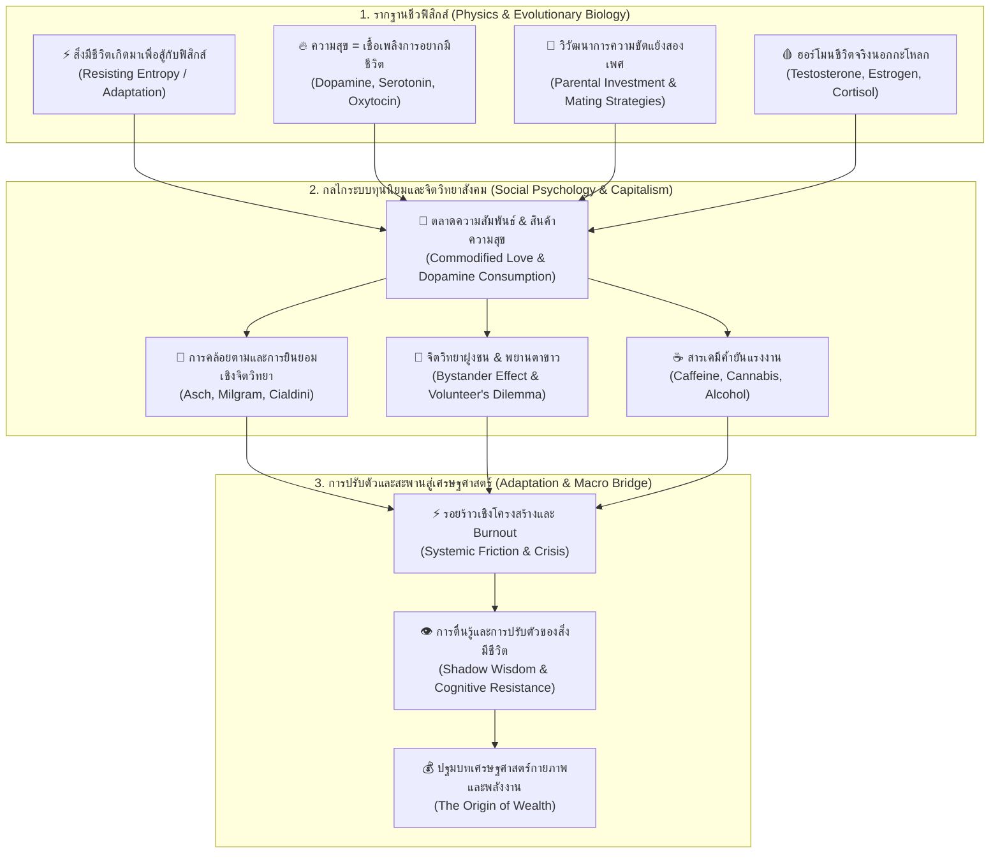

# 📖 โครงร่างหนังสือเล่มที่ 3 (Bio/Psy/Econ Series): โลกที่ติดโดปามีน (The Dopamine World)
> **ชื่อโครงการ:** psy + Econmi (หนังสือเกี่ยวกับไบโอ-จิตวิทยา เล่ม 3)
> **ผู้เขียน:** สังเคราะห์จากทัศนะและแนวคิดเชิงทฤษฎี UET (Unity Equilibrium Theory)
> **แก่นความคิดหลัก:** อธิบาย **"การต่อสู้ระหว่างสิ่งมีชีวิตกับฟิสิกส์"** ที่ขยายตัวจากระดับเซลล์สู่ระดับสังคม วิเคราะห์ว่าระบบภายนอก (ทุนนิยม/ตลาด/เมือง) ใช้ประโยชน์และแฮกกลไกทางชีวภาพ ฮอร์โมนเพศ และจุดอ่อนทางจิตวิทยาของมนุษย์อย่างไร ตลาดความสัมพันธ์ (Mating Market) และสังคมชายเป็นใหญ่เกิดขึ้นจากข้อขัดแย้งทางวิวัฒนาการอย่างไร และทำไมความสุขที่จำเป็นต่อการมีชีวิตถึงถูกแทนที่ด้วย "ความสุขแบบที่ซื้อได้" เล่มนี้ทำหน้าที่เป็น **"สะพานเชื่อมชีววิทยา จิตวิทยาสังคม และเศรษฐศาสตร์พฤติกรรม"** เพื่อส่งไม้ต่อไปยังวิกฤตเศรษฐกิจ พลังงาน และการเงินในเล่ม [The Origin of Wealth](../../economics_ai_energy/01_economics/book_1_blueprint.md)

---

## 🗺️ แผนผังการแสวงหาประโยชน์เชิงระบบและชีวฟิสิกส์ (Biophysical & Systemic Exploitation Tree)

---

## 📑 สารบัญและพิมพ์เขียวเนื้อหารายบท (8 บท: บทที่ 0 ถึง บทที่ 7)

### 📌 บทที่ 0: ปฐมบท — สิ่งมีชีวิตเกิดมาเพื่อสู้กับฟิสิกส์ (Life as Resistance against Entropy)
* **แก่นความคิด:** สิ่งมีชีวิตไม่ได้อยู่นิ่ง แต่เป็นระบบที่ "เกิดมาเพื่อปรับตัวและสู้กับฟิสิกส์" ทุกวินาทีสิ่งมีชีวิตต้องต่อสู้กับกฎข้อที่สองของอุณหพลศาสตร์ (The Second Law of Thermodynamics / Entropy) เพื่อรักษาระเบียบภายใน (Schrödinger’s Negentropy)
* **การสู้กับฟิสิกส์ใน 3 มิติของสังคมมนุษย์:**
  1. **สู้ในทางเศรษฐศาสตร์:** สู้กับความขาดแคลนของพลังงาน อาหาร และทรัพยากร
  2. **สู้ในทางรัฐศาสตร์และประวัติศาสตร์:** สู้กับภูมิศาสตร์ ข้อจำกัดของพื้นที่ และสภาพภูมิอากาศ
  3. **สู้ในทางจิตวิทยาและชีววิทยา:** สู้กับเวลาของชีวิต พลังงานสมองที่มีจำกัด และความเสื่อมถอย
* **หัวใจสำคัญ:** สังคมมนุษย์ที่เปลี่ยนไปไม่ได้แปลว่า "จบสิ้นหรือพังทลาย" แต่มันคือ **สนามประลองการปรับตัวใหม่** ของสิ่งมีชีวิตที่ไม่เคยหยุดนิ่ง
* 📚 **งานวิจัยและทฤษฎีอ้างอิง:**
  - Schrödinger, E. (1944). *What is Life? The Physical Aspect of the Living Cell.*
  - Friston, K. (2010). *The free-energy principle: a unified brain theory?* Nature Reviews Neuroscience.

---

### 📌 บทที่ 1: ความสุขกับการอยากมีชีวิต — เชื้อเพลิงของการมีอยู่ และความสุขที่ซื้อได้ (Happiness as the Engine of Existence)
* **แก่นความคิด:** มนุษย์ไม่ได้แค่ "อยากมีความสุข" แต่ **"ถ้าไม่มีความสุข มนุษย์จะไม่อยากมีชีวิตอยู่"** ความสุขคือสารเคมีนำร่องที่ธรรมชาติสร้างขึ้นเพื่อเป็นเชื้อเพลิงหล่อเลี้ยงเจตจำนงในการมีชีวิต (The Will to Live)
* **ประเด็นวิเคราะห์:**
  - **ภาวะสิ้นยินดี (Anhedonia):** เมื่อสมองขาดการตอบสนองของสารสื่อประสาท มนุษย์จะหมดแรงจูงใจในการขยับตัวและยอมแพ้ต่อความตาย
  - **ความสุข 3 ระบบ:**
    - *Dopamine (ความอยาก/การล่ารางวัล):* ความสุขระยะสั้นที่ผลักดันการลงมือทำ แต่ไม่มีวันอิ่ม
    - *Serotonin (ความสงบ/ความปลอดภัย):* ความพึงพอใจในสถานะและการอยู่ในสิ่งแวดล้อมที่กลมกลืน
    - *Oxytocin (ความผูกพัน/ความไว้วางใจ):* สายสัมพันธ์ทางสังคมที่ลดความตึงเครียดของระบบประสาท
  - **กับดักความสุขในโลกทุนนิยม:** ทุนนิยมไม่สามารถผลิต Serotonin และ Oxytocin ให้เราได้ เพราะความสงบและความอิ่มเอมทำให้คนหยุดซื้อของ ระบบจึงทำลายความสงบตามธรรมชาติ แล้วนำเสนอ **"ความสุขแบบที่ใช้เงินซื้อได้ (Commodifiable Dopamine)"** มาเป็นสิ่งชดเชยที่ต้องซื้อซ้ำไม่รู้จบ
* 📚 **งานวิจัยและทฤษฎีอ้างอิง:**
  - Berridge, K. C., & Robinson, T. E. (2016). *Liking, wanting, and the incentive-sensitization theory of addiction.* American Psychologist.
  - Lustig, R. (2017). *The Hacking of the American Mind: The Science Behind the Corporate Takeover of Our Bodies and Brains.*

---

### 📌 บทที่ 2: ตลาดความสัมพันธ์และวิวัฒนาการสองเพศ (The Relationship Market & Evolutionary Mating Strategies)
* **แก่นความคิด:** ความสัมพันธ์ระหว่างเพศและ "สังคมชายเป็นใหญ่ (Patriarchy)" ไม่ได้เกิดขึ้นจากความชั่วร้ายหรือการเลือกฝ่ายเดียว แต่เกิดจาก **"ความขัดแย้งทางวิวัฒนาการ (Evolutionary Sexual Conflict)"** เพื่อการเอาตัวรอดของเผ่าพันธุ์
* **ประเด็นวิเคราะห์:**
  - **ทฤษฎีการลงทุนของพ่อแม่ (Parental Investment Theory - Robert Trivers, 1972):**
    - *เพศหญิง:* ลงทุนทางชีววิทยาสูงมาก (ไข่มีจำกัด, ตั้งครรภ์ 9 เดือน, เลี้ยงลูกด้วยนม) จึงวิวัฒน์มาให้เป็นฝ่ายคัดเลือกสูง (Selective / Monogamous tendencies) เพื่อหาคู่ครองที่การันตีทรัพยากรและความปลอดภัย
    - *เพศชาย:* ต้นทุนทางชีววิทยาต่ำกว่า จึงวิวัฒน์มาให้แข่งขันแย่งชิงสถานะและมีแนวโน้มแสวงหาโอกาสกระจายพันธุ์ (Reproductive variance)
  - **ความขัดแย้งที่ต้องอยู่ร่วมกัน:** มนุษย์ทั้งสองเพศมีกลยุทธ์สืบพันธุ์ต่างกันอย่างสิ้นเชิง แต่กลับต้องถูกบีบให้อาศัยอยู่ในเผ่าเดียวกันและเลี้ยงดูลูกที่พึ่งพาตัวเองไม่ได้เป็นเวลาหลายปี
  - **เมื่อความสัมพันธ์กลายเป็น "ตลาด (The Mating Market)":** ในโลกทุนนิยม ความรักถูกลดทอนลงเป็นสินค้า มีการประเมินมูลค่า (Status, Wealth, Beauty) ผ่านแอปหาคู่ (Dating Apps) สร้างภาวะ Hypergamy และตัวเลือกที่ไม่สิ้นสุด (Paradox of Choice) ที่ทำให้ผู้คนไม่กล้าลงทุนทางอารมณ์ เกิดภาวะขาดแคลน Oxytocin เชิงโครงสร้าง
* 📚 **งานวิจัยและทฤษฎีอ้างอิง:**
  - Trivers, R. (1972). *Parental investment and sexual selection.*
  - Buss, D. M. (2016). *The Evolution of Desire: Strategies of Human Mating.* Basic Books.
  - Illouz, E. (2012). *Why Love Hurts: A Sociological Explanation.* Polity Press.

---

### 📌 บทที่ 3: ฮอร์โมนในชีวิตจริง นอกกะโหลกศีรษะ (Endocrine Realities: Testosterone, Estrogen & Dominance)
* **แก่นความคิด:** ขยายมุมมองจากสารสื่อประสาทในสมอง (เล่ม 2) สู่ **ระบบต่อมไร้ท่อและฮอร์โมนร่างกาย (Endocrine System)** ที่ขับเคลื่อนพฤติกรรมมนุษย์จริงในสังคม
* **ประเด็นวิเคราะห์:**
  - **Testosterone (ฮอร์โมนแห่งสถานะและการแข่งขัน):** ขับเคลื่อนการช่วงชิงลำดับชั้นทางสังคม (Dominance Hierarchy), การกล้าเสี่ยง, และการปกป้องอาณาเขต ทุนนิยมแฮกฮอร์โมนนี้ด้วยการขายสัญลักษณ์สถานะ (รถหรู, นาฬิกา, ตำแหน่งงาน)
  - **Estrogen & Progesterone (ฮอร์โมนแห่งรังและการประเมินความปลอดภัย):** กำหนดวงจรการดูแล สัญชาตญาณความปลอดภัย และความละเอียดอ่อนทางอารมณ์ ซึ่งถูกทุนนิยมแฮกผ่านอุตสาหกรรมความงามและสินค้าบริโภค
  - **Oxytocin & Vasopressin (ฮอร์โมนพันธะคู่ครองและเผ่าพันธุ์):** สารเคมีที่สร้างความภักดีและการผูกพันระยะยาว แต่ถูกทำลายด้วยวิถีชีวิตเมืองที่แยกมนุษย์ออกจากกัน
  - **Cortisol (ฮอร์โมนความเครียดเรื้อรัง):** เมื่อฮอร์โมนความเครียดพุ่งสูงอย่างต่อเนื่อง ร่างกายจะตัดวงจรฮอร์โมนเพศ ทำให้ความต้องการทางเพศลดลง อัตราการเกิดลดลง และสุขภาพจิตพังทลาย
* 📚 **งานวิจัยและทฤษฎีอ้างอิง:**
  - Sapolsky, R. M. (2017). *Behave: The Biology of Humans at Our Best and Worst.* Penguin Press.
  - Mazur, A., & Booth, A. (1998). *Testosterone and social rank in men.* Behavioral and Brain Sciences.

---

### 📌 บทที่ 4: จิตวิทยาการคล้อยตามและการยินยอม (Conformity, Compliance & Social Influence)
* **แก่นความคิด:** วิเคราะห์ว่า **ปัจเจกกลายเป็นส่วนหนึ่งของสังคมได้อย่างไร และสังคมเข้ามาควบคุมปัจเจกอย่างไร** ผ่านกลไกทางจิตวิทยาสังคม
* **ประเด็นวิเคราะห์:**
  - **การคล้อยตาม (Conformity - Solomon Asch, 1951):** มนุษย์ยอมปฏิเสธความจริงที่ตาตัวเองเห็น เพื่อไม่ให้ตนเองแปลกแยกจากกลุ่ม สมองมองว่า "การโดนขับออกจากเผ่า = ความตาย"
  - **การยินยอมเชิงจิตวิทยา (Psychological Compliance & Obedience - Stanley Milgram, 1963):** มนุษย์พร้อมจะกดปุ่มทำร้ายคนแปลกหน้า เพียงเพราะมีคนสวมเสื้อกาวน์หรือผู้มีอำนาจสั่งการ
  - **ความแตกต่างสำคัญ:** แยกขาดระหว่าง **"การยินยอมเชิงจิตวิทยา (กลไกสมองยอมตามแรงกดดันและ Heuristics)"** ในเล่มนี้ ออกจาก **"การยินยอมในสัญญาประชาคมแบบ John Locke (ความชอบธรรมของอำนาจรัฐ)"** ซึ่งจะยกยอดไปวิเคราะห์เชิงลึกใน Section 3 (History, Media & Power)
  - **วิศวกรรมการชักจูง (Cialdini’s Weapons of Influence):** สังคมทุนนิยมใช้ Social Proof, Scarcity, และ Authority ในการสร้างพฤติกรรมยินยอมซื้อและยินยอมจำนนต่อระบบ
* 📚 **งานวิจัยและทฤษฎีอ้างอิง:**
  - Asch, S. E. (1951). *Effects of group pressure upon the modification and distortion of judgments.*
  - Milgram, S. (1963). *Behavioral Study of obedience.* The Journal of Abnormal and Social Psychology.
  - Cialdini, R. B. (2006). *Influence: The Psychology of Persuasion.* Harper Business.

---

### 📌 บทที่ 5: จิตวิทยาฝูงชนและปรากฏการณ์พยานตาขาว (The Bystander Effect & Volunteer's Dilemma)
* **แก่นความคิด:** ผ่าความจริงของ **"พยานตาขาว"** ว่าไม่ใช่เรื่องความชั่วร้ายหรือความขี้ขลาดส่วนบุคคล แต่เป็น **ความล้มเหลวของการออกแบบปฏิสัมพันธ์กลุ่มและทฤษฎีเกม (Game Theory)**
* **ประเด็นวิเคราะห์:**
  - **Bystander Effect & Diffusion of Responsibility (Darley & Latané, 1968):** ยิ่งคนมุงเยอะ ความรับผิดชอบในใจของแต่ละคนจะถูกหาร $1/N$ ทุกคนคิดว่าคนอื่นจะโทรแจ้งเอง
  - **Pluralistic Ignorance:** การมองหน้ากันเพื่อประเมินสถานการณ์ เมื่อทุกคนยืนนิ่ง สมองจึงสรุปว่าไม่ใช่เรื่องฉุกเฉิน
  - **ทฤษฎีเกมของความเสียสละ (Volunteer's Dilemma):** คนแรกที่ก้าวขาออกไปช่วย แบกรับต้นทุนและความเสี่ยง 100% (บาดเจ็บ, ฟ้องร้อง, เสียเวลา) ขณะที่ผลประโยชน์กระจายให้ทุกคน หากไม่มีกฎหมายคุ้มครองพลเมืองดี (Good Samaritan Law) การอยู่นิ่งๆ จึงเป็นการตัดสินใจที่ประหยัดต้นทุนที่สุด
  - **วัฒนธรรมผู้ชมในยุคดิจิทัล (Spectator Culture):** สมาร์ตโฟนเปลี่ยนผู้พบเห็นจาก "ผู้มีส่วนร่วม" กลายเป็น "ตากล้องถ่ายคลิป" เพื่อแสวงหาการยอมรับทางโซเชียลมีเดีย
* 📚 **งานวิจัยและทฤษฎีอ้างอิง:**
  - Darley, J. M., & Latané, B. (1968). *Bystander intervention in emergencies: Diffusion of responsibility.* Journal of Personality and Social Psychology.
  - Diekmann, A. (1985). *Volunteer's dilemma.* Journal of Conflict Resolution.

---

### 📌 บทที่ 6: สารเคมีค้ำยันโครงสร้างแรงงาน (Biopolitical Coping: Chemical Stabilizers of Capitalism)
* **แก่นความคิด:** ทุนนิยมไม่ได้แค่ควบคุมผ่านกฎหมาย แต่ควบคุมผ่าน **"สารเคมีที่อนุญาตให้บริโภค"** เพื่อค้ำจุนเสถียรภาพของแรงงานไม่ให้พังทลายลงก่อนกำหนด
* **ประเด็นวิเคราะห์:**
  - **คาเฟอีน (Systemic Uppers):** สารกระตุ้นที่ถูกกฎหมายและได้รับการยกย่อง ทำหน้าที่บล็อกตัวรับ Adenosine เพื่อหลอกสมองว่าไม่เหนื่อย ทำให้แรงงานสามารถขายเวลาทำงานเกินขีดจำกัดทางชีวภาพ
  - **กัญชาและสารผ่อนคลาย (Systemic Downers):** ทางแก้ขัดราคาถูกที่ระบบอนุญาต เพื่อจำลองความสงบ (Serotonin-mimic) ให้แรงงานที่ถูกพรากจากธรรมชาติ ได้เสพเพื่อคลายเครียดและลดแรงต้านทานต่อโครงสร้าง
  - **แอลกอฮอล์ (Social Lubricant):** สารกดประสาทที่ช่วยละลายความอึดอัดทางสังคม ช่วยชดเชยการขาด Oxytocin ชั่วคราวเพื่อให้มนุษย์ที่เหินห่างยังพอจะมีปฏิสัมพันธ์ร่วมกันได้
  - **การแพทย์พาณิชย์กับการปิดปากอาการ:** การใช้ยาต้านเศร้าเพื่อทำให้แรงงานกลับไปทำงานต่อได้ โดยไม่เคยแตะต้องโครงสร้างสังคมที่เป็นพิษ
* 📚 **งานวิจัยและทฤษฎีอ้างอิง:**
  - Courtwright, D. T. (2001). *Forces of Habit: Drugs and the Making of the Modern World.* Harvard University Press.
  - Fisher, M. (2009). *Capitalist Realism: Is There No Alternative?* Zero Books (Privatization of Stress).

---

### 📌 บทที่ 7: ปัญญาจากรอยร้าว สู่การออกแบบโลกใหม่ (Systemic Friction & The Bridge to Physical Wealth)
* **แก่นความคิด:** สิ่งมีชีวิตเกิดมาเพื่อสู้กับฟิสิกส์และความเจ็บปวด ภาวะหมดไฟ (Burnout) วิกฤตสุขภาพจิต และความล้มเหลวของตลาดความสัมพันธ์ ไม่ใช่ความพ่ายแพ้ แต่เป็น **"รอยร้าวที่ปลุกให้สิ่งมีชีวิตตื่นขึ้นมาปรับตัวครั้งใหญ่"**
* **ประเด็นวิเคราะห์:**
  - **พลังของความขาดแคลนและ Shadow Function:** ชนชั้นกลาง-ล่างที่ไม่มีทางลัด ต้องเผชิญความเจ็บปวดตรงๆ จนเกิดการกระตุ้นสติปัญญาและฟังก์ชันภายในที่ซ่อนอยู่ (Shadow) เพื่อมองทะลุภาพลวงตาของระบบ
  - **ขีดจำกัดของการเยียวยาระดับปัจเจก:** เราไม่สามารถฝึกสติหรือแก้ Mindset เพื่อเอาตัวรอดในกรงขังที่กำลังพังทลายได้ตลอดไป ปัญหาชีวภาพและจิตวิทยาคืออาการแสดง (Symptom) ของระบบปิดทางเศรษฐกิจ
  - **สะพานเชื่อมสู่ [The Origin of Wealth]:** การก้าวข้ามจาก "จิตวิทยาและชีวภาพ" ไปสู่ **"เศรษฐศาสตร์กายภาพ (Biophysical Economics) และประวัติศาสตร์การเงิน"** เพื่อตั้งคำถามว่า: *ระบบเงินตรา หนี้สิน และพลังงานฟอสซิล แฮกเวลาชีวิตและชีววิทยาของมนุษยชาติมาตั้งแต่เมื่อไหร่?*
* 📚 **งานวิจัยและทฤษฎีอ้างอิง:**
  - Han, B.-C. (2015). *The Burnout Society.* Stanford University Press.
  - Hall, C. A., & Klitgaard, K. A. (2018). *Energy and the Wealth of Nations: An Introduction to Biophysical Economics.* Springer.

---
