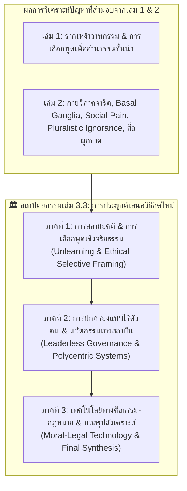

# 📖 พิมพ์เขียวแม่บท เล่มที่ 3.3: การสร้างวาทกรรมใหม่และสถาปัตยกรรมจารีตใหม่
*(Book 3.3 Master Blueprint: Applied Emancipatory Framework, Leaderless Governance & Moral-Legal Technology)*

> **ชื่อโครงการ:** `03_3_reformation_of_the_mind` (Section 3: History & Hegemony - Book 3)  
> **รูปแบบการวิเคราะห์:** การประยุกต์ทฤษฎี สถาปัตยกรรมทางปัญญา และนวัตกรรมทางสถาบัน (Applied Philosophy, Institutional Design & Emancipatory Architecture)  
> **แก่นเรื่องหลัก:** **เล่มที่ 3 ทำหน้าที่เสนอการประยุกต์วิธีคิดใหม่และสถาปนาจารีตใหม่ที่ดีล้วนๆ (Pure Forward-Looking Application)** โดยปราศจากเนื้อหาการเล่าประวัติศาสตร์ย้อนหลังหรือเกร็ดความรู้ปรัชญาในอดีต (ซึ่งถูกรวบจัดเต็มไว้ในเล่ม 1 และ เล่ม 2 เรียบร้อยแล้ว) เล่มนี้มุ่งเน้นการเสนอโซลูชันเชิงโครงสร้าง:
> 1. การสลายอคติและการตื่นรู้จากการสมยอมเทียม (Unlearning & Pluralistic Ignorance Dissolution)
> 2. การเลือกพูดเชิงจริยธรรม (Ethical Selective Framing)
> 3. การปกครองแบบไร้ตัวตนและการบริหารทรัพยากรร่วม (Leaderless Governance & Ostrom Commons)
> 4. การสถาปนาเทคโนโลยีทางศีลธรรม-กฎหมายและนิติรัฐที่ยั่งยืน (Moral-Legal Technology & Sustainable Rule of Law)
> 
> 📌 **ชุดเอกสารกำกับมาตรฐานประจำเซกชัน:**
> - แผนที่ข้ออ้างและขอบเขตหลักฐาน: [`../SECTION_CLAIM_MAP.md`](../SECTION_CLAIM_MAP.md) (`CLM-SEC3-018` ถึง `CLM-SEC3-020`)
> - ทะเบียนข้อมูลวิทยาศาสตร์และหลักฐาน: [`../SCIENTIFIC_DATA_REGISTER.md`](../SCIENTIFIC_DATA_REGISTER.md)
> - กล่องเครื่องมือความคิด 3 แว่นตาสำหรับผู้อ่าน: [`../READERS_CONCEPTUAL_TOOLKIT.md`](../READERS_CONCEPTUAL_TOOLKIT.md)
> - ทะเบียนทฤษฎีและการต่อจิ๊กซอว์: [`../THEORY_AND_CITATION_REGISTER.md`](../THEORY_AND_CITATION_REGISTER.md)

---

## 🗺️ 1. Master Cognitive Architecture & Chapter Blueprint

---

## 📑 2. Detailed Chapter Architecture (ตามมาตรฐาน 3 หน้าต่อตอน: Page A / Page B / Page C)

### ภาคที่ 1: การสลายอคติและการเลือกพูดเชิงจริยธรรม (De-biasing & Ethical Selective Framing)

#### 📌 บทที่ 1: การถอดถอนอคติและการตื่นรู้จากการสมยอมเทียม (Unlearning & De-biasing)
*   **ตอนที่ 1.A: การทำลายภาพลวงตา 'พวกเรา vs พวกเขา' (Dissolving the Out-Group Bias):**
    *   *Page A (Main Narrative):* ชี้ให้เห็นว่า 'ศัตรู' ที่เราเกลียดในพื้นที่สื่อ แท้จริงคือเหยื่อของการถูกปั่นวาทกรรมเหมือนกับเรา การสลายภาพจำช่วยดึงสมองออกจากสภาวะ Amygdala Hijack
    *   *Page B (Evidence & Citations):* Kahneman (*Thinking, Fast and Slow*), Centola et al. (2005) สถิติ Pluralistic Ignorance และงานวิจัยจิตวิทยาสังคมเรื่อง Social Categorization
    *   *Page C (Synthesis & Application):* กระบวนการ 'Unlearn' ในชีวิตประจำวัน และการสร้างพื้นที่ปลอดภัยทางจิตวิทยาในการสื่อสาร
*   **ตอนที่ 1.B: การสลายสภาวะการสมยอมเทียม (Breaking Pluralistic Ignorance):**
    *   *Page A (Main Narrative):* เมื่อคนส่วนใหญ่ต่างไม่เห็นด้วยกับจารีตที่กดทับในใจ แต่แสร้งทำตามเพราะคิดว่าคนอื่นเชื่อจริงๆ การส่งเสียงความจริงเพียงคนเดียวสามารถทำลายเกลียวแห่งความเงียบได้
    *   *Page B (Evidence & Citations):* Elisabeth Noelle-Neumann (*Spiral of Silence*), Asch Conformity Experiments, Bicchieri (*The Grammar of Society*)
    *   *Page C (Synthesis & Application):* เทคนิคการเปิดเผยความเห็นแท้จริงโดยปราศจากความเสี่ยงต่อ Social Pain

#### 📌 บทที่ 2: การเลือกพูดเชิงจริยธรรม (Ethical Selective Framing)
*   **ตอนที่ 2.A: การรีเฟรมวาทกรรมเพื่อประโยชน์ส่วนรวม (Re-framing for the Commons):**
    *   *Page A (Main Narrative):* ชนชั้นนำใช้ Selective Framing เพื่อผลประโยชน์ส่วนตน เราสามารถนำเครื่องมือเดียวกันนี้มาใช้สกัดเฉพาะมิติที่ดีงามและปลดปล่อยสังคม
    *   *Page B (Evidence & Citations):* Entman (*Framing Theory*), George Lakoff (*Don't Think of an Elephant*), Habermas (*Communicative Action*)
    *   *Page C (Synthesis & Application):* กรณีศึกษาการเปลี่ยนกรอบคิด 'คนชังชาติ vs ผู้รักชาติ' สู่ 'พลเมืองผู้ร่วมสร้างนิติรัฐ'
*   **ตอนที่ 2.B: การสกัดแก่นมรดกทางปัญญาเดิม (Synthesizing Classical Wisdom):**
    *   *Page A (Main Narrative):* สกัดเอาแก่นแท้ของพุทธดั้งเดิม (สติ-ปัญญา กาลามสูตร อนัตตา) และปรัชญาตะวันตก (สิทธิมนุษยชนของ J.S. Mill) มาเป็นภาษาที่คนรุ่นใหม่เข้าใจและใช้ได้จริง
    *   *Page B (Evidence & Citations):* Kalama Sutta, J.S. Mill (*On Liberty*), Schopenhauer's Compassion Ethics
    *   *Page C (Synthesis & Application):* ธรรมนูญการสื่อสารสาธารณะที่เคารพศักดิ์ศรีความเป็นมนุษย์

---

### ภาคที่ 2: สถาปัตยกรรมวิธีคิดใหม่และการปกครองแบบไร้ตัวตน (Leaderless Governance & Polycentric Systems)

#### 📌 บทที่ 3: สถาปัตยกรรมความจริงเชิงประจักษ์ทางศีลธรรม (Empirical Morality)
*   **ตอนที่ 3.A: ศีลธรรมที่ไม่ขึ้นกับเทวสิทธิ์ (Secular & Empirical Ethics):**
    *   *Page A (Main Narrative):* ศีลธรรมไม่ใช่กฎศักดิ์สิทธิ์ที่ใครอ้างพระเจ้ามาสั่ง แต่เป็น 'ข้อตกลงในการลดความทุกข์และการเบียดเบียนกันในสังคม'
    *   *Page B (Evidence & Citations):* Frans de Waal (*The Age of Empathy*), Peter Singer (*Applied Ethics*), Sam Harris (*The Moral Landscape*)
    *   *Page C (Synthesis & Application):* การออกแบบระบบบรรทัดฐานสังคมบนพื้นฐานการลดความเจ็บปวดและความเสียหายจริง

#### 📌 บทที่ 4: การปกครองแบบไร้ตัวตนและการกระจายศูนย์ (Leaderless Governance Architecture)
*   **ตอนที่ 4.A: ปรัชญาเล่าจื๊อสู่ระบบไม่รวมศูนย์ (Lao Tzu to Decentralized Networks):**
    *   *Page A (Main Narrative):* 'ผู้นำที่ดีที่สุดคือผู้นำที่ประชาชนรู้สึกว่าสิ่งนั้นสำเร็จได้ด้วยตัวพวกเขาเอง' การออกแบบระบบที่ไม่พึ่งพาฮีโร่หรือทรราชเดี่ยว
    *   *Page B (Evidence & Citations):* Lao Tzu (*Tao Te Ching*), Elinor Ostrom (Nobel Prize: *Governing the Commons*), Polycentric Governance Models
    *   *Page C (Synthesis & Application):* โครงสร้างสถาบันแบบกระจายอำนาจ ชุมชนจัดการตนเอง และการป้องกันการรวมศูนย์อำนาจ
*   **ตอนที่ 4.B: การถ่วงดุลอำนาจแบบกระจายศูนย์ (Polycentric Institutional Balance):**
    *   *Page A (Main Narrative):* การออกแบบสถาบันที่โปร่งใส มีกลไกคานอำนาจหลายขั้ว และสลายสายบังคับบัญชาแนวดิ่ง
    *   *Page B (Evidence & Citations):* Vincent Ostrom, Daron Acemoglu & James Robinson (*Why Nations Fail* - Inclusive Institutions)
    *   *Page C (Synthesis & Application):* กลไกการมีส่วนร่วมของประชาชนผ่านแพลตฟอร์มดิจิทัลแบบโปร่งใส

---

### ภาคที่ 3: การสถาปนาจารีตใหม่ที่ดีอย่างยั่งยืน (Sustaining the New Tradition)

#### 📌 บทที่ 5: เทคโนโลยีทางศีลธรรม-กฎหมาย (Moral-Legal Technology)
*   **ตอนที่ 5.A: นิติรัฐที่แท้จริงและการลบล้างวัฒนธรรมลอยนวลพ้นผิด (The True Rule of Law & Anti-Impunity):**
    *   *Page A (Main Narrative):* กฎหมายต้องไม่เป็นเพียงเครื่องมือของชนชั้นนำ (Rule by Law) แต่ต้องเป็นหลักนิติรัฐที่ผูกมัดผู้มีอำนาจทุกคนเท่าเทียมกัน (Rule of Law)
    *   *Page B (Evidence & Citations):* Tom Bingham (*The Rule of Law*), Lon Fuller (*The Morality of Law*), งานวิจัยอาชญาวิทยาของ อ.ติน ปรัชญพฤทธิ์
    *   *Page C (Synthesis & Application):* การออกแบบกลไกศาลอิสระ การตรวจสอบทรัพย์สินโปร่งใส และการยกเลิกกฎหมายที่ละเมิดสิทธิมนุษยชน
*   **ตอนที่ 5.B: สถาบันคุ้มครองการคิดต่างและนวัตกรรมจารีต (Institutionalizing Dissent & Tradition Evolution):**
    *   *Page A (Main Narrative):* จารีตที่ดีต้องไม่แช่แข็ง แต่ต้องเปิดพื้นที่ให้มีการทบทวนและแก้ไขตามกาลเวลา
    *   *Page B (Evidence & Citations):* Karl Popper (*The Open Society and Its Enemies*), John Rawls (*A Theory of Justice*)
    *   *Page C (Synthesis & Application):* กลไก Sunset Clause สำหรับกฎหมาย และการทบทวนจารีตประจำรอบทศวรรษ

#### 📌 บทที่ 6: มหากาพย์บทสังเคราะห์ประจำ Section 3 (Section Synthesis & The Bounded Promise)
*   **ตอนที่ 6.A: จากเปลือกโลก สู่ สื่อ วาทกรรม และการปลดแอก (The Grand Handoff & Synthesis):**
    *   *Page A (Main Narrative):* สรุปการเดินทาง 12 เล่ม: จากธรณีวิทยาและสภาพแวดล้อม (Sec 0) ➔ สมองและชีววิทยา (Sec 1) ➔ สถาบันสังคม (Sec 2) ➔ สู่วาทกรรมและจารีตใหม่ (Sec 3)
    *   *Page B (Evidence & Citations):* ประมวลผลจาก `THEORY_AND_CITATION_REGISTER.md`, `SCIENTIFIC_DATA_REGISTER.md`, และ `SECTION_CLAIM_MAP.md`
    *   *Page C (Synthesis & Application):* คำสัญญาที่จำกัดขอบเขต (Bounded Promise) และภารกิจของพลเมืองโลกในการร่วมสร้างอนาคต
