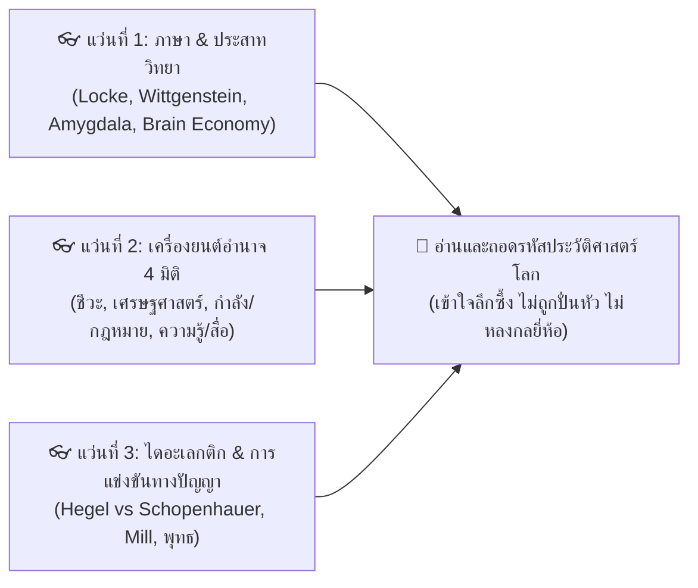
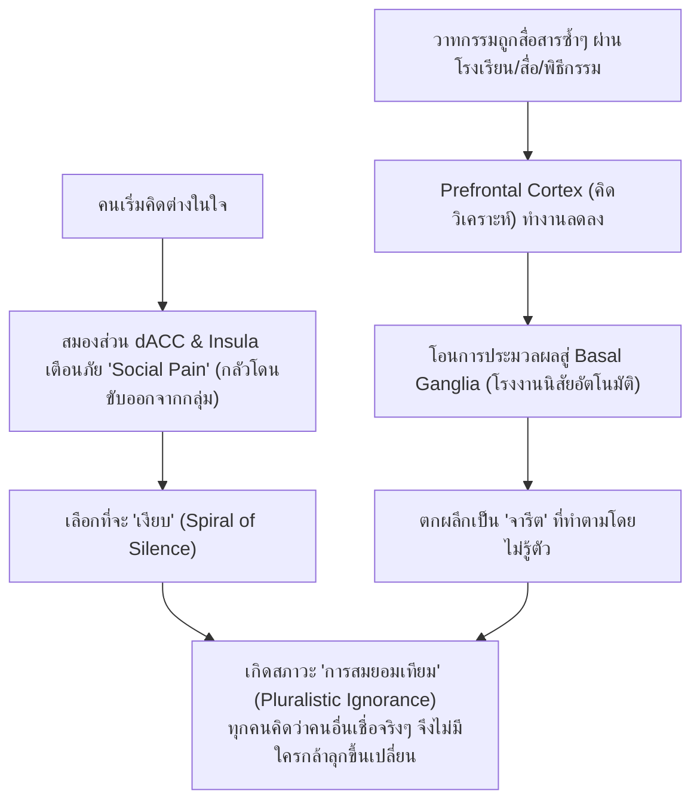

# 🧰 คู่มือเครื่องมือทางความคิดสำหรับผู้อ่าน (Reader's Conceptual Toolkit)
*(Section 3: Master Conceptual Toolkit — History, Media, Hegemony & Social Transformation)*

> **วัตถุประสงค์:** เอกสารชุดนี้คือ **"กล่องเครื่องมือทางความคิด (The 3-Lens Toolbox)"** ที่จัดเตรียมไว้ให้ผู้อ่านพกติดตัวก่อนเริ่มต้นเดินทางในประวัติศาสตร์โลกและไทย ช่วยให้ผู้อ่านสามารถถอดรหัสวาทกรรม การเมือง สื่อ และการครองความเป็นใหญ่ได้อย่างทะลุปรุโปร่ง

---

## 🧭 1. แว่นตา 3 อันสำหรับมองประวัติศาสตร์โลก (The 3 Analytical Lenses)

### 👓 แว่นที่ 1: ภาษาศาสตร์และประสาทวิทยา (Language & Neurobiology)
*   **สภาวะขาดคำอธิบาย (Blankness of Explanation):** สมองมนุษย์เกลียดความไม่รู้ เมื่อเจอความไม่รู้หรือความสับสน สมองส่วน *Amygdala* จะส่งสัญญาณเตือนภัยความกลัว มนุษย์จึงต้องรีบสร้างหรือรับเอา "คำอธิบาย/วาทกรรมสำเร็จรูป" เพื่อให้ร่างกายกลับสู่สภาวะสงบและปลอดภัย (*Parasympathetic*)
*   **เศรษฐศาสตร์พลังงานสมอง (Thermodynamic Brain Economy):** สมองใช้พลังงานสูงถึง 20% ของร่างกาย จึงมีแนวโน้มตามธรรมชาติที่จะเลือกเสพ "เรื่องเล่าสำเร็จรูปชุ่ยๆ" เพื่อประหยัดพลังงานแคลอรี นำไปสู่การยอมรับจารีตเดิมโดยไม่ออกแรงคิดวิเคราะห์
*   **พรมแดนความคิด (Epistemic Horizon):** มนุษย์คิดนอกเหนือจากข้อมูลที่ตนเองมีไม่ได้ สื่อที่ครอบงำสังคมจึงเป็นตัวกำหนด "ขอบเขตความจริง" ของคน เหมือนเงาบนผนังถ้ำของเพลโต (*Plato's Cave*)

---

### 👓 แว่นที่ 2: เครื่องยนต์อำนาจ 4 มิติ (The 4-Power Model)

ทุกปรากฏการณ์ในประวัติศาสตร์และวาทกรรม ขับเคลื่อนด้วยฐานอำนาจ 4 ด้านที่ทำงานร่วมกันเสมอ:

| มิติอำนาจ | แก่นแท้ของอำนาจ | นักคิดอ้างอิง | ตัวอย่างในประวัติศาสตร์จริง |
| :--- | :--- | :--- | :--- |
| **1. อำนาจทางชีวะ (Bio-Power)** | สัญชาตญาณเอาชีวิตรอด ความกลัวตาย สายเลือด อารมณ์ และความเจ็บปวดทางสังคม (Social Pain) | Michel Foucault, Evolutionary Biology | การปลุกความกลัวภัยความมั่นคง, การขู่ตัดขาดจากกลุ่มสังคม |
| **2. อำนาจทางเศรษฐศาสตร์ (Economic Power)** | ทุน ทรัพยากร ปัจจัยการผลิต ที่ดิน ภาษี เงินตรา ปากท้อง | Michael Mann, Karl Marx | สนธิสัญญาเบาว์ริง (1855), แผนมาร์แชลล์ (Marshall Plan $13.3B) |
| **3. อำนาจทางกำลังรวมกฎหมาย (Coercive Power & Law)** | กำลังกายภาพ กองทัพ อาวุธ ตำรวจ และกฎหมายในฐานะกลไกผูกขาดความรุนแรงของรัฐ | Max Weber, อ.ติน ปรัชญพฤทธิ์ | สนธิสัญญาแวร์ซาย (1919), รัฐประหาร, การใช้ ม.112 / กฎหมายความมั่นคง |
| **4. อำนาจทางความรู้รวมสื่อ (Knowledge Power & Media)** | วาทกรรม การศึกษา ศาสนา เรื่องเล่า โทรทัศน์ หนังสือพิมพ์ อัลกอริทึม | Antonio Gramsci, Walter Lippmann | ไตรภูมิพระร่วง, โฆษณาชวนเชื่อ Goebbels, VOA, Social Media |

---

### 👓 แว่นที่ 3: กระบวนการไดอะเลกติก (The Dialectical Evolution)
*   ความรู้และความชอบธรรมไม่ได้หยุดนิ่ง แต่พัฒนาผ่านการปะทะกันของความคิด:
    *   **Thesis (ข้อเสนอเดิม):** วาทกรรมหรือจารีตที่ผู้มีอำนาจสถาปนาไว้ (เช่น ระบบวรรณะพราหมณ์, ลัทธิบูชารัฐของ Hegel)
    *   **Antithesis (ข้อคัดค้าน):** คำอธิบายใหม่ที่ดีกว่าที่ลุกขึ้นมาท้าทาย (เช่น ไดอะเลกติกของพระพุทธเจ้า, ปรัชญา Schopenhauer & J.S. Mill)
    *   **Synthesis (ข้อสังเคราะห์ใหม่):** การตกผลึกเป็นจารีตใหม่ที่มีความสมบูรณ์และเป็นธรรมมากขึ้น (เช่น ปฏิญญาสากลว่าด้วยสิทธิมนุษยชน UDHR 1948)

---

## 🧠 2. กลไกสมองของการสยบยอม (The Neuro-Anatomy of Tradition)

---

## 🏷️ 3. เมทริกซ์การถอดรหัส: ยี่ห้อการเมือง vs ระบบสังคมจริง

| สังคม | ยี่ห้อหน้ากล่อง (Brand) | กลไกสื่อและวาทกรรม (Discourse) | ระบบความสัมพันธ์ทางสังคมจริง (Actual System) |
| :--- | :--- | :--- | :--- |
| **🇨🇳 จีน** | คอมมิวนิสต์ / สังคมนิยม | วาทกรรม "ความเจริญรุ่งเรืองร่วมกัน & กตัญญูต่อพรรค" | **จารีตฮ่องเต้รวมศูนย์อำนาจ 2,000 ปี** (พรรคคอมมิวนิสต์คือราชวงศ์ใหม่) |
| **🇺🇸 สหรัฐฯ** | เสรีนิยมประชาธิปไตย | วาทกรรม "อเมริกันดรีม & เสรีภาพปัจเจก" | **คณาธิปไตยกลุ่มทุนผูกขาด (Plutocracy)** (2 พรรคใหญ่คุมโดยกลุ่มทุน) |
| **🇹🇭 ไทย** | ประชาธิปไตยอันมีพระมหากษัตริย์ทรงเป็นประมุข | วาทกรรม "ความสงบเรียบร้อย & ชาติ ศาสน์ กษัตริย์" | **เครือข่ายอุปถัมภ์ศักดินาซ่อนรูป (Patron-Client Network)** |

---

## 🚀 4. สะพานเชื่อมสู่การปลดแอก (The Emancipatory Handoff to Book 3.3)

เมื่อผู้อ่านใช้เครื่องมือทั้ง 3 แว่นตาเดินทางผ่านประวัติศาสตร์จนถึงยุคปัจจุบันในเล่ม 3.1 และ 3.2 ผู้อ่านจะเข้าใจว่า:
1. **เราไม่ได้โง่:** แต่สมองและพฤติกรรมเราถูกออกแบบมาให้สยบยอมตามกลไกวิวัฒนาการ
2. **ศัตรูไม่ได้อยู่ตรงข้าม:** คนที่เราเกลียดในพื้นที่สื่อ แท้จริงคือเหยื่อของการถูกปั่นวาทกรรมเหมือนกับเรา
3. **ทางออกคือการสร้างจารีตใหม่:** เล่ม 3.3 จะมอบพิมพ์เขียวในการ **Unlearn อคติ**, นำ **การเลือกพูดเชิงจริยธรรม** มาใช้, และออกแบบ **การปกครองแบบไร้ตัวตน (Leaderless Governance)** เพื่อคืนอำนาจให้แก่ประชาชนอย่างแท้จริง
