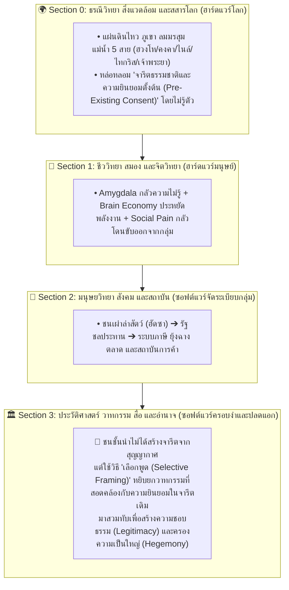
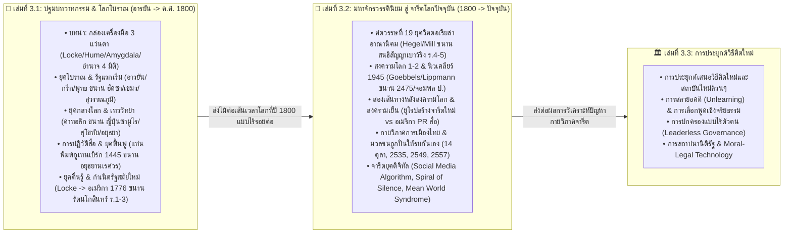

# 📖 พิมพ์เขียวภาพรวมเซกชัน 3: วาทกรรม จารีต และการสถาปนาสังคมใหม่
*(Section 3 Master Blueprint: History, Media, Hegemony & Social Transformation)*

> **ชื่อเซกชัน:** Section 3: History & Hegemony (ชุดไตรภาค 3 เล่ม)  
> **ขอบเขตการศึกษารวม:** ประวัติศาสตร์สื่อ วาทกรรม ญาณวิทยาภาษา ทฤษฎีอำนาจ 4 มิติ ประสาทวิทยา พฤติกรรมศาสตร์ กายวิภาคการเมือง และสถาปัตยกรรมจารีตใหม่  
> 
> **เส้นทางเดินเรื่องขนาน (Parallel Global-Thai Timeline):**
> - **เล่มที่ 1 และ เล่มที่ 2:** เล่าประวัติศาสตร์โลกและประวัติศาสตร์ไทยขนานกันเป็นเส้นตรงเส้นเดียว (ตั้งแต่ยุคโบราณ/อยุธยา $\rightarrow$ ยุคกลาง/ศักดินา $\rightarrow$ ยุคตื่นรู้/รัตนโกสินทร์ $\rightarrow$ สงครามโลก/2475 $\rightarrow$ สงครามเย็น $\rightarrow$ ยุคปัจจุบัน) แล้วจึงวิเคราะห์กลไกสมอง ปรากฏการณ์การสวมยี่ห้ออำนาจ และสภาวะมวลชนเห่า/รบกันเองในช่วงท้าย
> - **เล่มที่ 3:** รับผิดชอบ **"การประยุกต์เสนอวิธีคิดและสถาปัตยกรรมจารีตใหม่ล้วนๆ"** โดยปราศจากเนื้อหาเล่าประวัติศาสตร์ย้อนหลัง
>
> 📌 **ชุดเอกสารมาตรฐานและธรรมนูญวิจัยประจำเซกชัน (Section 3 Governance Suite):**
> - พิมพ์เขียวระเบียบวิธีวิจัย: [`SECTION_RESEARCH_DESIGN.md`](./SECTION_RESEARCH_DESIGN.md)
> - การสังเคราะห์วรรณกรรมวิชาการระดับโลก: [`SECTION_LITERATURE_REVIEW.md`](./SECTION_LITERATURE_REVIEW.md)
> - แผนที่ข้ออ้างและขอบเขตหลักฐาน: [`SECTION_CLAIM_MAP.md`](./SECTION_CLAIM_MAP.md)
> - กล่องเครื่องมือความคิด 3 แว่นตาสำหรับผู้อ่าน: [`READERS_CONCEPTUAL_TOOLKIT.md`](./READERS_CONCEPTUAL_TOOLKIT.md)
> - ทะเบียนข้อมูลวิทยาศาสตร์และหลักฐานเชิงประจักษ์: [`SCIENTIFIC_DATA_REGISTER.md`](./SCIENTIFIC_DATA_REGISTER.md)
> - ตารางเปรียบเทียบความต่างจากวรรณกรรมเดิม: [`LITERATURE_DIFFERENTIATION.md`](./LITERATURE_DIFFERENTIATION.md)
> - ทะเบียนทฤษฎีและการต่อจิ๊กซอว์ 40+ นักคิด: [`THEORY_AND_CITATION_REGISTER.md`](./THEORY_AND_CITATION_REGISTER.md)
> - ตารางเส้นเวลาประวัติศาสตร์ขนาน: [`PARALLEL_TIMELINE.md`](./PARALLEL_TIMELINE.md)
> - แผนผังการพึ่งพาข้ามเซกชัน: [`DEPENDENCY_MAP.md`](./DEPENDENCY_MAP.md)
> - เมทริกซ์การจัดสรรเล่มและบท: [`VOLUME_MATRIX.md`](./VOLUME_MATRIX.md)
> - พจนานุกรมศัพท์วิชาการควบคุม: [`SHARED_TERMS.md`](./SHARED_TERMS.md)

---

## 📐 1. ฐานรากกายภาพสู่ซอฟต์แวร์วาทกรรม (The Physical-to-Discursive Continuum)

### 🔑 แก่นทฤษฎีสำคัญของ Section 3:
1. **จารีตธรรมชาติและความยินยอมตั้งต้น (Pre-Existing Consent):** มนุษย์มีฉันทามติที่ถูกหล่อหลอมมาจากสภาพแวดล้อมทางภูมิศาสตร์ การเอาชีวิตรอด และชีววิทยาสมองอยู่ก่อนแล้ว (ต้องอ่าน Section 0 เล่ม 0.3 ถึงจะเข้าใจรากเหง้าอย่างสมบูรณ์)
2. **การหยิบยกวาทกรรมสวมทับ (Discursive Co-optation):** ชนชั้นนำและเครือข่ายอำนาจในแต่ละยุคไม่ได้เสกจารีตขึ้นมาใหม่จากความว่างเปล่า แต่ใช้วิธี **"เลือกหยิบยกวาทกรรม"** ที่เข้าล็อกกับความยินยอมในจารีตธรรมชาติเดิม เพื่อให้มวลชนยอมรับอำนาจโดยสมัครใจ (*Manufactured Consent*)
3. **การปลดแอก (Emancipation):** การจะทำลายวงจรอุบาทว์ จึงต้องเริ่มต้นจากการ **Unlearn ถอดรื้อวาทกรรมลวง** แล้วสถาปนา **การเลือกพูดเชิงจริยธรรม & สถาปัตยกรรมจารีตใหม่ที่ดี (เล่ม 3.3)**

---

## 🗺️ 2. สถาปัตยกรรมเชื่อมโยง 3 เล่ม (Inter-Book Architecture)

---

## 📚 3. สรุปขอบเขตหน้าที่ของแต่ละเล่มในไตรภาค

### 📌 เล่มที่ 3.1: ปฐมบทวาทกรรมและการจัดระเบียบโลกโบราณ (ราว 3,000 ปีก่อน ค.ศ. — ค.ศ. 1800)
*   **โฟลเดอร์:** `uet_history/3_publish/books/history_media_power/01_history_media`
*   **หน้าที่:** ปูบทนำแจกแว่นตาทฤษฎี 3 อัน แล้วเล่าประวัติศาสตร์ของ **ทั้งโลก (ยุโรป, จีน, ญี่ปุ่น, อินเดีย, ตะวันออกกลาง, สยาม/ไทย)** ขนานกันเป็นเส้นตรงเส้นเดียว: กำเนิดภาษา/อารยัน/ฮัดซา $\rightarrow$ ยุคกลางคาทอลิก/ซามูไร/สุโขทัย/อยุธยา $\rightarrow$ แท่นพิมพ์กูเทนเบิร์ก 1445 $\rightarrow$ ยุคตื่นรู้ Locke/Hume/Rousseau/Kant $\rightarrow$ กำเนิดรัฐอเมริกา 1776 ขนาน ก่อตั้งรัตนโกสินทร์ 2325 (ร.1-ร.3)

### 📌 เล่มที่ 3.2: มหาจักรวรรดินิยม สงครามโลก สู่ จารีตโลกปัจจุบัน (ค.ศ. 1800 — ปัจจุบัน)
*   **โฟลเดอร์:** `uet_history/3_publish/books/history_media_power/02_political_psychology`
*   **หน้าที่:** รับไม้ต่อจากปี 1800 เดินหน้าต่อเนื่องทั้งโลก: ศตวรรษที่ 19 ลัทธิล่าอาณานิคมวิคตอเรีย ขนาน ร.4 สนธิสัญญาเบาว์ริง (1855) และ ร.5 ปฏิรูป $\rightarrow$ สงครามโลก 1-2, Goebbels, Lippmann, นิวเคลียร์ 1945 ขนาน 2475 $\rightarrow$ สองเส้นทางหลังสงครามโลก (ยุโรปสร้างจารีตใหม่ vs อเมริกาส่งออกสื่อผูกขาด) ขนาน สงครามเย็นไทย $\rightarrow$ กายวิภาคการเมืองไทยและสภาวะมวลชนถูกปั่นให้รบกันเอง $\rightarrow$ จารีตยุคอัลกอริทึมดิจิทัล

### 📌 เล่มที่ 3.3: การสร้างวาทกรรมใหม่เพื่อสร้างจารีตใหม่ที่ดี (การประยุกต์เสนอวิธีคิดใหม่ล้วนๆ)
*   **โฟลเดอร์:** `uet_history/3_publish/books/history_media_power/03_philosophy_governance`
*   **หน้าที่:** **การประยุกต์เสนอวิธีคิดและสถาปัตยกรรมจารีตใหม่ล้วนๆ (Pure Forward-Looking Application)** โดยปราศจากการเล่าประวัติศาสตร์ย้อนหลัง (รอรับข้อเสนอและรายละเอียดบทจากผู้ใช้ในขั้นตอนต่อไป)
