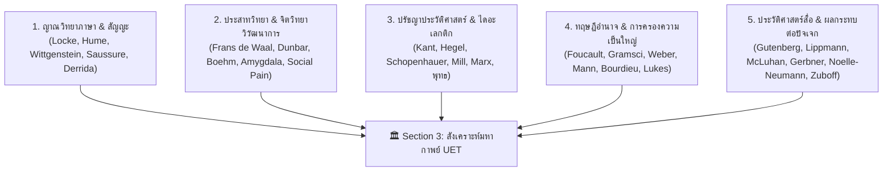

# Section 3: Comprehensive Literature Review
*(Section 3: Literature Review — Epistemology, Power, Media History, Neuroscience & Hegemony)*

- **Section ID**: `section_03_history_hegemony`
- **Document**: Parent Literature Review
- **Status**: Comprehensive Boundary Lock (v1 - Multi-Disciplinary SOTA Review)
- **Section Blueprint Reference**: `section-03-v1`

---

## 1. Executive Summary & Epistemic Landscape

การศึกษาประวัติศาสตร์ วาทกรรม สื่อ และอำนาจในแวดวงวิชาการกระแสหลักที่ผ่านมา มักประสบปัญหา **"การแยกส่วนศึกษา (Disciplinary Silos)"**:
*   *นักปรัชญาญาณวิทยา* วิเคราะห์ภาษาและตรรกะในเชิงนามธรรมโดยไม่เชื่อมโยงกับประสาทวิทยาและแรงขับทางชีววิทยา
*   *นักประวัติศาสตร์* บันทึกเหตุการณ์ตามลำดับเวลาโดยขาดการวิเคราะห์กลไกสมองของการสยบยอม
*   *นักรัฐศาสตร์* วิเคราะห์ระบอบการปกครองบนหน้ากระดาษ (ประชาธิปไตย vs เผด็จการ) โดยละเลยว่าระบบความสัมพันธ์ทางสังคมจริงขับเคลื่อนด้วยจารีตโบราณที่สวมยี่ห้อใหม่
*   *นักนิเทศศาสตร์* ศึกษาอิทธิพลของสื่อมวลชนและอัลกอริทึมโดยไม่มองย้อนกลับไปถึงรากฐานทางธรณีวิทยา สิ่งแวดล้อม และวิวัฒนาการทางภาษา

**Section 3 (History & Hegemony)** ก้าวข้ามข้อจำกัดเหล่านี้ด้วยการสังเคราะห์วรรณกรรมวิชาการระดับโลก 5 สายธารหลักเข้าด้วยกันอย่างเป็นระบบ:

---

## 2. Detailed Review by Theoretical Domain

### 🅰️ สายธารที่ 1: ญาณวิทยา ภาษาศาสตร์ และพรมแดนแห่งความคิด (Epistemology & Language)

*   **John Locke (1689, *An Essay Concerning Human Understanding* Book III):**
    *   *วรรณกรรมดั้งเดิม:* ล็อคชี้ว่าภาษาเป็น "สัญญะสมมติ (Arbitrary Signs)" และจิตมนุษย์เริ่มต้นเป็นแผ่นกระดาษเปล่า (*Tabula Rasa*)
    *   *การต่อยอดของ UET:* UET เชื่อมโยง *Tabula Rasa* เข้ากับ **"สภาวะขาดคำอธิบาย (Blankness of Explanation)"** ซึ่งกระตุ้นความกลัวในสมองส่วน *Amygdala* ทำให้มนุษย์จำต้องยอมรับวาทกรรมสำเร็จรูปเพื่อความรู้สึกปลอดภัย
*   **Ludwig Wittgenstein (1921, *Tractatus Logico-Philosophicus*):**
    *   *วรรณกรรมดั้งเดิม:* *"The limits of my language mean the limits of my world"* (พรมแดนของภาษาคือพรมแดนของโลกเรา)
    *   *การต่อยอดของ UET:* สถาปนากรอม **"พรมแดนความคิด (Epistemic Horizon)"** ชี้ว่าสื่อและวาทกรรมทำหน้าที่เป็นกรงขังขอบเขตข้อมูล ทำให้มนุษย์ไม่สามารถจินตนาการถึงทางเลือกนอกกรอบได้เมื่อสื่อถูกผูกขาด
*   **Ferdinand de Saussure (1916) & Jacques Derrida (1967):**
    *   *วรรณกรรมดั้งเดิม:* โครงสร้างสัญญะ (Signifier/Signified) และการรื้อถอนคู่อุปสรรคทวิลักษณ์ (Deconstruction of Binary Oppositions)
    *   *การต่อยอดของ UET:* ชี้ให้เห็นว่าผู้มีอำนาจสร้างวาทกรรมผ่านคู่ตรงข้าม (เช่น สงบ vs วุ่นวาย, ชาติ vs กบฏ) เพื่อผูกขาดความชอบธรรมในการใช้กำลัง

---

### 🅱️ สายธารที่ 2: ประสาทวิทยา จิตวิทยาวิวัฒนาการ และมานุษยวิทยา (Neuroscience & Anthropology)

*   **Frans de Waal (1982, *Chimpanzee Politics*) & Robin Dunbar (1992, *The Social Brain Hypothesis*):**
    *   *วรรณกรรมดั้งเดิม:* มนุษย์วิวัฒนาการสมองส่วนหน้า (*Neocortex*) มาเพื่อการเล่นเกมการเมืองในกลุ่มและการสร้างพันธมิตรเอาชีวิตรอด โดยมีขีดจำกัดความสัมพันธ์ที่ 150 คน (*Dunbar's Number*)
    *   *การต่อยอดของ UET:* อธิบายว่าทำไมเมื่อสังคมขยายสเกลเกิน 150 คน มนุษย์จึงต้องสร้าง "ศาสนาและวาทกรรม" มาทำหน้าที่เป็นซอฟต์แวร์ควบคุมฝูงชน
*   **Christopher Boehm (1999, *Hierarchy in the Forest*):**
    *   *วรรณกรรมดั้งเดิม:* ชนเผ่าล่าสัตว์หาของป่า (เช่น ชาวฮัดซา) ใช้กลไก **Reverse Dominance Hierarchy** ล้อเลียนและคว่ำบาตรคนขี้อวด เพื่อป้องกันการสะสมอำนาจเดี่ยว
    *   *การต่อยอดของ UET:* เปรียบเทียบฮัดซากับ **สังคมญี่ปุ่น (*Sekentei & Mura Hachibu*)** เพื่อพิสูจน์ว่า จารีตสามารถถูกออกแบบให้เป็นเครื่องมือสร้างความเท่าเทียม หรือเครื่องมือกดทับสยบยอมก็ได้
*   **Naomi Eisenberger & Matthew Lieberman (2003, 2004, *Science*):**
    *   *วรรณกรรมดั้งเดิม:* การถูกกีดกันทางสังคม (Social Exclusion) กระตุ้นสมองส่วน *Dorsal Anterior Cingulate Cortex (dACC)* และ *Anterior Insula* ซึ่งเป็นวงจรเดียวกับความเจ็บปวดทางกายภาพ (*Social Pain*)
    *   *การต่อยอดของ UET:* อธิบายกลไกทางสรีรวิทยาว่าทำไมคนถึงยอมปฏิบัติตามจารีตที่ตนเองไม่เห็นด้วย เพราะสมองกลัวความเจ็บปวดจากการถูกสังคมขับไล่

---

### 🅲️ สายธารที่ 3: ปรัชญาประวัติศาสตร์ ไดอะเลกติก และสิทธิมนุษยชน (Historical Dialectics)

*   **G.W.F. Hegel (1807, 1821) vs Arthur Schopenhauer (1818):**
    *   *Hegel:* ไดอะเลกติกเชิดชูรัฐ (*Geist*) ในฐานะจุดสูงสุดของเหตุผล ถูกนำไปบิดเบือนเป็นลัทธิชาตินิยมและฟาสซิสต์
    *   *Schopenhauer:* คัดค้านการบูชารัฐ หันมารับอิทธิพลพุทธ/อุปนิษัทเรื่องความทุกข์ (*Will to Live*) และความเห็นอกเห็นใจ (*Compassion*) วางรากฐาน Existentialism
*   **Jeremy Bentham (1789) ➔ John Stuart Mill (1859, *On Liberty*):**
    *   *วรรณกรรมดั้งเดิม:* วิวัฒนาการจากอรรถประโยชน์นิยมเชิงปริมาณแบบไร้หัวใจ สู่การสังเคราะห์คุณค่าและศักดิ์ศรีความเป็นมนุษย์
    *   *การต่อยอดของ UET:* แสดงให้เห็นสายธารไดอะเลกติกจาก Schopenhauer สู่ J.S. Mill ซึ่งกลายเป็นรากฐานของปฏิญญาสากลว่าด้วยสิทธิมนุษยชน (UDHR 1948) หลังสงครามโลกครั้งที่ 2

---

### 🅳️ สายธารที่ 4: ทฤษฎีอำนาจ การครองความเป็นใหญ่ และการเมืองไทย (Power & Hegemony)

*   **Michel Foucault (1975, 1976):** *Discipline and Punish*, *Power/Knowledge*, และ *Biopolitics* — อำนาจไม่ใช่สิ่งของที่ใครถือไว้คนเดียว แต่อยู่ในทุกสายสัมพันธ์และวาทกรรม
*   **Antonio Gramsci (1971, *Prison Notebooks*):** *Cultural Hegemony* (การครองความเป็นใหญ่ทางวัฒนธรรม) และ *Manufacture of Consent* — ชนชั้นนำสร้าง "สามัญสำนึก (Common Sense)" ผ่านโรงเรียน ศาสนา และสื่อ เพื่อให้มวลชนยินยอมต่อจารีตโดยสมัครใจ
*   **Michael Mann (1986, *The Sources of Social Power*):** โมเดล IEMP (Ideological, Economic, Military, Political) ซึ่ง UET นำมาสังเคราะห์เป็น **"ทฤษฎีอำนาจ 4 มิติ"** (ชีวะ, เศรษฐศาสตร์, กำลังรวมกฎหมาย, ความรู้รวมสื่อ)
*   **Noam Chomsky & Edward S. Herman (1988, *Manufacturing Consent*):** แบบจำลองโฆษณาชวนเชื่อ (The Propaganda Model) ที่อธิบายการคัดกรองข่าวสารของสื่อมวลชนในโลกทุนนิยม
*   **งานวิจัยอำนาจและกระบวนการยุติธรรมไทย (อ.ติน ปรัชญพฤทธิ์ และคณะ):** การผ่าโครงสร้างเครือข่ายอุปถัมภ์ศักดินาซ่อนรูปและการใช้กฎหมายเป็นเครื่องมือทางการเมือง

---

### 🅴️ สายธารที่ 5: ประวัติศาสตร์สื่อ ผลกระทบต่อปัจเจก และยุคดิจิทัล (Media History & Cognition)

*   **Walter Lippmann (1922, *Public Opinion*):** *"The World Outside and the Pictures in Our Heads"* — ปัจเจกตอบสนองต่อภาพจำลองที่สื่อสร้างขึ้นในหัว ไม่ใช่ความจริงของโลก
*   **Marshall McLuhan (1964, *Understanding Media*):** *"The Medium is the Message"* — รูปแบบของเทคโนโลยีสื่อเปลี่ยนโครงสร้างประสาทสัมผัสของมนุษย์ (แท่นพิมพ์กูเทนเบิร์ก ➔ วิทยุ ➔ โทรทัศน์ ➔ สมาร์ตโฟน)
*   **George Gerbner (1976, *Cultivation Theory*):** *Mean World Syndrome* (กลุ่มอาการโลกโหดร้าย) — การเสพสื่อข่าวสาร/อาชญากรรมมากๆ ปลูกฝังให้ปัจเจกกลัวโลกเกินจริง กระตุ้น Amygdala ให้เรียกร้องผู้นำอำนาจนิยม
*   **Elisabeth Noelle-Neumann (1974, *Spiral of Silence*):** เกลียวแห่งความเงียบ — ปัจเจกกลัวการแปลกแยกทางสังคม จึงเลือกที่จะเงียบเมื่อเห็นว่าตนเองเป็นชนกลุ่มน้อยในสื่อ
*   **Shoshana Zuboff (2019, *The Age of Surveillance Capitalism*):** อัลกอริทึม Social Media ในปัจจุบันแฮกระบบโดปามีนและพฤติกรรมมนุษย์เพื่อผลประโยชน์เชิงพาณิชย์และการแบ่งขั้วทางการเมือง

---

## 3. The Core Literature Gap Addressed by Section 3

วรรณกรรมที่มีอยู่ทั้งหมดขาด **"การเชื่อมโยงสายธารเดียว (The Unified Continuum)"**:
1. ยังไม่มีงานใดเชื่อมโยงตั้งแต่ **ข้อจำกัดทางกายภาพ/สิ่งแวดล้อม (Section 0)** ➔ **สมองและชีววิทยา (Section 1)** ➔ **สถาบันสังคม (Section 2)** ➔ **สู่วาทกรรมและสื่อ (Section 3)**
2. ยังไม่มีงานใดที่ผ่าให้เห็นชัดเจนว่า **"ระบบการปกครองบนหน้ากระดาษ (ยี่ห้อ) $\neq$ ระบบความสัมพันธ์ทางสังคมจริง (จารีต)"** ได้อย่างเป็นระบบทั้งในบริบทสากล (จีน, อเมริกา, ยุโรป) และบริบทไทย
3. Section 3 จึงทำหน้าที่เป็น **"บทสังเคราะห์ขั้นสุดยอด (Grand Synthesis)"** ที่เชื่อมโยงศาสตร์ทั้งหมดเพื่อนำไปสู่ **"การปลดแอกและการสร้างจารีตใหม่ที่ดี (Emancipatory Architecture)"** ในเล่ม 3.3
