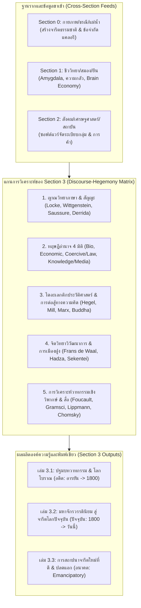

# Section 3: Research Design & Methodology
*(Section 3: Master Research Design — History, Media, Hegemony & Social Transformation)*

- **Section ID**: `section_03_history_hegemony`
- **Document**: Parent Research Design & Epistemological Framework
- **Status**: Comprehensive Boundary Lock (v1 - Global Synchronous Hegemonic Architecture)
- **Section Blueprint Reference**: `section-03-v1`

---

## 1. Guiding Research Questions

1. **The Physical & Biological Genesis of Pre-Existing Consent (รากฐานทางกายภาพและความยินยอมตั้งต้น):**
   - จารีต (Tradition) ไม่ได้เกิดขึ้นจากวาทกรรมลอยๆ ในสุญญากาศ แต่สืบทอดมาจากแรงบีบทางกายภาพ/สิ่งแวดล้อม (Section 0) และชีววิทยาความกลัว/การประหยัดพลังงานสมอง (Section 1) อย่างไร?
   - ฉันทามติ/ความยินยอมตั้งต้นโดยไม่รู้ตัว (Tacit Pre-Existing Consent) ก่อรูปขึ้นจากสภาพแวดล้อมทางภูมิศาสตร์และแม่น้ำหลักของโลก (ฮวงโห, คงคา, ไนล์, ไทกริส, เจ้าพระยา) ก่อนที่รัฐโบราณจะถือกำเนิดขึ้นได้อย่างไร?

2. **The Discursive Co-optation by Ruling Elites (การหยิบยกและสวมทับวาทกรรมของชนชั้นนำ):**
   - ชนชั้นนำในแต่ละยุคสมัยใช้กลไก "การเลือกพูด (Selective Framing)" หยิบยกวาทกรรมที่สอดคล้องกับความยินยอมในจารีตที่มีอยู่แล้ว มาสวมทับเพื่อสร้างความชอบธรรม (Legitimacy) และปกป้องผลประโยชน์ของตนอย่างไร?
   - ทำไมวาทกรรมที่ประสบความสำเร็จในการครองความเป็นใหญ่ (Hegemony) จึงต้องมีรากฐานเชื่อมโยงกับจารีตเดิมเสมอ?

3. **The Common Linguistic & Cognitive Root (สายธารภาษาอารยันและความเป็นพี่น้องกันของมนุษยชาติ):**
   - รากภาษาอินโด-ยูโรเปียน (Proto-Indo-European / Aryan) จากคอเคซัส/จอร์เจีย แตกกิ่งก้านสู่ตะวันออก (สันสกฤต/พระเวท ➔ พุทธ) และตะวันตก (กรีก/ละติน ➔ คริสต์/ยุคตื่นรู้) อย่างไร?
   - โศกนาฏกรรมแห่งความเกลียดชัง (สงครามครูเสด, สงคราม 30 ปี, สงครามโลก) แท้จริงแล้วคือการที่ชนชั้นนำปั้นวาทกรรมหลอกล่อให้มนุษย์ซึ่งเป็น "ญาติร่วมสายธารภาษาและความคิด" ไปรบกันเองเพื่อผลประโยชน์ของผู้นำใช่หรือไม่?

4. **The Industrialization of Propaganda & Post-WWII Bifurcation (การอุตสาหกรรมสื่อและ 2 เส้นทางหลังสงครามโลก):**
   - แท่นพิมพ์กูเทนเบิร์ก (1445) ➔ สื่อสิ่งพิมพ์ ➔ วิทยุ/ภาพยนตร์ผูกขาดของ Goebbels & Lippmann พัฒนาสู่การสร้าง "ภาพในหัว" (Pictures in our heads) ให้มวลชนได้อย่างไร?
   - ทำไมหลังสงครามโลกครั้งที่ 2 (1945) ยุโรปที่พังพินาศจึงถูกบีบให้สร้าง "จารีตใหม่ที่ดีจริง" (UN, UDHR, EU, ชำระประวัติศาสตร์) ในขณะที่อเมริกาและประเทศรับอิทธิพลกลับนำเทคนิคสื่อผูกขาดมาพัฒนาเป็น PR, บริโภคนิยม, และ Social Media Algorithms ที่สร้างจารีตปัญหาจนถึงปัจจุบัน?

5. **The Disconnect between Political Brand vs. Deep Social Hierarchy (ภาพลวงตายี่ห้อการเมือง vs ระบบสังคมจริง):**
   - ทำไมระบบการปกครองบนหน้ากระดาษ (Brand: ประชาธิปไตย, คอมมิวนิสต์, สังคมนิยม) จึงไม่สัมพันธ์กับระบบความสัมพันธ์ทางสังคมจริง (Actual System: ฮ่องเต้รวมศูนย์ในจีน, ทุนผูกขาดในอเมริกา, อุปถัมภ์ศักดินาซ่อนรูปในไทย)?
   - สภาวะมวลชนถูกปั่นให้รบกันเอง (Controlled Mass Agitation / Barking Mechanism) ทำงานอย่างไรในการเบนเข็มจากการตรวจสอบโครงสร้างอำนาจ?

6. **The Emancipatory Architecture & Sustainable New Tradition (สถาปัตยกรรมจารีตใหม่และการปลดแอก):**
   - กระบวนการสลายอคติ (Unlearning) และการสลายการสมยอมเทียม (Pluralistic Ignorance) ทำงานอย่างไร?
   - การเลือกพูดเชิงจริยธรรม (Ethical Selective Framing), การปกครองแบบไร้ตัวตน (Leaderless Governance), และเทคโนโลยีทางศีลธรรม-กฎหมาย (Moral-Legal Technology) สามารถสถาปนาจารีตใหม่ที่ดีและยั่งยืนได้อย่างไรโดยไม่หวนกลับสู่วงจรอุบาทว์?

---

## 2. Epistemological & Methodological Framework

---

## 3. Evidence Hierarchy & Source Classification

Section 3 กำหนดลำดับชั้นของหลักฐานอย่างเข้มงวดตามมาตรฐาน UET Research Constitution:

- **Tier 1 (Primary / Hard Evidence - หลักฐานปฐมภูมิ):**
  - ตัวบทกฎหมาย สนธิสัญญาจริง และคำประกาศประวัติศาสตร์ (Act of Supremacy 1534, Bowring Treaty 1855, Treaty of Versailles 1919, US Declaration 1776, ประกาศ 2475, UDHR 1948)
  - คัมภีร์และจารึกโบราณต้นฉบับ (ปุรุษสุกตะ/ฤคเวท, ศิลาจารึกสุโขทัยหลักที่ 1, ไตรภูมิพระร่วง, พระธรรมศาสตร์)
  - งานเขียนปรัชญาต้นฉบับ (John Locke, David Hume, Rousseau, Kant, Hegel, Schopenhauer, J.S. Mill, Plato)
  - ข้อมูลสถิติประชากร ผู้เสียชีวิตในสงคราม งบประมาณ Marshall Plan สถิติการค้าข้าว/ภาษี และสถิติ fMRI สมอง
- **Tier 2 (Authoritative Secondary Syntheses - งานสังเคราะห์วิชาการชั้นนำ):**
  - งานประวัติศาสตร์เปรียบเทียบ ภาษาศาสตร์ และจิตวิทยาวิวัฒนาการ (Frans de Waal, Robin Dunbar, Christopher Boehm, Benedict Anderson, Walter Lippmann, Marshall McLuhan, George Gerbner, Elisabeth Noelle-Neumann, Shoshana Zuboff)
  - งานทฤษฎีอำนาจ สังคมวิทยา และอาชญาวิทยา (Michel Foucault, Antonio Gramsci, Max Weber, Michael Mann, Pierre Bourdieu, Steven Lukes, Noam Chomsky, อ.ติน ปรัชญพฤทธิ์)
- **Tier 3 (UET Grand Emancipatory Synthesis - กรอบสังเคราะห์ไตรภาค UET):**
  - การต่อจิ๊กซอว์ข้ามศาสตร์: จากเปลือกโลกและสิ่งแวดล้อม (Sec 0) ➔ สมองและชีววิทยา (Sec 1) ➔ สถาบันสังคม (Sec 2) ➔ สู่วาทกรรม อำนาจ และการสร้างจารีตใหม่ที่ดี (Sec 3)
