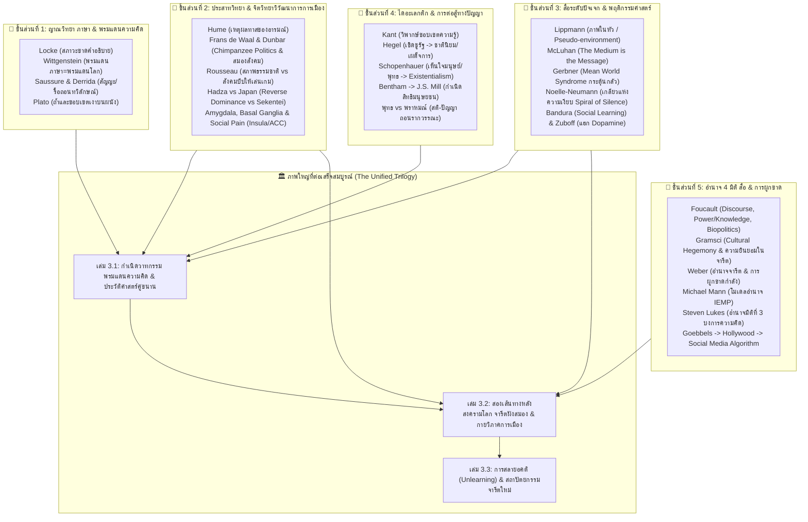

# 📚 ทะเบียนทฤษฎีและแผนผังการต่อจิ๊กซอว์ทางวิชาการ (Academic Theory & Citation Register)
*(Section 3: Master Theoretical Foundations & Citation Mapping)*

> **ปรัชญาการทำงานของโครงการ:** *"ยืนบนบ่าของยักษ์ (Standing on the Shoulders of Giants)"* — งานวิชาการในอดีตได้อธิบายชิ้นส่วนความจริงไว้มากมายในแต่ละศาสตร์ ภารกิจของไตรภาคชุดนี้คือการ **"นำชิ้นส่วนจิ๊กซอว์เหล่านั้นมาต่อร้อยเรียงเข้าด้วยกัน"** เพื่อเผยให้เห็นภาพรวมของความสัมพันธ์ตั้งแต่ **วาทกรรม $\rightarrow$ การตกผลึกเป็นจารีต $\rightarrow$ การสถาปนาจารีตใหม่ที่ดี**

---

## 🧩 1. แผนผังการต่อจิ๊กซอว์ข้ามศาสตร์ (The Master Jigsaw Puzzle)

---

## 📖 2. ทะเบียนรายนามนักคิด ทฤษฎี และตำแหน่งการอ้างอิงในหนังสือ

### 🅰️ กลุ่มที่ 1: ญาณวิทยา ภาษาศาสตร์ และพรมแดนแห่งการรับรู้ (Epistemology & Language)

| นักคิด / ทฤษฎี | ผลงานสำคัญ / แนวคิดหลัก | บทบาทในการต่อจิ๊กซอว์ | เล่ม / บทที่อ้างอิง |
|:---|:---|:---|:---:|
| **John Locke** | *An Essay Concerning Human Understanding* (Book III: Of Words, *Tabula Rasa*) & *Second Treatise of Government* | อธิบายสภาวะขาดคำอธิบาย (Blankness of Explanation) สัญญะสมมติ และขยายสู่ "ความยินยอมตั้งแต่ระดับจารีต" (Pre-political Consent) | เล่ม 3.1 (บทนำ, บท 2, บท 3) |
| **David Hume** | *A Treatise of Human Nature* ("Reason is the slave of the passions") | มนุษย์ขับเคลื่อนด้วยอารมณ์และสัญชาตญาณความกลัว แต่มนุษย์สร้างเหตุผลและวาทกรรมมาบังหน้าการกระทำ | เล่ม 3.1 (บทนำ, บท 2) |
| **Ludwig Wittgenstein** | *Tractatus Logico-Philosophicus* ("The limits of my language mean the limits of my world") | ข้อมูลและภาษาที่ได้รับคือตัวกำหนด "พรมแดนความคิด" (Epistemic Horizon) มนุษย์คิดนอกขอบเขตข้อมูลที่มีไม่ได้ | เล่ม 3.1 (บทนำ, บท 1) |
| **Plato** | *The Republic* (Allegory of the Cave) | การผูกขาดสื่อเปรียบเหมือนการขังคนไว้ในถ้ำ ขอบเขตเงาบนผนังกลายเป็นโลกทั้งใบของคนในถ้ำ | เล่ม 3.1 (บทนำ, บท 1) |
| **Ferdinand de Saussure** | *Course in General Linguistics* (Signifier / Signified) | ภาษาเป็นระบบสัญญะเชิงโครงสร้างที่กำหนดความหมายผ่านความแตกต่าง | เล่ม 3.1 (บท 3) |
| **Jacques Derrida** | *Of Grammatology* (Deconstruction) | การรื้อถอนคู่อุปสรรคทวิลักษณ์ (Binary Oppositions) เช่น ศูนย์กลาง-ชายขอบ, ความสงบ-ความวุ่นวาย ที่ผู้มีอำนาจใช้ครอบงำ | เล่ม 3.1 (บท 3) |
| **Proto-Indo-European / Aryan** | เทววิทยาอารยันโบราณ (จอร์เจีย/คอเคซัส) | รากภาษาประธาน-กริยา-กรรม และเรื่องเล่าแยกชิ้นส่วนสร้างจักรวาล วางรากคิดเรื่องศูนย์กลางอำนาจเด็ดขาด | เล่ม 3.1 (บท 1) |

---

### 🅱️ กลุ่มที่ 2: ประสาทวิทยา จิตวิทยาวิวัฒนาการ และมานุษยวิทยาการเมือง (Neuroscience, Evolutionary Psychology & Anthropology)

| นักคิด / สาขาวิชา | แนวคิดหลัก / กลไกวิวัฒนาการ | บทบาทในการต่อจิ๊กซอว์ | เล่ม / บทที่อ้างอิง |
|:---|:---|:---|:---:|
| **Evolutionary Neuroscience** | Amygdala, Sympathetic & Parasympathetic Systems | ความไม่รู้กระตุ้น Amygdala ให้ตื่นกลัวภัยคุกคาม การได้วาทกรรม/คำอธิบายช่วยดึงเข้าสู่ Parasympathetic ทำให้รู้สึกปลอดภัย | เล่ม 3.1 (บทนำ, บท 1) |
| **Thermodynamic Brain Economy** | Brain Energy Minimization / Heuristics (สอดคล้อง Daniel Kahneman) | สมองใช้พลังงานสูง จึงเลือกเสพวาทกรรมสำเร็จรูปชุ่ยๆ เพื่อประหยัดพลังงานแคลอรี นำไปสู่การสยบยอมตามเรื่องเล่าเดิม | เล่ม 3.1 (บทนำ, บท 1) |
| **Frans de Waal & Robin Dunbar** | *Chimpanzee Politics* & The Social Brain Hypothesis | มนุษย์วิวัฒนาการสมองส่วนหน้ามาเพื่อ "เล่นเกมการเมืองในกลุ่ม" และสร้างพันธมิตรเอาชีวิตรอด การเกาะกลุ่มจึงเป็นยีนพื้นฐาน | เล่ม 3.2 (บท 2) |
| **Jean-Jacques Rousseau** | *Discourse on Inequality* & *The Social Contract* | สภาพธรรมชาติมนุษย์ไม่ได้เลวร้าย แต่เมื่อมารวมเป็นสังคม การแข่งขันและสถานะบีบให้มนุษย์ทุกคนต้องเล่นเกมการเมืองและสวมหน้ากาก | เล่ม 3.2 (บท 2) |
| **Christopher Boehm (Hadza Case)** | *Hierarchy in the Forest* (Reverse Dominance Hierarchy) | กรณีศึกษาชนเผ่าฮัดซา (แทนซาเนีย): กลไกการคานอำนาจแบบกลับด้าน คนในเผ่าร่วมกันล้อเลียน/คว่ำบาตรคนขี้อวด เพื่อป้องกันการเกิดจารีตชนชั้นนำผูกขาด | เล่ม 3.2 (บท 2, บท 4) |
| **Japanese Cultural Norms (Japan Case)** | *Sekentei* (世間体 - สายตาสังคม) & *Mura Hachibu* (村八分 - คว่ำบาตร 80%) | กรณีศึกษาญี่ปุ่น: จารีตที่เข้มงวดสุดขีด ความกลัวการถูกขับออกจากกลุ่ม (Social Pain) บีบให้ปัจเจกสยบยอมตามบรรทัดฐานอย่างเคร่งครัด | เล่ม 3.2 (บท 2) |
| **Basal Ganglia Habituation** | Procedural Memory & Habit Loops | เมื่อวาทกรรมถูกทำซ้ำนานพอ สมองจะโอนการคิดจาก Prefrontal Cortex สู่ Basal Ganglia กลายเป็น "จารีตอัตโนมัติ" | เล่ม 3.2 (บท 2) |
| **Naomi Eisenberger & Matthew Lieberman** | Social Pain Theory (Insula & Anterior Cingulate Cortex) | สมองประมวลผลการถูกขับออกจากกลุ่มเป็นความเจ็บปวดจริงทางกายภาพ ทำให้คนยอมปฏิบัติตามจารีตแม้ในใจจะไม่เห็นด้วย | เล่ม 3.2 (บท 2) |
| **Floyd Allport & Dale Miller** | Pluralistic Ignorance (สภาวะการสมยอมเทียม) | คนส่วนใหญ่ต่างไม่เห็นด้วยกับจารีตในใจ แต่แสร้งทำเป็นปฏิบัติตามเพราะคิดว่าคนอื่นเชื่อจริงๆ | เล่ม 3.2 (บท 2) |
| **Henri Tajfel & Jonathan Haidt** | Social Identity Theory & Moral Matrices | มนุษย์แบ่งขั้ว "พวกเรา vs พวกเขา" และติดอยู่ในเขาวงกตศีลธรรมของกลุ่มตนเอง | เล่ม 3.2 (บท 4) |

---

### 🅲️ กลุ่มที่ 3: อิทธิพลของสื่อที่มีต่อระดับปัจเจก (Individual Media Effects & Behavioral Conditioning)

| นักคิด / ทฤษฎี | ผลงานสำคัญ / แนวคิดหลัก | บทบาทในการต่อจิ๊กซอว์ | เล่ม / บทที่อ้างอิง |
|:---|:---|:---|:---:|
| **Walter Lippmann** | *Public Opinion (1922)* ("The Pictures in Our Heads") | ปัจเจกไม่ได้ตอบสนองต่อความจริงแท้ แต่ตอบสนองต่อ "ภาพจำลองที่สื่อสร้างขึ้นในหัว" (Pseudo-environment) | เล่ม 3.1 (บทนำ, บท 1), เล่ม 3.2 |
| **Marshall McLuhan** | *Understanding Media* ("The Medium is the Message") | รูปแบบของสื่อเปลี่ยนโครงสร้างประสาทสัมผัสและการรับรู้ของปัจเจกโดยตรง (จากสมาธิอ่านหนังสือกว้างลึกสู่ภาพและเสียงจอ) | เล่ม 3.1 (บท 2, บท 5) |
| **George Gerbner** | Cultivation Theory & "Mean World Syndrome" | ปัจเจกที่เสพสื่อข่าวสาร/อาชญากรรมมากๆ จะถูกปลูกฝังความกลัว มองว่าโลกอันตรายเกินจริง กระตุ้น Amygdala ให้เรียกร้องอำนาจนิยม | เล่ม 3.1 (บทนำ), เล่ม 3.2 (บท 1) |
| **Elisabeth Noelle-Neumann** | Spiral of Silence (เกลียวแห่งความเงียบ) | ปัจเจกกลัวการแปลกแยกทางสังคม (Social Isolation) หากเห็นว่าตนเป็นชนกลุ่มน้อยในสื่อ จะเลือกที่จะ "เงียบ" ทำให้กระแสหลักครอบงำ | เล่ม 3.2 (บท 2, บท 5) |
| **Albert Bandura** | Social Cognitive Theory (Bobo Doll Experiment) | ปัจเจกซึมซับและลอกเลียนแบบพฤติกรรม ค่านิยม และความก้าวร้าวจากตัวแบบในสื่อมวลชน | เล่ม 3.1 (บท 4), เล่ม 3.2 |
| **Neil Postman** | *Amusing Ourselves to Death* | สื่อเปลี่ยนข้อมูลเป็นการบันเทิง (Infotainment) ทำให้ปัจเจกสูญเสียความสามารถในการคิดวิเคราะห์เชิงลึก เสพติดความบันเทิงจนเฉื่อยชา | เล่ม 3.1 (บท 5), เล่ม 3.2 |
| **Shoshana Zuboff & B.J. Fogg** | *The Age of Surveillance Capitalism* & Behavioral Design | อัลกอริทึม Social Media ยุคปัจจุบันแฮกระบบโดปามีนของปัจเจก ปรับเปลี่ยนพฤติกรรมและป้อนวาทกรรมเร้าอารมณ์เพื่อผลประโยชน์เชิงพาณิชย์ | เล่ม 3.2 (บท 5) |

---

### 🅳️ กลุ่มที่ 4: ปรัชญาประวัติศาสตร์และกระบวนการไดอะเลกติก (Dialectics & Political Philosophy)

| นักคิด / ทฤษฎี | ผลงานสำคัญ / แนวคิดหลัก | บทบาทในการต่อจิ๊กซอว์ | เล่ม / บทที่อ้างอิง |
|:---|:---|:---|:---:|
| **St. Augustine & Thomas Aquinas** | Christian Scholasticism & Medieval Determinism | การนำปรัชญากรีกมาแปลงเป็น Dogma ทางเทววิทยา อ้างพระเจ้าผูกขาดความจริงในยุคกลาง ขนานกับไตรภูมิพระร่วงสยาม | เล่ม 3.1 (บท 2) |
| **Immanuel Kant** | *Critique of Pure Reason* & *Moral Philosophy* | จุดเริ่มของการวิพากษ์ขอบเขตความรู้และรากฐานจริยธรรมสากล ก่อนจะแตกสายไดอะเลกติกหลัง Kant | เล่ม 3.1 (บท 3) |
| **G.W.F. Hegel** | *Phenomenology of Spirit* & *Philosophy of Right* | ไดอะเลกติกเชิดชูรัฐ (*Geist*) ถูกชนชั้นนำนำไปใช้อ้างความชอบธรรมสร้างลัทธิชาตินิยมและระบอบอำนาจนิยม | เล่ม 3.1 (บท 3, บท 5), เล่ม 3.2 (บท 3) |
| **Arthur Schopenhauer** | *The World as Will and Representation* | คัดค้านการบูชารัฐของ Hegel รับอิทธิพลพุทธ/อุปนิษัทเรื่องความทุกข์และความเห็นอกเห็นใจ วางรากฐาน Existentialism | เล่ม 3.1 (บท 3), เล่ม 3.3 |
| **Jeremy Bentham** | *Principles of Morals and Legislation* (Quantitative Utilitarianism) | อรรถประโยชน์นิยมเชิงปริมาณแบบไร้หัวใจ ถูกรัฐนำไปอ้างความชอบธรรมในการกดทับคนกลุ่มน้อย | เล่ม 3.1 (บท 3, บท 4) |
| **John Stuart Mill** | *On Liberty* & *Utilitarianism* | สังเคราะห์ไดอะเลกติกจาก Bentham โดยรับอิทธิพลคุณค่ามนุษย์จาก Romanticism/Schopenhauer กำเนิดวาทกรรมสิทธิมนุษยชนสากล | เล่ม 3.1 (บท 4), เล่ม 3.3 |
| **Karl Marx** | *The German Ideology* & *Das Kapital* | Historical Materialism, Base & Superstructure — ชี้ว่าชนชั้นที่คุมปัจจัยการผลิตทางวัตถุย่อมคุมการผลิตความคิดของยุคสมัย | เล่ม 3.1 (บท 3), เล่ม 3.2 (บท 3) |
| **พระพุทธเจ้า (Siddhartha Gautama)** | อริยสัจ 4, อนัตตา, ปฏิจจสมุปบาท | ไดอะเลกติกคัดค้านระบบวรรณะ เทวลิขิต และอัตตาแช่แข็งของพราหมณ์ สกัดกลับสู่ความจริงเชิงประจักษ์ (สติ-ปัญญา $\rightarrow$ ศีล) | เล่ม 3.1 (บท 1), เล่ม 3.3 |
| **เล่าจื้อ (Lao Tzu)** | *Tao Te Ching* (อูเหวย / ไร้การครอบงำ) | การปกครองแบบไร้ตัวตน (Leaderless Governance) ป้องกันการกลับมาของอำนาจผูกขาด | เล่ม 3.3 |

---

### 🅴️ กลุ่มที่ 5: อำนาจ 4 มิติ สื่อมวลชน และการครองความเป็นใหญ่ (Power, Media & Hegemony)

| นักคิด / ทฤษฎี | ผลงานสำคัญ / แนวคิดหลัก | บทบาทในการต่อจิ๊กซอว์ | เล่ม / บทที่อ้างอิง |
|:---|:---|:---|:---:|
| **Michel Foucault** | *Discipline and Punish*, *The History of Sexuality*, *Power/Knowledge* | นิยาม Discourse (วาทกรรม), Power/Knowledge (อำนาจกับความรู้สร้างกันและกัน), และ Biopolitics (ชีวอำนาจ) | เล่ม 3.1 (บทนำ, บท 5), เล่ม 3.2 (บท 1) |
| **Antonio Gramsci** | *Prison Notebooks* (Cultural Hegemony & Manufacture of Consent) | การครองความเป็นใหญ่ทางวัฒนธรรม — ชนชั้นนำสร้าง "สามัญสำนึก" ผ่านสถาบันสังคมเพื่อให้มวลชนยินยอมต่อจารีตโดยสมัครใจ | เล่ม 3.1 (บทนำ), เล่ม 3.2 (บท 1, บท 4) |
| **Max Weber** | *Economy and Society* (Traditional Authority & Monopoly of Violence) | อำนาจจารีตประเพณี (Traditional Authority) และหน้าที่ของกฎหมาย/รัฐในการผูกขาดการใช้กำลังทางกายภาพ | เล่ม 3.1 (บทนำ), เล่ม 3.2 (บท 1) |
| **Michael Mann** | *The Sources of Social Power* (IEMP Model) | ฐานอำนาจ 4 ด้าน: Ideological, Economic, Military, Political power (รากฐานของทฤษฎีอำนาจ 4 มิติ) | เล่ม 3.1 (บทนำ), เล่ม 3.2 (บท 1) |
| **Steven Lukes** | *Power: A Radical View* (Three Dimensions of Power) | มิติที่ 3 ของอำนาจ: อำนาจในการหล่อหลอมและบงการความต้องการ/พรมแดนความคิด โดยที่คนถูกบงการไม่รู้ตัว | เล่ม 3.1 (บทนำ, บท 5), เล่ม 3.2 (บท 2) |
| **Pierre Bourdieu** | *Language and Symbolic Power* & *Outline of a Theory of Practice* | Symbolic Power (อำนาจเชิงสัญลักษณ์) และ Habitus (ความเคยชินที่ฝังตัวในร่างกายและพฤติกรรม) | เล่ม 3.2 (บท 2) |
| **Noam Chomsky & Edward S. Herman** | *Manufacturing Consent* (The Propaganda Model) | แบบจำลองโฆษณาชวนเชื่อ 5 ด่านที่สื่อกระแสหลักของกลุ่มทุน/รัฐใช้คัดกรองข่าวสารเพื่อสร้างความยินยอม | เล่ม 3.2 (บท 1, บท 3) |
| **Joseph Goebbels & Nazi Propaganda** | Fascist Media Monopoly | ต้นแบบระบบการผูกขาดช่องทางสื่อเพื่อขยายวาทกรรมความเกลียดชังและล้างสมองมวลชน | เล่ม 3.2 (บท 1) |
| **Benedict Anderson** | *Imagined Communities* (Print-Capitalism) | ทุนนิยมสิ่งพิมพ์ (หนังสือพิมพ์/นิยาย) สร้างภาษามาตรฐานและจินตนาการเรื่อง "ชาติ" ร่วมกัน | เล่ม 3.1 (บท 3, บท 4) |
| **Robert Entman & Erving Goffman** | Framing Theory (Selective Framing) | การเลือกพูด/การตีกรอบ (Framing) คัดเลือกเฉพาะบางแง่มุมของความจริงเพื่อกำหนดทิศทางการรับรู้ของสังคม | เล่ม 3.1 (บทนำ), เล่ม 3.3 |
| **Elinor Ostrom** | *Governing the Commons* (Polycentric Governance) | สถาปัตยกรรมระบบไม่รวมศูนย์และการจัดการทรัพยากรร่วมโดยชุมชน ไร้รัฐรวมศูนย์ | เล่ม 3.3 (บท 4) |
| **Tom Bingham & Lon Fuller** | *The Rule of Law* & *The Morality of Law* | นิติรัฐที่แท้จริง กฎหมายผูกมัดผู้มีอำนาจ และการขจัดวัฒนธรรมลอยนวลพ้นผิด (Anti-Impunity) | เล่ม 3.3 (บท 5) |
| **Karl Popper** | *The Open Society and Its Enemies* | สังคมเปิดที่เปิดรับการวิพากษ์วิจารณ์ และกลไกการปรับปรุงจารีตตามกาลเวลา | เล่ม 3.3 (บท 5) |
| **John Rawls** | *A Theory of Justice* (Veil of Ignorance) | ม่านแห่งความไม่รู้เพื่อออกแบบกฎกติกาที่เป็นธรรมสำหรับทุกคนในสังคม | เล่ม 3.3 (บท 5) |
| **อ.ติน ปรัชญพฤทธิ์ & คณาจารย์อาชญาวิทยาไทย** | ทฤษฎีอำนาจและโครงสร้างกระบวนการยุติธรรมไทย | การผ่าโครงสร้างอำนาจทางกฎหมายและกำลังบังคับในบริบทสังคมไทย | เล่ม 3.1 (บทนำ), เล่ม 3.2 (บท 4) |

---

## 🎯 4. สรุปความสอดคล้องของทั้ง 3 เล่ม

*   **เล่มที่ 3.1:** ร้อยเรียง **ญาณวิทยาภาษา (กลุ่ม 1)** + **ประสาทวิทยาความกลัว & สื่อระดับปัจเจก (กลุ่ม 2 & 3: Lippmann, McLuhan, Gerbner)** + **ไดอะเลกติก (กลุ่ม 4)** + **อำนาจ 4 มิติ (กลุ่ม 5)** เข้ากับประวัติศาสตร์ขนานโลก-ไทยตั้งแต่ยุคโบราณถึงสงครามโลก/นิวเคลียร์
*   **เล่มที่ 3.2:** ร้อยเรียง **สองเส้นทางหลังสงครามโลก (ยุโรป vs อเมริกา/ฟาสซิสต์)** + **จิตวิทยาวิวัฒนาการและการเมืองกลุ่ม (Frans de Waal, Rousseau, Hadza vs Japan)** + **กลไก Basal Ganglia, Social Pain, Pluralistic Ignorance, Spiral of Silence** + **Cultural Hegemony (Gramsci) / Symbolic Power (Bourdieu)** + **การเมืองไทย (สภาวะมวลชนรบกันเองบนฐานความยินยอมในจารีตใหญ่)**
*   **เล่มที่ 3.3:** สังเคราะห์ชิ้นส่วนทั้งหมดเพื่อสร้าง **โซลูชันการสลายอคติ (Unlearning)** + **การเลือกพูดเชิงจริยธรรม (Ethical Selective Framing)** + **การปกครองแบบไร้ตัวตน (Lao Tzu, Elinor Ostrom)** + **เทคโนโลยีทางศีลธรรม-กฎหมาย (Moral-Legal Technology: Bingham, Fuller, Popper, Rawls)**
